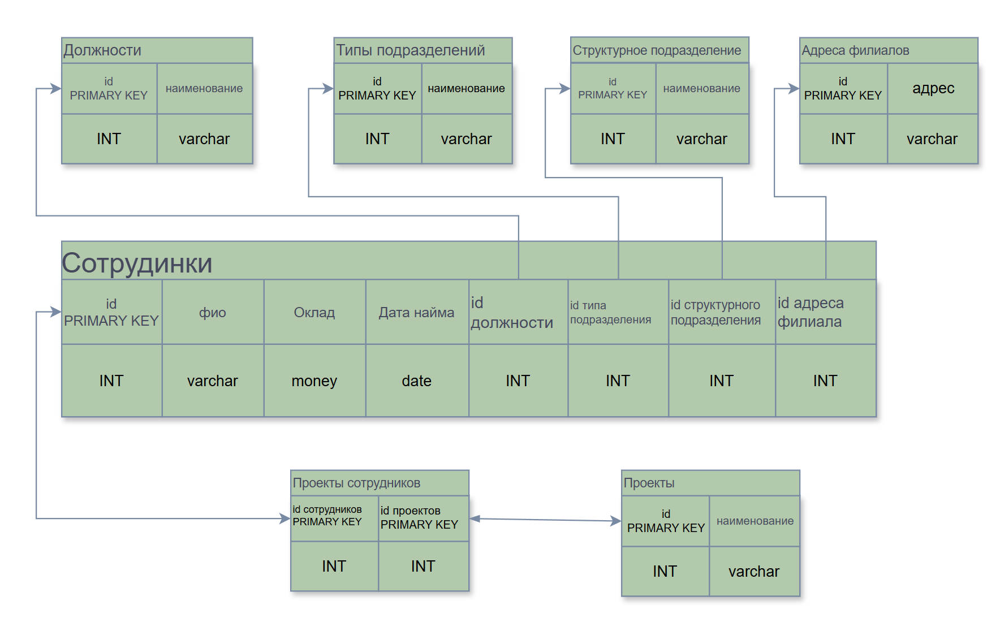
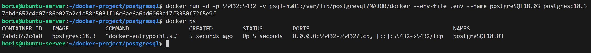
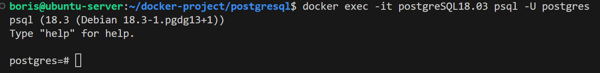
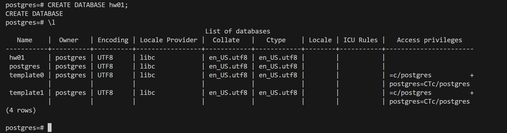
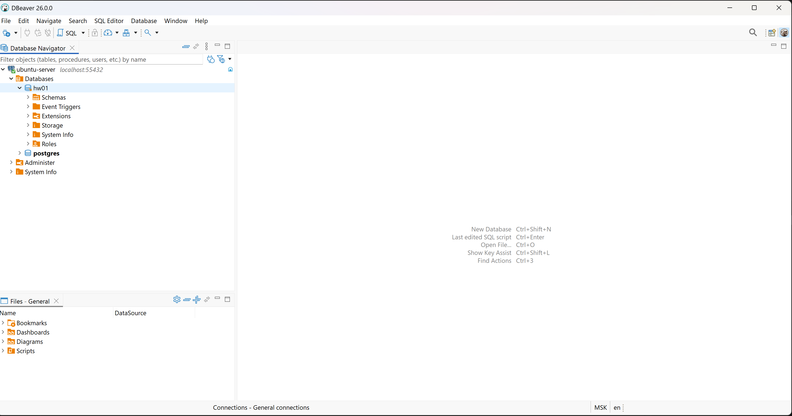
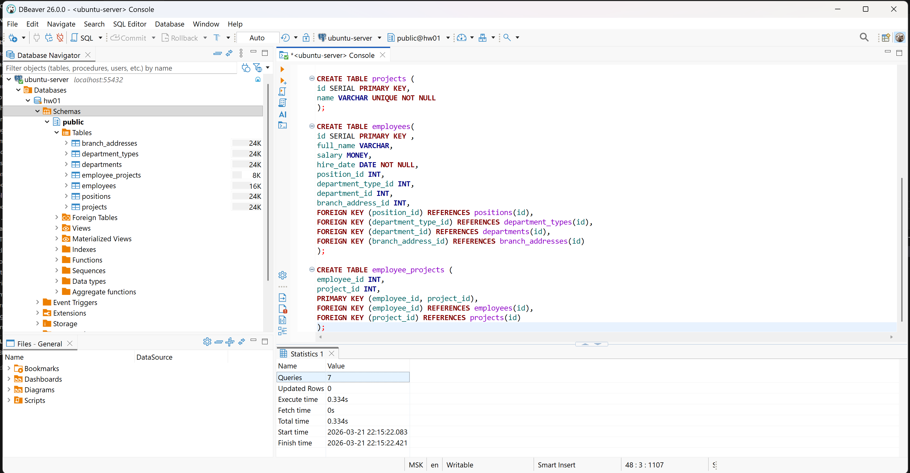
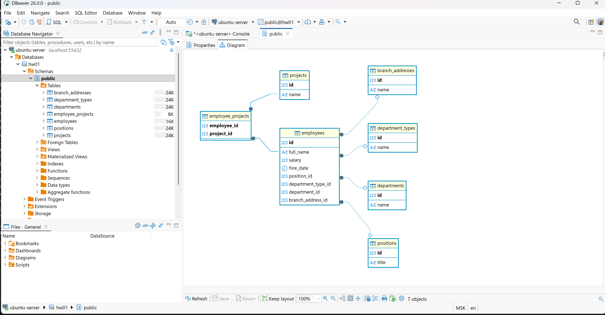

# Домашнее задание к занятию "`Базы данных`" - `Сидоров Борис`

---
---

### Легенда

Заказчик передал вам [файл в формате Excel](files/hw-01/hw-12-1.xlsx), в котором сформирован отчёт. 

На основе этого отчёта нужно выполнить следующие задания.

### Задание 1

Опишите не менее семи таблиц, из которых состоит база данных:

- какие данные хранятся в этих таблицах;
- какой тип данных у столбцов в этих таблицах, если данные хранятся в PostgreSQL.

Приведите решение к следующему виду:

Сотрудники (

- идентификатор, первичный ключ, serial,
- фамилия ,
- ...
- идентификатор структурного подразделения, внешний ключ, integer).

---

### Решение 1
Изучив исходную таблицу, принял решение разделить её на **7 таблиц**:
- сотрудники
- должности
- типы подразделений
- структурное подразделение
- адреса филиалов
- проекты
- проекты сотрудников

Подробный список столбцов, типов данных, первичных и внешних ключей получился таким:

```text
cотрудники (
 идентификатор, первичный ключ, SERIAL,
 фио, varchar,
 оклад, money, 
 дата найма, date,
 идентификатор должности, внешний ключ, int, 
 идентификатор подразделения, внешний ключ, int,
 идентификатор cтруктурного подразделение, внешний ключ, int,
 идентификатор адреса филиала, внешний ключ, int)


должность (
 идентификатор, первичный ключ, SERIAL,
 наименование должности, varchar, UNIQUE, NOT NULL)

тип подразделения (
 идентификатор, первичный ключ, SERIAL,
 наименование типа подразделения, varchar, UNIQUE, NOT NULL)

cтруктурное подразделение (
 идентификатор, первичный ключ, SERIAL,
 наименование cтруктурного подразделения, varchar, UNIQUE, NOT NULL)

адреса филиалов (
 идентификатор, первичный ключ, SERIAL,
 адрес филиала, varchar, UNIQUE, NOT NULL)

проекты (
 идентификатор, первичный ключ, SERIAL,
 наименование проекта, varchar, UNIQUE, NOT NULL)


\# **`промежуточная таблица реализующая свзяь многие ко многим`**

сотрудники и проекты (
 идентификатор сотрудников_id, внешний ключ, int,
 идентификатор проектов_id, внешний ключ, int,
 первичный ключ (сотрудников_id, проектов_id))
 ```

Скрин схемы связей получился таким:




ссылка на файл в формате draw

[draw](<files/hw-01/Связь таблиц.drawio>)

---
---

### Задание 2*

1. Разверните СУБД Postgres на своей хостовой машине, на виртуальной машине или в контейнере docker.
2. Опишите схему, полученную в предыдущем задании, с помощью скрипта SQL.
3. Создайте в вашей полученной СУБД новую базу данных и выполните полученный ранее скрипт для создания вашей модели данных.

В качестве решения приложите SQL скрипт и скриншот диаграммы.

Для написания и редактирования sql удобно использовать  специальный инструмент dbeaver.

---

### Решение 2
Приступаю к настройке **`СУБД Postgres`** на локальном хосте. Для развёртки **`СУБД`** буду использовать **`docker`** + именованный том. Создаю контейнер командой:

    docker run -d -p 55432:5432 -v psql-hw01:/var/lib/postgresql/MAJOR/docker --env-file .env --name postgreSQL18.03 postgres:18.3

Буду использовать образ **`postgres:18.3`**, также проброшу порт **`55432`** в контейнер и именованный том для работы с данными.



Подключаюсь к контейнеру через **`docker exec -it`** и сразу запущу **`cli`** интерфейс **`psql`**:

    docker exec -it postgreSQL18.03 psql -U postgres



Создам учебную базу данных для выполнения задания.



Далее можно работать через **`cli`**, но впоследствии всё равно придётся установить какой-либо графический интерфейс для более эффективного взаимодействия с **`PostgreSQL`**. Установлю универсальный **`DBeaver`** и подключусь к базе.



Что касается задания, для создания таблиц и их ограничений для столбцов у меня получился следующий скрипт:

```sql
CREATE TABLE positions (
    id SERIAL PRIMARY KEY,
    title VARCHAR UNIQUE NOT NULL
);

CREATE TABLE department_types(
    id SERIAL PRIMARY KEY,
    name VARCHAR UNIQUE NOT NULL
);

CREATE TABLE departments (
    id SERIAL PRIMARY KEY,
    name VARCHAR UNIQUE NOT NULL
);

CREATE TABLE branch_addresses (
    id SERIAL PRIMARY KEY,
    name VARCHAR UNIQUE NOT NULL
);

CREATE TABLE projects (
    id SERIAL PRIMARY KEY,
    name VARCHAR UNIQUE NOT NULL
);

CREATE TABLE employees(
    id SERIAL PRIMARY KEY,
    full_name VARCHAR,
    salary MONEY,
    hire_date DATE NOT NULL,
    position_id INT,
    department_type_id INT,
    department_id INT,
    branch_address_id INT,
    FOREIGN KEY (position_id) REFERENCES positions(id),
    FOREIGN KEY (department_type_id) REFERENCES department_types(id),
    FOREIGN KEY (department_id) REFERENCES departments(id),
    FOREIGN KEY (branch_address_id) REFERENCES branch_addresses(id)
);

CREATE TABLE employee_projects (
    employee_id INT,
    project_id INT,
    PRIMARY KEY (employee_id, project_id),
    FOREIGN KEY (employee_id) REFERENCES employees(id),
    FOREIGN KEY (project_id) REFERENCES projects(id)
);
```

Важно то, что сперва я описал создание таблиц, на которые будет ссылаться таблица **`employees`** по первичным ключам. Затем уже таблицу **`employees`**, где будут указаны внешние ключи, и в самую последнюю очередь таблицу **`employee_projects`**, в которой осуществляется связь многие ко многим.  
Итоговый файл скрипта находится тут: 

[**`Script.sql`**](files/hw-01/task-2/Script.sql)

запускаю скрипт



Все **7** таблиц создались, теперь могу посмотреть диаграмму, которая визуально поможет отобразить все связи между таблицами.



Готово, модель данных создана.

---
---
