# Домашнее задание к занятию "`Работа с данными (DDL/DML)`" - `Сидоров Борис`

---
---

### Задание 1
1.1. Поднимите чистый инстанс MySQL версии 8.0+. Можно использовать локальный сервер или контейнер Docker.

1.2. Создайте учётную запись sys_temp. 

1.3. Выполните запрос на получение списка пользователей в базе данных. (скриншот)

1.4. Дайте все права для пользователя sys_temp. 

1.5. Выполните запрос на получение списка прав для пользователя sys_temp. (скриншот)

1.6. Переподключитесь к базе данных от имени sys_temp.

Для смены типа аутентификации с sha2 используйте запрос: 
```sql
ALTER USER 'sys_test'@'localhost' IDENTIFIED WITH mysql_native_password BY 'password';
```
1.6. По ссылке https://downloads.mysql.com/docs/sakila-db.zip скачайте дамп базы данных.

1.7. Восстановите дамп в базу данных.

1.8. При работе в IDE сформируйте ER-диаграмму получившейся базы данных. При работе в командной строке используйте команду для получения всех таблиц базы данных. (скриншот)

*Результатом работы должны быть скриншоты обозначенных заданий, а также простыня со всеми запросами.*

---

### Решение 1
Приступаю к развертыванию **`СУБД MySQL`**. Для решения дальнейших задач, как и в первом задании, буду использовать **`docker`**. Образ выбрал **`mysql:8.0.45-debian`**. Также проброшу порт **`3306`** и задам пароль для **`root`**, используя переменную **`MYSQL_ROOT_PASSWORD`**, значение которой буду брать из файла **`.env`**. Так как в **`СУБД`** будут храниться данные, я создам **2** именованных тома: один для хранения данных, связанных с **`СУБД`**, а другой для обычных данных, если потребуется что-то копировать в контейнер. По итогу запускаю контейнер такой командой:

    docker run -d -p 3306:3306 \
    -v mysql-db-hw02:/var/lib/mysql \
    -v mysql-file-storage-hw02:/data \
    --env-file .env \
    --name mysql-8.0.45 \
    mysql:8.0.45-debian

Запускаю процесс развертывания контейнера.


Пробую подключиться к **`cli mysql`**.

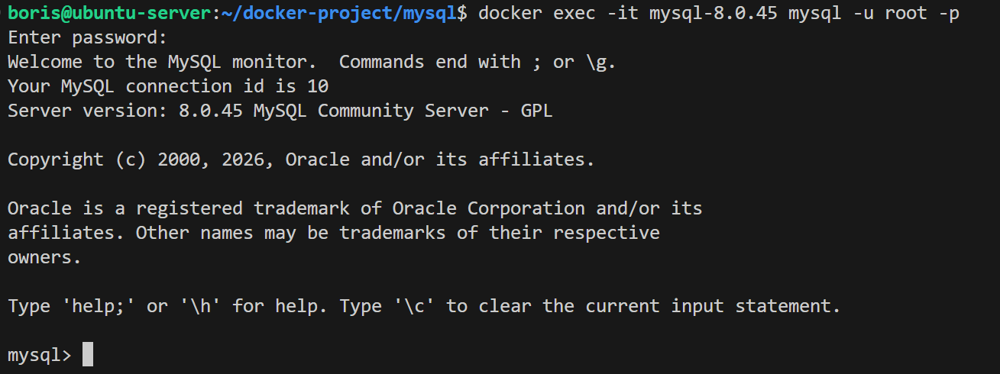

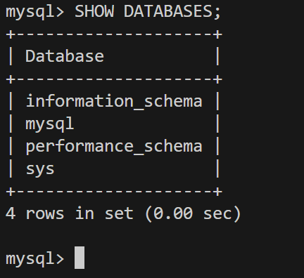

**`СУБД`** работает!  

Теперь подключусь с удалённого ПК, используя **`ssh`** туннель и приложение с графическим интерфейсом **`DBeaver`**.


Приступаю ко второму пункту. Создаю нового пользователя.  
Создаю пользователя **`sys_temp`** с паролем **`12321`**, а знаком **`%`** помечаю, что под этим пользователем можно будет подключаться не только с локального хоста:

    CREATE USER 'sys_temp'@'%' IDENTIFIED BY '12321';

После создания нового пользователя проверяю, появилась ли запись в системной базе данных о нём:

    SELECT Host , `User` FROM mysql.user;

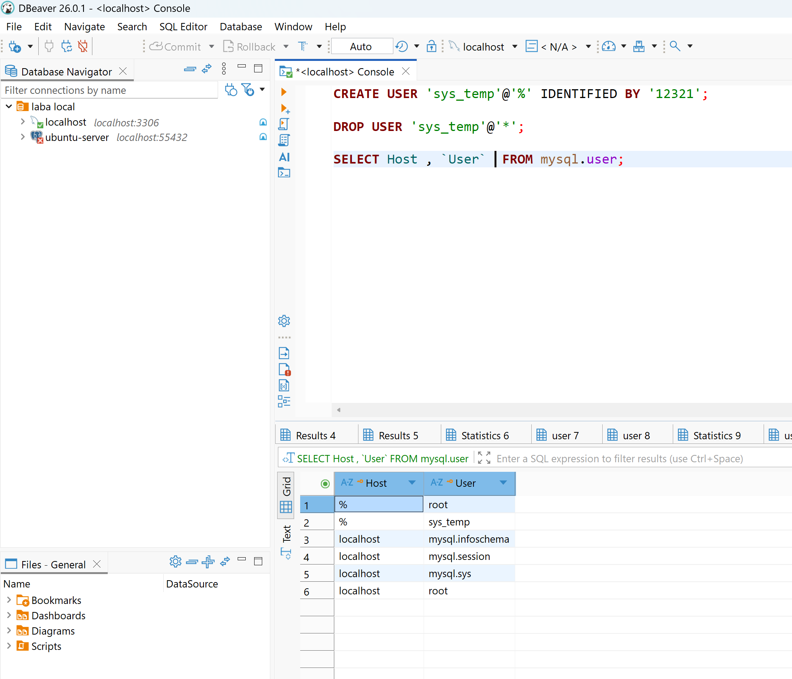

Вижу, что пользователь **`sys_temp`** появился.

Следующим шагом повышаю привилегии новому пользователю, выдавая все права. Для этого использую **`DCL`** команду **`GRANT`**:

    GRANT ALL PRIVILEGES ON *.* TO 'sys_temp'@'%';

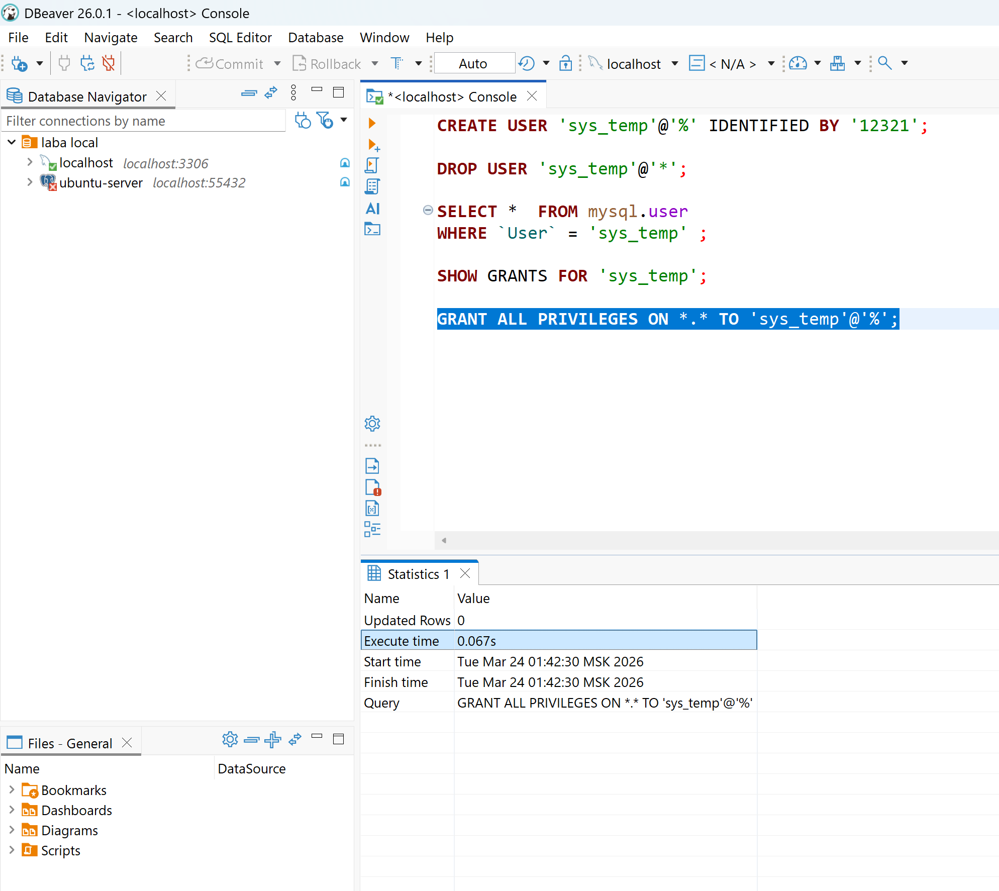

Этой командой говорю выдать все права на все базы и объекты в них (**`*.*`**) пользователю **`'sys_temp'@'%'`**.

Теперь проверю, что по итогу получилось выдать новому пользователю. Для этого воспользуюсь запросом **`SHOW GRANTS`**:

    SHOW GRANTS FOR 'sys_temp';

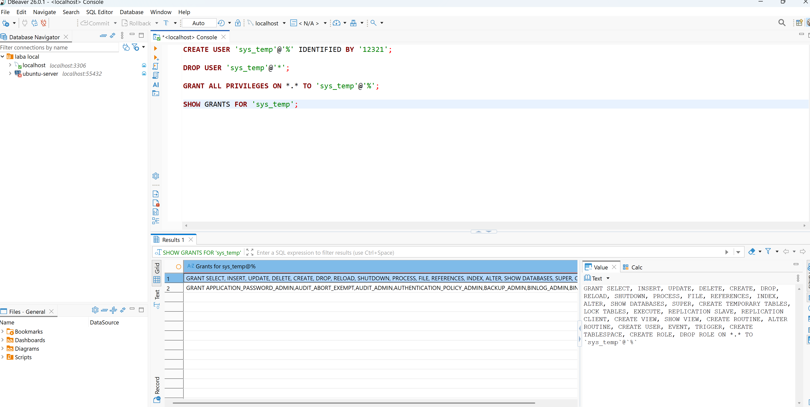

Вижу в выводе весь перечень выданных глобальных и динамических привилегий.  
Важно, что у нового пользователя не будет возможности выдавать подобные права, так как при выдаче прав не указывал опцию **`WITH GRANT OPTION`**, которая позволяет передавать права другим пользователям, но не более тех, которые он сам получил.

Попробую подключиться под новым пользователем.


Получилось.

Далее качаю дамп учебной **`БД`**.


Теперь копирую директорию с файлами в контейнер с **`СУБД`**.

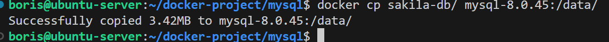

Далее через **`cli`** сперва выполняю скрипт по созданию структуры **`БД`**, а потом наполнение данными.


Проверяю диаграмму через приложение.


Вижу, что новая **`БД`** **`sakila`** появилась и диаграмма есть.


---
---

### Задание 2
Составьте таблицу, используя любой текстовый редактор или Excel, в которой должно быть два столбца: в первом должны быть названия таблиц восстановленной базы, во втором названия первичных ключей этих таблиц. Пример: (скриншот/текст)
```
Название таблицы | Название первичного ключа
customer         | customer_id
```

---

### Решение 2
В задании подразумевалось, скорее всего, подсчитать количество первичных ключей и создать таблицу, выписывая, в какой таблице какой столбец содержит первичный ключ. Я закопался в документации **`MySQL`** и наткнулся на раздел информационных схем. Оказывается, к этим схемам можно обращаться через **`SELECT`** как к обычным таблицам, к тому же отфильтровывать данные, используя оператор **`WHERE`**. Далее я нашёл информационную схему под названием **`KEY_COLUMN_USAGE`**, в которой содержатся все ограничения, в том числе и первичные ключи. Сделав запрос к этой схеме через **`SELECT`** и используя **`WHERE`**, я получил в выводе то, что мне было нужно, – список всех первичных ключей в **`БД sakila`**.

По итогу у меня получился такой запрос:

    SELECT TABLE_NAME AS name_table, COLUMN_NAME AS name_primarykey 
    FROM INFORMATION_SCHEMA.KEY_COLUMN_USAGE
    WHERE CONSTRAINT_SCHEMA = 'sakila' AND CONSTRAINT_NAME = 'PRIMARY';

Я взял нужные мне столбцы – имя таблицы, имя столбца из таблицы **`KEY_COLUMN_USAGE`** информационной схемы, по условию, где схема относится к нужной мне **`БД`** и к нужному мне ограничению.

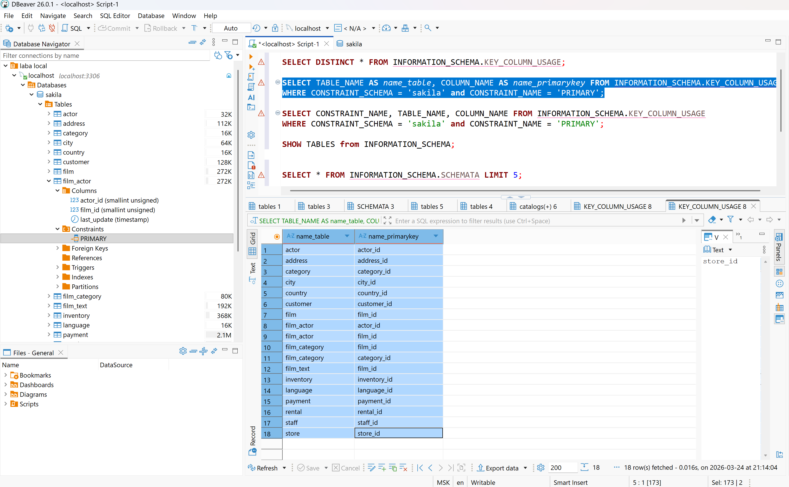

Вот сама таблица:

[**`KEY_COLUMN_USAGE_202603242126.xlsx`**](files/hw-02/task-2/KEY_COLUMN_USAGE_202603242126.xlsx)

---
---

### Задание 3*
3.1. Уберите у пользователя sys_temp права на внесение, изменение и удаление данных из базы sakila.

3.2. Выполните запрос на получение списка прав для пользователя sys_temp. (скриншот)

*Результатом работы должны быть скриншоты обозначенных заданий, а также простыня со всеми запросами.*

---

### Решение 3
В задании сказано отозвать права на внесение, изменение и удаление данных из конкретной базы **`sakila`**. Значит, речь идёт о записях в таблице, которые уже существуют. Мне потребуется отозвать такие привилегии, как **`INSERT`**, **`UPDATE`**, **`DELETE`**.

Сперва выведу ещё раз список всех привилегий пользователя **`sys_temp`**. Воспользуюсь командой:

    SHOW GRANTS FOR sys_temp;

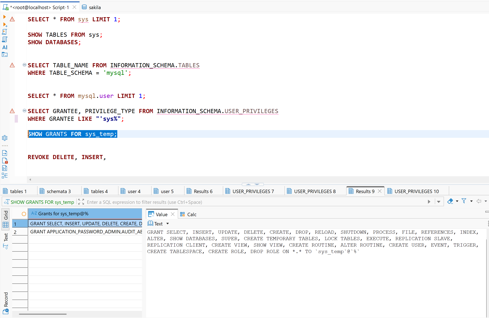

Проблема в том, что в первом задании было сказано выдать права пользователю вообще на всё, что и было сделано, а теперь просят убрать доступы с конкретной **`БД`**. Когда я попытался это сделать, получил ошибку.

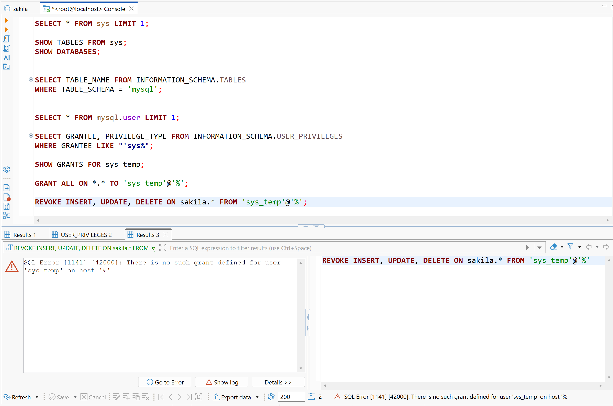

Значит, мне нужно забрать глобальный доступ у пользователя, затем выдать все, но уже для **`БД sakila`**, и забрать требуемые по заданию доступы. Подход с точки зрения безопасности не совсем верный, но в задании не было сказано, какие именно должны быть права у пользователя, сказано только, каких быть не должно. Поэтому делаю так.

Забираю все права у пользователя **`sys_temp`**:

    REVOKE ALL ON *.* FROM 'sys_temp'@'%';

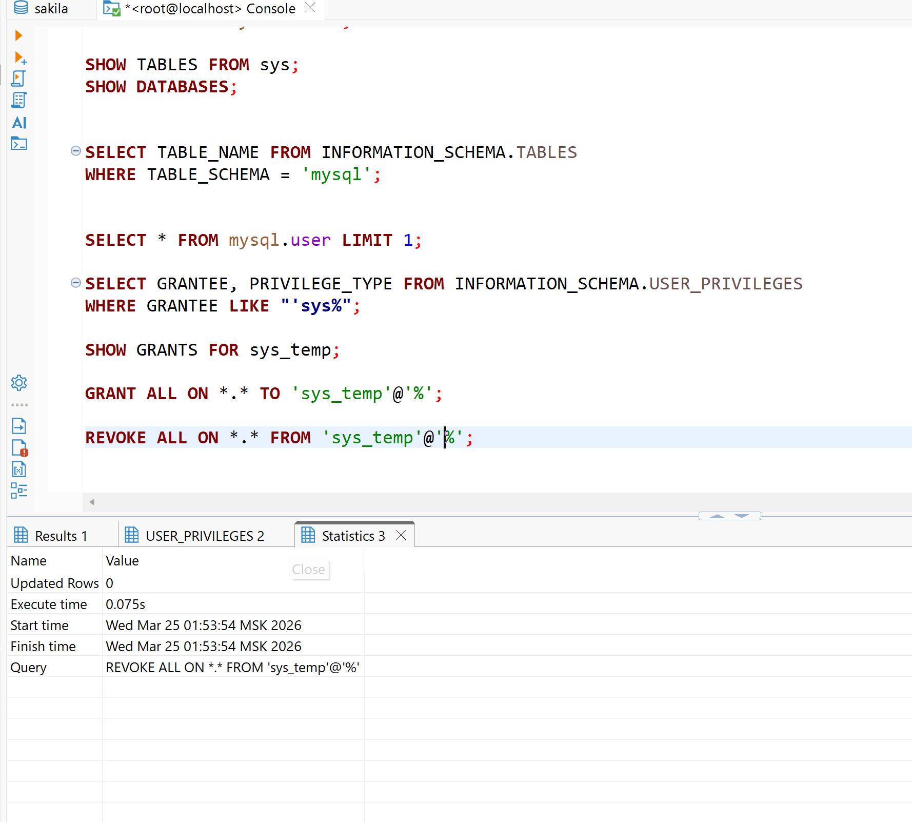

Проверяю:

    SHOW GRANTS FOR sys_temp;

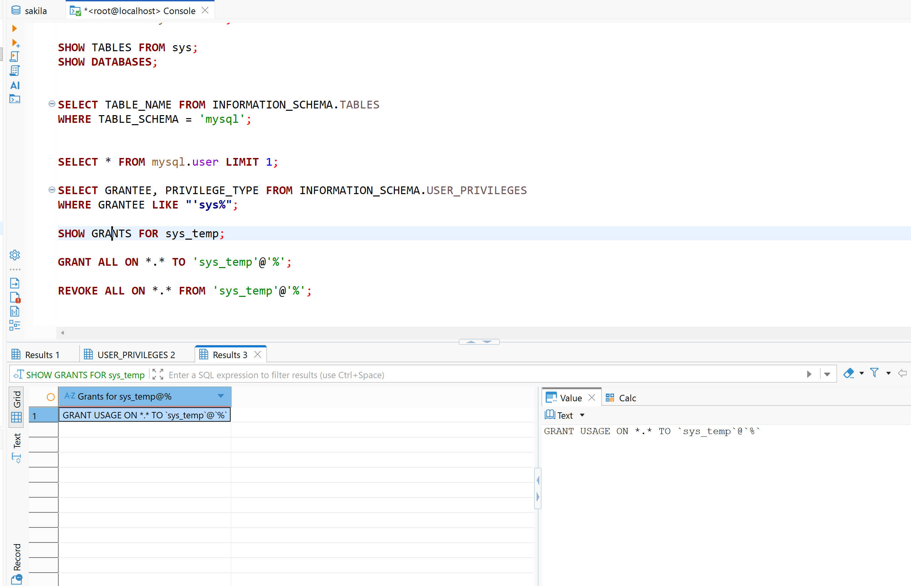

Вот ещё один запрос, но только через информационную схему, где отчётливо видно, что остался только **`USAGE`**, что означает отсутствие привилегий. Правда, это не стандартная таблица, и в документации чётко написано, что вывод не одно и то же, используя **`SHOW GRANTS`**:

    SELECT GRANTEE, PRIVILEGE_TYPE FROM INFORMATION_SCHEMA.USER_PRIVILEGES
    WHERE GRANTEE LIKE "'sys%";

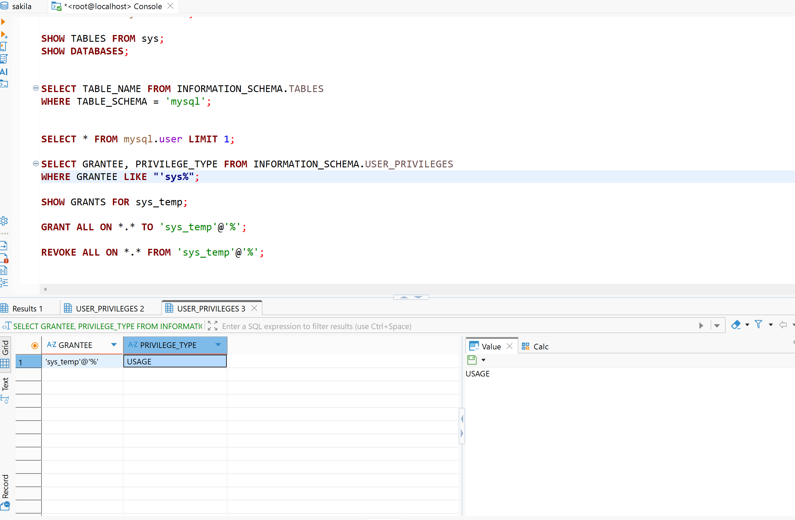

Далее выдаю права на всё, но уже только для **`БД sakila`**:

    GRANT ALL ON sakila.* TO 'sys_temp'@'%';

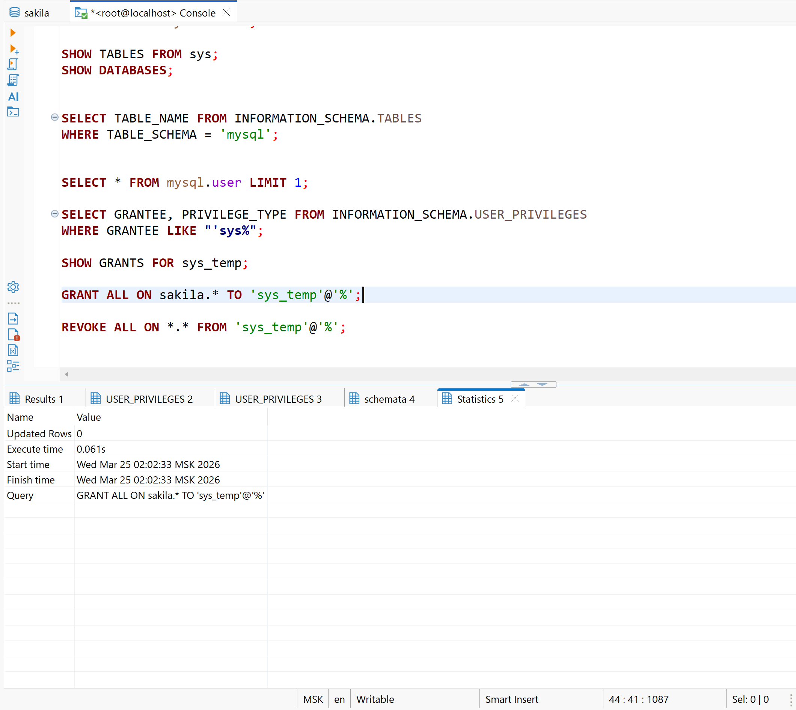

Проверяю:

    SHOW GRANTS FOR sys_temp;

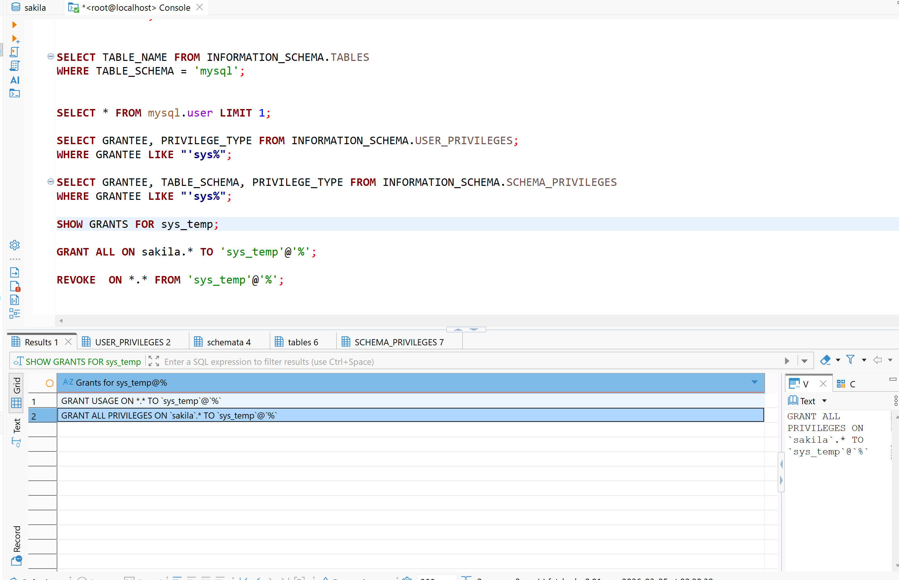

Запрос к информационной схеме **`SCHEMA_PRIVILEGES`**, где уже можно посмотреть привилегии по разным **`БД`**:

    SELECT GRANTEE, TABLE_SCHEMA, PRIVILEGE_TYPE FROM INFORMATION_SCHEMA.SCHEMA_PRIVILEGES
    WHERE GRANTEE LIKE "'sys%";

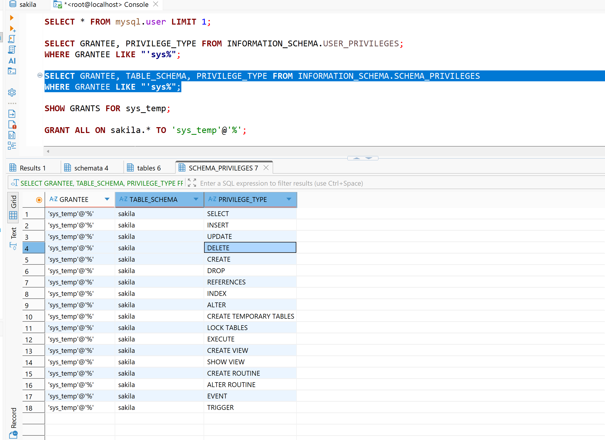

Отзываю требуемые привилегии по заданию:

    REVOKE INSERT, UPDATE, DELETE ON sakila.* FROM 'sys_temp'@'%';

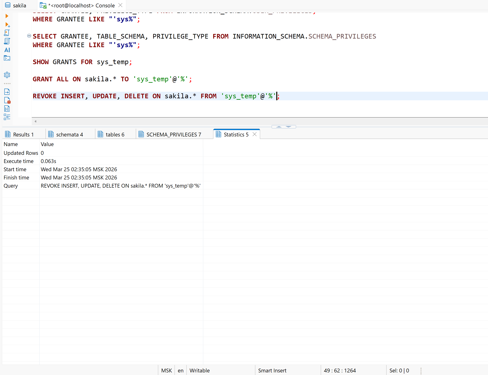

Проверяю, какие теперь есть доступы у пользователя:

    SHOW GRANTS FOR sys_temp;

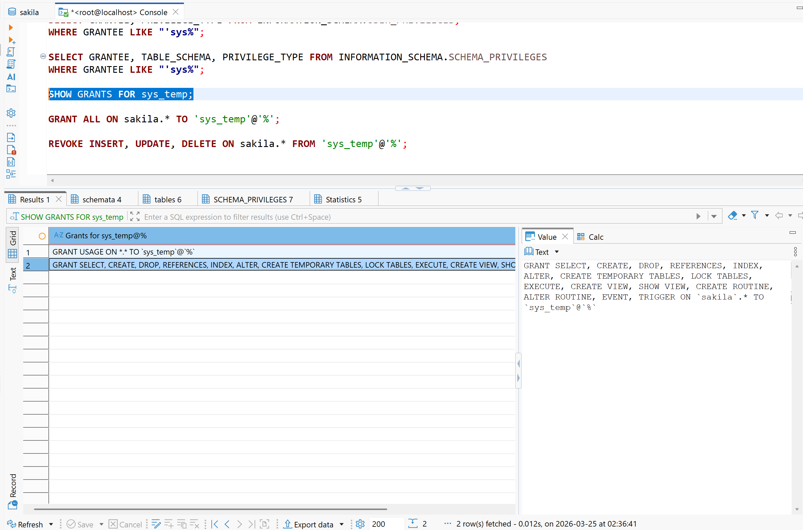

Вижу, что **`ALL`** пропало и остался список привилегий за исключением тех, которые отозвал.

Или запрос через информационную схему.

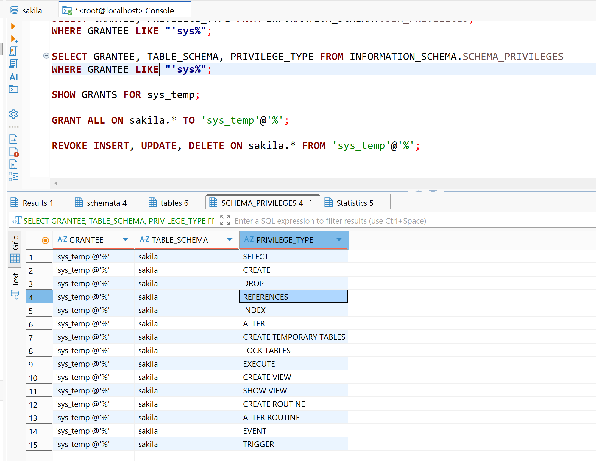

---
---