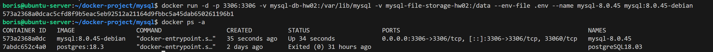
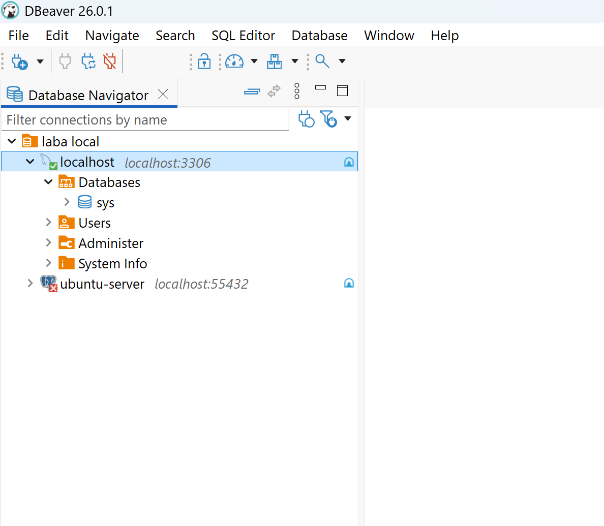
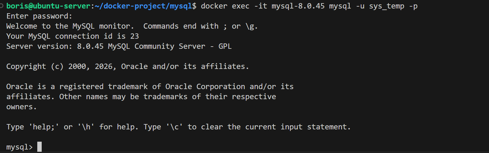
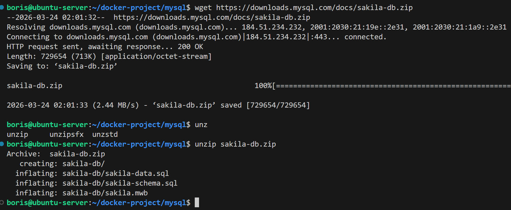
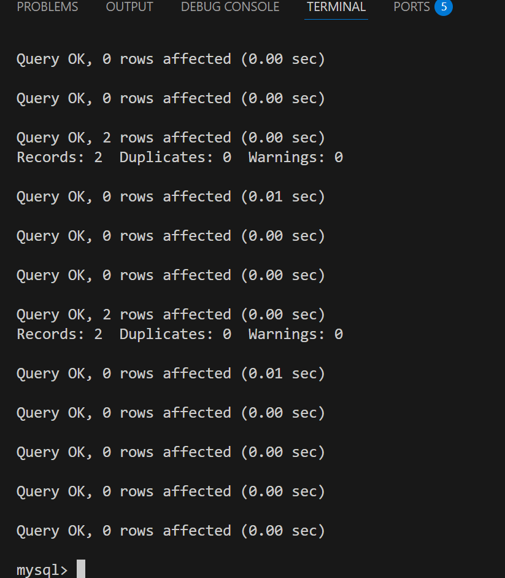
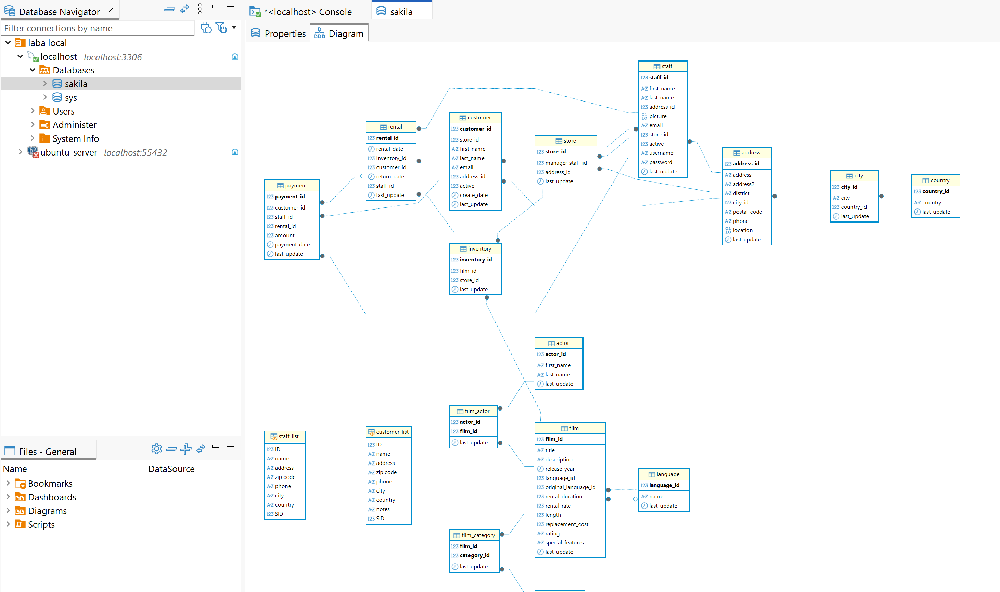
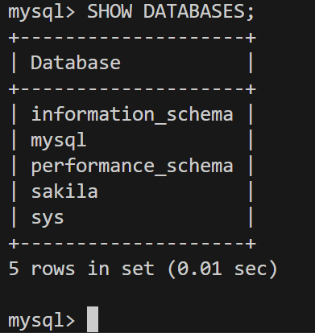

# Домашнее задание к занятию "`Работа с данными (DDL/DML)`" - `Сидоров Борис`

---
---

### Задание 1
1.1. Поднимите чистый инстанс MySQL версии 8.0+. Можно использовать локальный сервер или контейнер Docker.

1.2. Создайте учётную запись sys_temp. 

1.3. Выполните запрос на получение списка пользователей в базе данных. (скриншот)

1.4. Дайте все права для пользователя sys_temp. 

1.5. Выполните запрос на получение списка прав для пользователя sys_temp. (скриншот)

1.6. Переподключитесь к базе данных от имени sys_temp.

Для смены типа аутентификации с sha2 используйте запрос: 
```sql
ALTER USER 'sys_test'@'localhost' IDENTIFIED WITH mysql_native_password BY 'password';
```
1.6. По ссылке https://downloads.mysql.com/docs/sakila-db.zip скачайте дамп базы данных.

1.7. Восстановите дамп в базу данных.

1.8. При работе в IDE сформируйте ER-диаграмму получившейся базы данных. При работе в командной строке используйте команду для получения всех таблиц базы данных. (скриншот)

*Результатом работы должны быть скриншоты обозначенных заданий, а также простыня со всеми запросами.*

---

### Решение 1
Приступаю к развертыванию **`СУБД MySQL`**. Для решения дальнейших задач, как и в первом задании, буду использовать **`docker`**. Образ выбрал **`mysql:8.0.45-debian`**. Также проброшу порт **`3306`** и задам пароль для **`root`**, используя переменную **`MYSQL_ROOT_PASSWORD`**, значение которой буду брать из файла **`.env`**. Так как в **`СУБД`** будут храниться данные, я создам **2** именованных тома: один для хранения данных, связанных с **`СУБД`**, а другой для обычных данных, если потребуется что-то копировать в контейнер. По итогу запускаю контейнер такой командой:

    docker run -d -p 3306:3306 \
    -v mysql-db-hw02:/var/lib/mysql \
    -v mysql-file-storage-hw02:/data \
    --env-file .env \
    --name mysql-8.0.45 \
    mysql:8.0.45-debian

Запускаю процесс развертывания контейнера.



Пробую подключиться к **`cli mysql`**.


**`СУБД`** работает!  

Теперь подключусь с удалённого ПК, используя **`ssh`** туннель и приложение с графическим интерфейсом **`DBeaver`**.



Приступаю ко второму пункту. Создаю нового пользователя.  
Создаю пользователя **`sys_temp`** с паролем **`12321`**, а знаком **`%`** помечаю, что под этим пользователем можно будет подключаться не только с локального хоста:

    CREATE USER 'sys_temp'@'%' IDENTIFIED BY '12321';

После создания нового пользователя проверяю, появилась ли запись в системной базе данных о нём:

    SELECT Host , `User` FROM mysql.user;


Вижу, что пользователь **`sys_temp`** появился.

Следующим шагом повышаю привилегии новому пользователю, выдавая все права. Для этого использую **`DCL`** команду **`GRANT`**:

    GRANT ALL PRIVILEGES ON *.* TO 'sys_temp'@'%';


Этой командой говорю выдать все права на все базы и объекты в них (**`*.*`**) пользователю **`'sys_temp'@'%'`**.

Теперь проверю, что по итогу получилось выдать новому пользователю. Для этого воспользуюсь запросом **`SHOW GRANTS`**:

    SHOW GRANTS FOR 'sys_temp';


Вижу в выводе весь перечень выданных глобальных и динамических привилегий.  
Важно, что у нового пользователя не будет возможности выдавать подобные права, так как при выдаче прав не указывал опцию **`WITH GRANT OPTION`**, которая позволяет передавать права другим пользователям, но не более тех, которые он сам получил.

Попробую подключиться под новым пользователем.



Получилось.

Далее качаю дамп учебной **`БД`**.



Теперь копирую директорию с файлами в контейнер с **`СУБД`**.


Далее через **`cli`** сперва выполняю скрипт по созданию структуры **`БД`**, а потом наполнение данными.



Проверяю диаграмму через приложение.



Вижу, что новая **`БД`** **`sakila`** появилась и диаграмма есть.



---
---
