# Домашнее задание к занятию "`SQL. Часть 1`" - `Сидоров Борис`

---
---

Задание можно выполнить как в любом IDE, так и в командной строке.

### Задание 1

Получите уникальные названия районов из таблицы с адресами, которые начинаются на “K” и заканчиваются на “a” и не содержат пробелов.

---

### Решение 1
Первым делом мне нужно найти интересующую меня таблицу, над которой необходимо провести выборку по заданию. Будем исходить из того, что мне известна **`БД`** – это **`sakila`**.

Первым шагом выведу таблицы информационной схемы для поиска нужной мне схемы:

    SHOW TABLES FROM INFORMATION_SCHEMA;

Обращаясь к информационной схеме через **`SELECT FROM information_schema.TABLES`**, я могу в выводе получить весь список таблиц. Делать такой запрос через **`*`** неразумно, так как таблиц будет очень много. Лучше вывести по **`LIMIT`** несколько и понять, по какому столбцу лучше фильтровать выборку. Это будет столбец **`TABLE_SCHEMA`**, в качестве значения которого указывается наименование **`БД`**. По этому столбцу я буду делать выборку.

    SELECT * FROM information_schema.TABLES
    WHERE TABLE_SCHEMA = "sakila";

Я нашёл целевую таблицу, теперь могу с ней проводить операции.

Опущу подробности всех вариантов выборки, отмечу, что сперва я посмотрел, какие столбцы есть в этой таблице, указав **`LIMIT`**, нашёл столбец, в котором хранятся интересующие данные, вывел весь список, а дальше начал подбирать условие **`WHERE`**. Я использовал выражение **`LIKE`**, в котором можно гибко фильтровать шаблоны совпадений. Экспериментальным путём я подобрал два выражения **`LIKE`**, используя логическое **`AND`**, так чтобы в выборку попали данные, которые подходят под два условия. По итогу финальный запрос получился таким:

    SELECT DISTINCT district FROM address
    WHERE district LIKE 'K%%a' AND district NOT LIKE '% %';

В первом, используя **`%`**, указал желаемое начало строки и конец, а во втором – отрицание пустой строки в значении. Результат получился таким.

---
---

### Задание 2

Получите из таблицы платежей за прокат фильмов информацию по платежам, которые выполнялись в промежуток с 15 июня 2005 года по 18 июня 2005 года **включительно** и стоимость которых превышает 10.00.

---

### Решение 2
Определив, что целевая таблица является **`payment`**, я сделал выборку по всем столбцам, чтобы понять, в каких из них хранятся значения даты и стоимости. Дал лимит на **`10`** строк и сортировку **`ORDER BY`**, чтобы снизить нагрузку:

    SELECT * FROM payment ORDER BY payment_id LIMIT 10;

Вижу, что нужно осуществлять сортировку по столбцу **`payment_date`**, в котором хранятся данные с датой и временем, и столбцу **`amount`**, в котором хранятся данные с суммой.

Опущу подготовительные работы, в которых я сперва вывожу в **`SELECT`** два столбца с лимитом, затем пробую первые попытки отфильтровать в условии **`WHERE`** через **`BETWEEN`**. Самое главное, что в задании упоминается строгое правило: найти платежи в диапазоне дат включительно. А значит, помимо оператора **`BETWEEN`** нужно работать только с датой, чтобы совпадения были наиболее точными, ведь дата **`2005-06-18 00:00:01`** уже будет за пределами и не попадёт в выборку. Для этого в **`WHERE`** перед указанием столбца я буду использовать функцию **`DATE`**, которая поможет извлечь дату из времени. Остаётся добавить ещё одно логическое **`AND`** по столбцу **`amount`** и отсортировать в хронологии. Итоговый запрос получился таким:

    SELECT payment_date, amount FROM payment
    WHERE DATE(payment_date) BETWEEN "2005-06-15" AND "2005-06-18" AND amount > "10.00"
    ORDER BY payment_date;

---
---

### Задание 3

Получите последние пять аренд фильмов.

---

### Решение 3
Смотрю все таблицы в **`БД sakila`**:

    SELECT * FROM information_schema.tables
    WHERE TABLE_SCHEMA = "sakila"
    LIMIT 20;

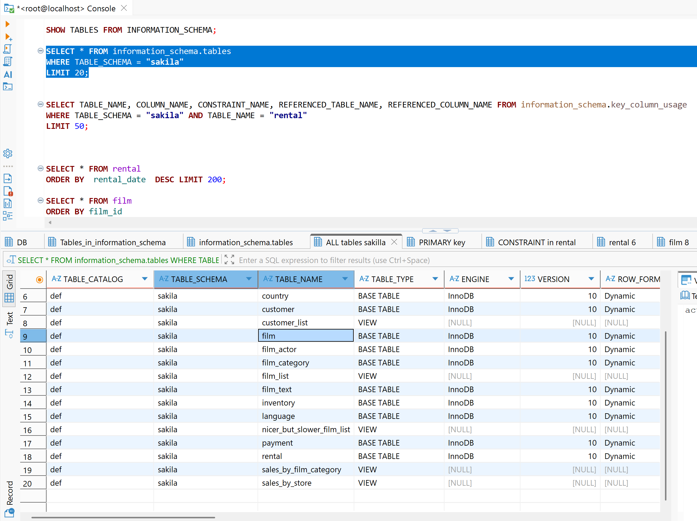

Вижу таблицу **`rental`**, в которой должны быть записи об арендах.  
Сделаю полную выборку по лимиту для понимания содержимого:

    SELECT * FROM rental ORDER BY rental_id LIMIT 10;

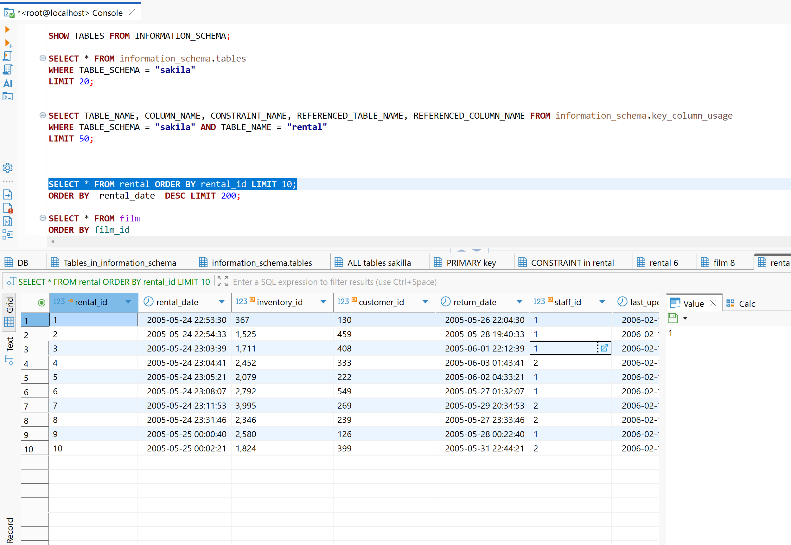

Вижу столбец **`rental_date`**, по ней и буду сортировать данные через **`ORDER BY`**, используя **`DESC`** для сортировки от большего к меньшему, то есть первыми в списке будут самые свежие даты. Так же поставлю лимит на **`5`** строк. Получился такой запрос:

    SELECT rental_date, rental_id FROM rental
    ORDER BY rental_date DESC 
    LIMIT 5;

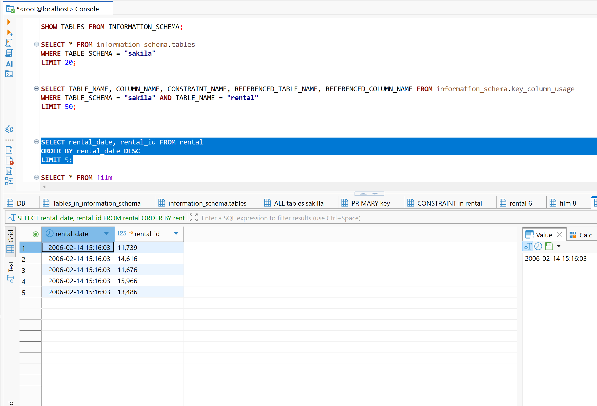

---
---

### Задание 4

Одним запросом получите активных покупателей, имена которых Kelly или Willie. 

Сформируйте вывод в результат таким образом:
- все буквы в фамилии и имени из верхнего регистра переведите в нижний регистр,
- замените буквы 'll' в именах на 'pp'.

---

### Решение 4
Первым делом сперва найду покупателей в таблице **`customer`**, над которыми нужно будет осуществить редактирование:

    SELECT first_name, last_name FROM customer
    WHERE active = "1" AND
    first_name IN ("Kelly", "Willie");

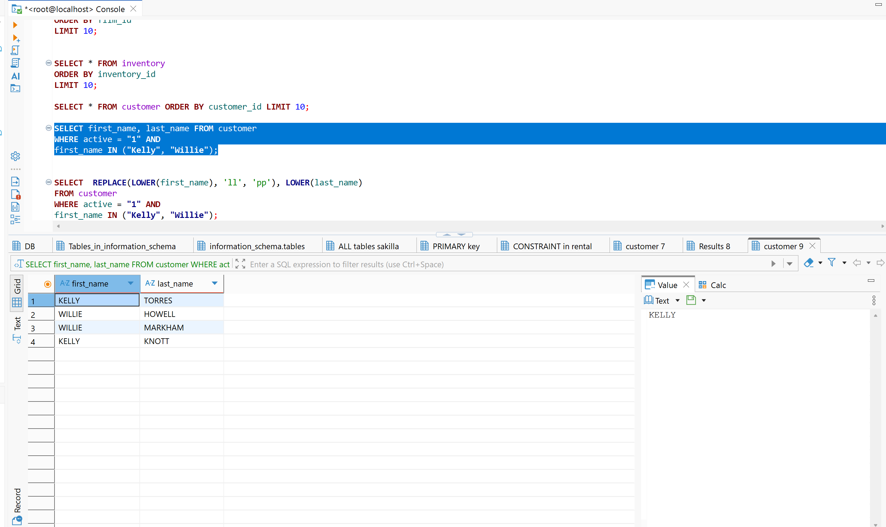

Затем переведу столбцы в нижний регистр:

    SELECT LOWER(first_name), LOWER(last_name) FROM customer
    WHERE active = "1" AND
    first_name IN ("Kelly", "Willie");

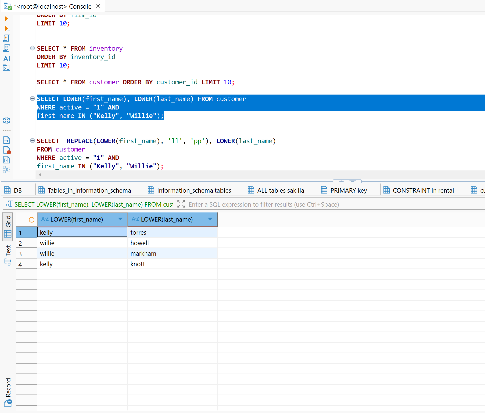

Теперь через **`REPLACE`** изменю в столбце **`first_name`** символы по требуемому шаблону. Что важно: нужно делать замену поверх уже работающей функции **`LOWER`**, иначе обработка будет не с маленькими символами, а с большими, и результат будет совсем другим. По итогу получается такая команда:

    SELECT REPLACE(LOWER(first_name), 'll', 'pp'), LOWER(last_name)
    FROM customer
    WHERE active = "1" AND
    first_name IN ("Kelly", "Willie");

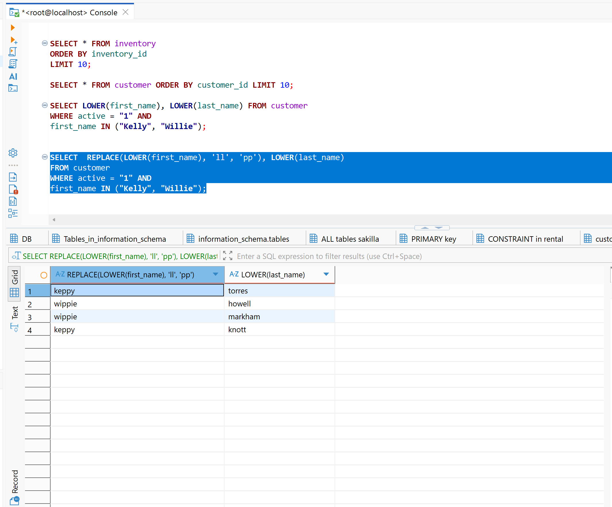

---
---

### Задание 5*

Выведите Email каждого покупателя, разделив значение Email на две отдельных колонки: в первой колонке должно быть значение, указанное до @, во второй — значение, указанное после @.

---

### Решение 5
В предыдущем задании уже приходилось работать с таблицей **`customer`**, и понятно, что операции нужно проводить над столбцом **`email`**. Для того чтобы разделить целую строку на несколько разных частей по указанному маркеру, я буду использовать такую функцию, как **`SUBSTRING_INDEX`**. В отличие от простой функции **`SUBSTRING`**, в **`SUBSTRING_INDEX`** можно указывать количество вхождений до указанного разделителя, тем самым можно гибко вытаскивать подстроку из строки.

По итогу у меня получился такой запрос:

    SELECT CONCAT(first_name, ' ', last_name) AS customer, 
           SUBSTRING_INDEX(email, '@', 1) AS local_part, 
           SUBSTRING_INDEX(email, '@', -1) AS domain,
           email AS origin_mail
    FROM customer 
    ORDER BY customer_id;

Я использовал псевдонимы для каждого обрабатываемого столбца для наглядности, а в функции **`SUBSTRING_INDEX`** после объявления столбца следует как раз необходимый разделитель, а следующее число говорит, сколько вхождений будет до этого разделителя. В том случае, если число отрицательное, отсчёт будет не слева, а справа.

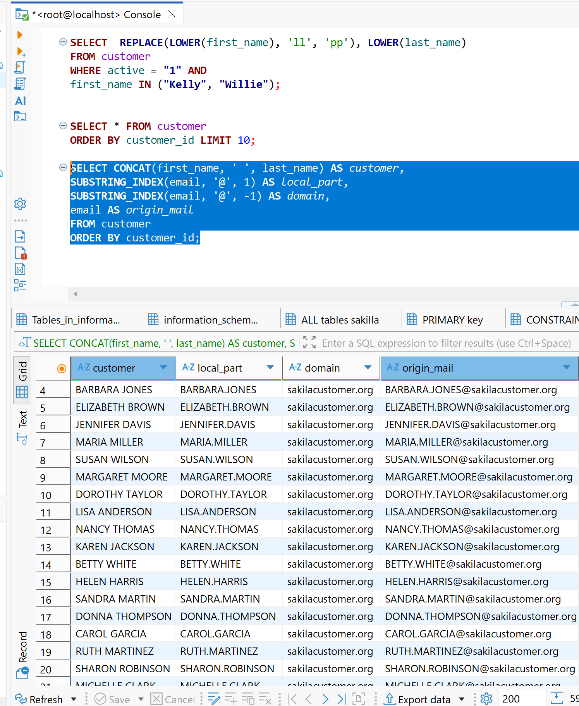

Я вывел для наглядности несколько столбцов, чтобы проверить, верно ли получилось разделение. Теперь в запросе уберу все лишние столбцы и сформирую только два, как сказано в задании. В условии не сказано, активные или неактивные покупатели, поэтому в **`WHERE`** ничего не будет, единственное – отсортирую по **`id`**. Итоговый запрос получился следующим:

    SELECT CONCAT(first_name, ' ', last_name) AS customer, 
           SUBSTRING_INDEX(email, '@', 1) AS local_part, 
           SUBSTRING_INDEX(email, '@', -1) AS domain
    FROM customer 
    ORDER BY customer_id;

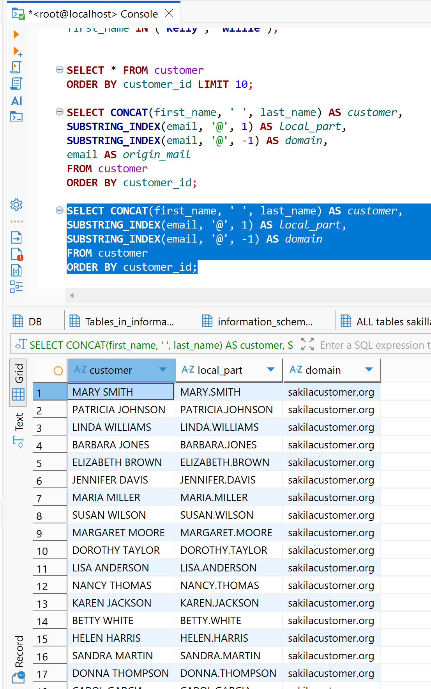

---
---

### Задание 6*

Доработайте запрос из предыдущего задания, скорректируйте значения в новых колонках: первая буква должна быть заглавной, остальные — строчными.

---

### Решение 6
Итак, есть исходные данные по двум колонкам, которые я получил, выполнив следующий запрос:

    SELECT SUBSTRING_INDEX(email, '@', 1) AS local_part, 
    SUBSTRING_INDEX(email, '@', -1) AS domain
    FROM customer 
    ORDER BY customer_id;

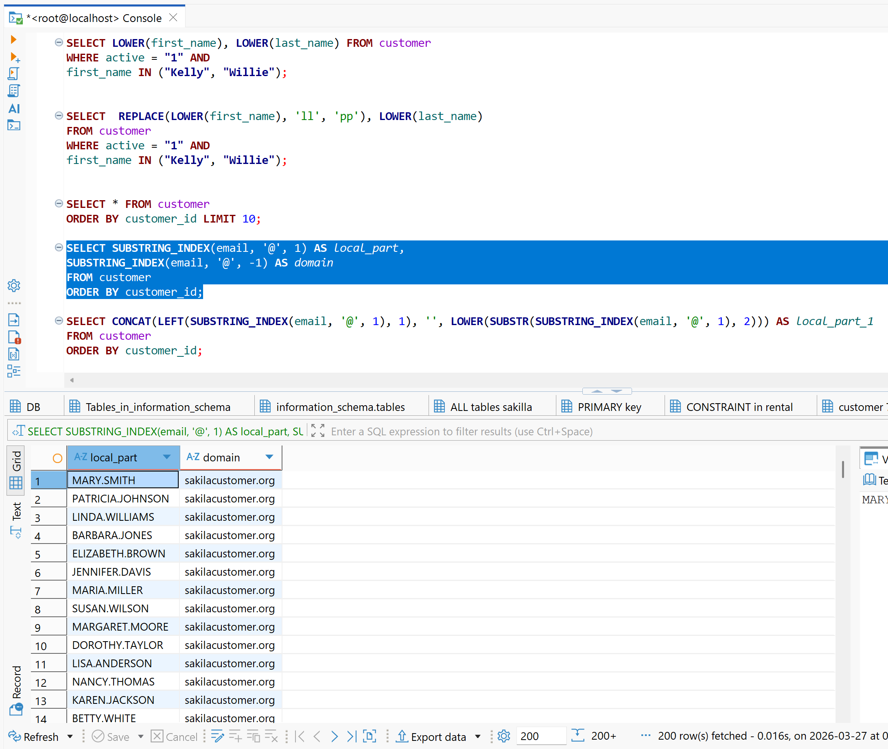

Задача – сделать первый символ в верхнем регистре в двух колонках.

Первым шагом будет извлечь первый символ как в первом, так и во втором столбце. Делать я это буду, обернув имеющийся уже результат функции **`SUBSTRING_INDEX`** в функцию **`LEFT`** с указанием первого символа. Получается приблизительно такой запрос:

    SELECT LEFT(SUBSTRING_INDEX(email, '@', 1), 1) AS local_part, 
    LEFT(SUBSTRING_INDEX(email, '@', -1), 1) AS domain
    FROM customer 
    ORDER BY customer_id;

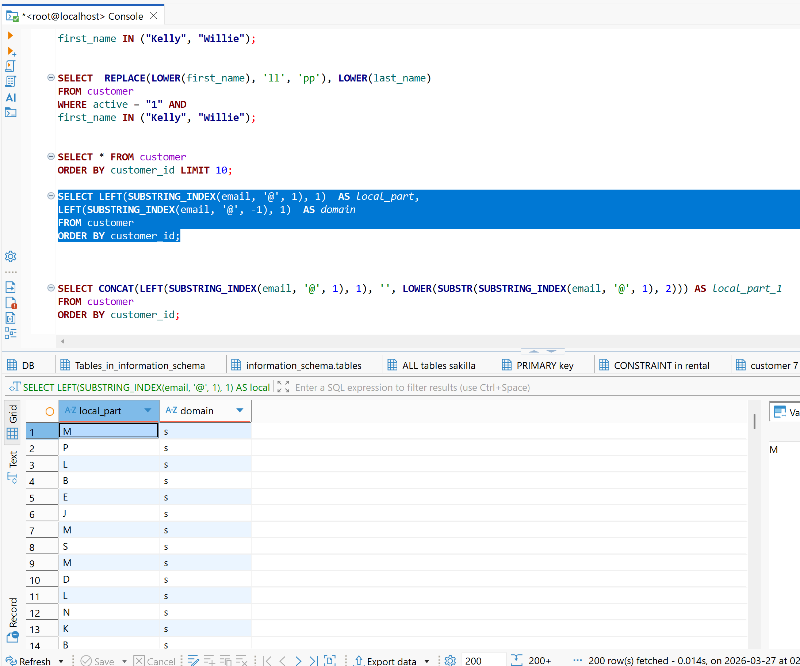

Теперь у меня есть первые символы как первого, так и второго столбца. Далее нужно получить строку без первого символа. Для этого я оберну функцию **`SUBSTRING_INDEX`** в обычную функцию **`SUBSTRING`** и укажу отсчёт со второго символа. На данном этапе я добавлю ещё **2** столбца, чтобы было видно результат работы запроса:

    SELECT LEFT(SUBSTRING_INDEX(email, '@', 1), 1) AS local_part, 
    LEFT(SUBSTRING_INDEX(email, '@', -1), 1) AS domain,
    SUBSTRING(SUBSTRING_INDEX(email, '@', 1), 2) AS local_part_test,
    SUBSTRING(SUBSTRING_INDEX(email, '@', -1), 2) AS domain_test
    FROM customer 
    ORDER BY customer_id;

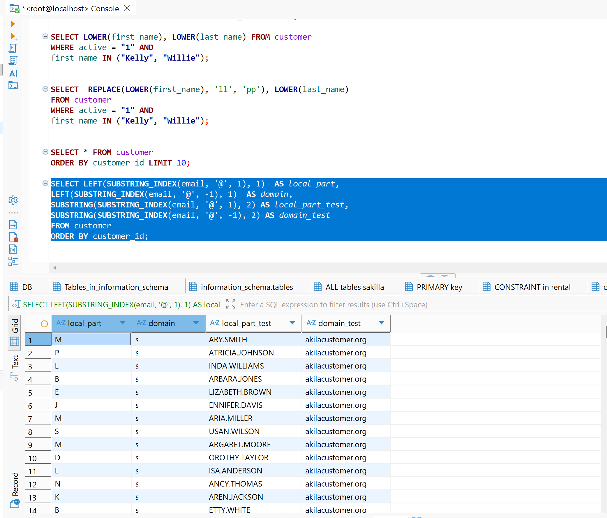

У меня есть две части будущего целого столбца. Одиночный символ, который находится в верхнем регистре, не трогаю, а тот, который в нижнем, преобразую в верхний через **`UPPER`**. Просто оберну столбец **`domain`** в функцию **`UPPER`** и посмотрю, что получится:

    SELECT LEFT(SUBSTRING_INDEX(email, '@', 1), 1) AS local_part, 
    UPPER(LEFT(SUBSTRING_INDEX(email, '@', -1), 1)) AS domain,
    SUBSTRING(SUBSTRING_INDEX(email, '@', 1), 2) AS local_part_test,
    SUBSTRING(SUBSTRING_INDEX(email, '@', -1), 2) AS domain_test
    FROM customer 
    ORDER BY customer_id;

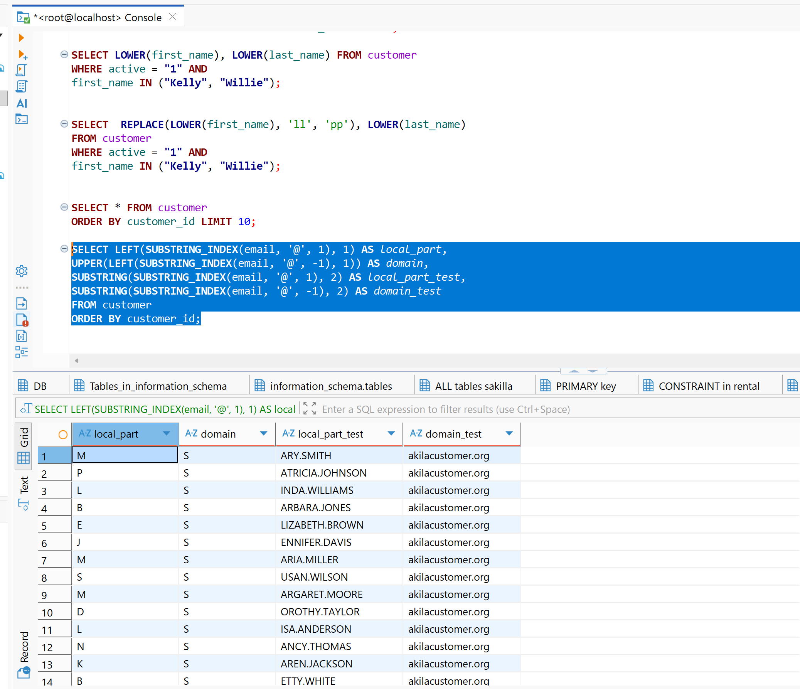

У меня готовы заглавные символы. Теперь нужно сделать то же самое только для столбца **`local_part_test`**, обернув всё в **`LOWER`**:

    SELECT LEFT(SUBSTRING_INDEX(email, '@', 1), 1) AS local_part, 
    UPPER(LEFT(SUBSTRING_INDEX(email, '@', -1), 1)) AS domain,
    LOWER(SUBSTRING(SUBSTRING_INDEX(email, '@', 1), 2)) AS local_part_test,
    SUBSTRING(SUBSTRING_INDEX(email, '@', -1), 2) AS domain_test
    FROM customer 
    ORDER BY customer_id;

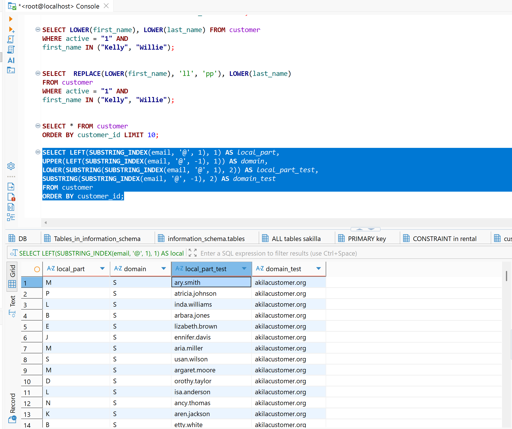

Осталось склеить столбцы **`local_part`** с **`local_part_test`** и **`domain`** с **`domain_test`** соответственно. Первым делом склею **`local_part`**:

    SELECT CONCAT(
        LEFT(SUBSTRING_INDEX(email, '@', 1), 1),'',
        LOWER(SUBSTRING(SUBSTRING_INDEX(email, '@', 1), 2))	
    ) AS local_part,
    UPPER(LEFT(SUBSTRING_INDEX(email, '@', -1), 1)) AS domain,
    SUBSTRING(SUBSTRING_INDEX(email, '@', -1), 2) AS domain_test
    FROM customer 
    ORDER BY customer_id;

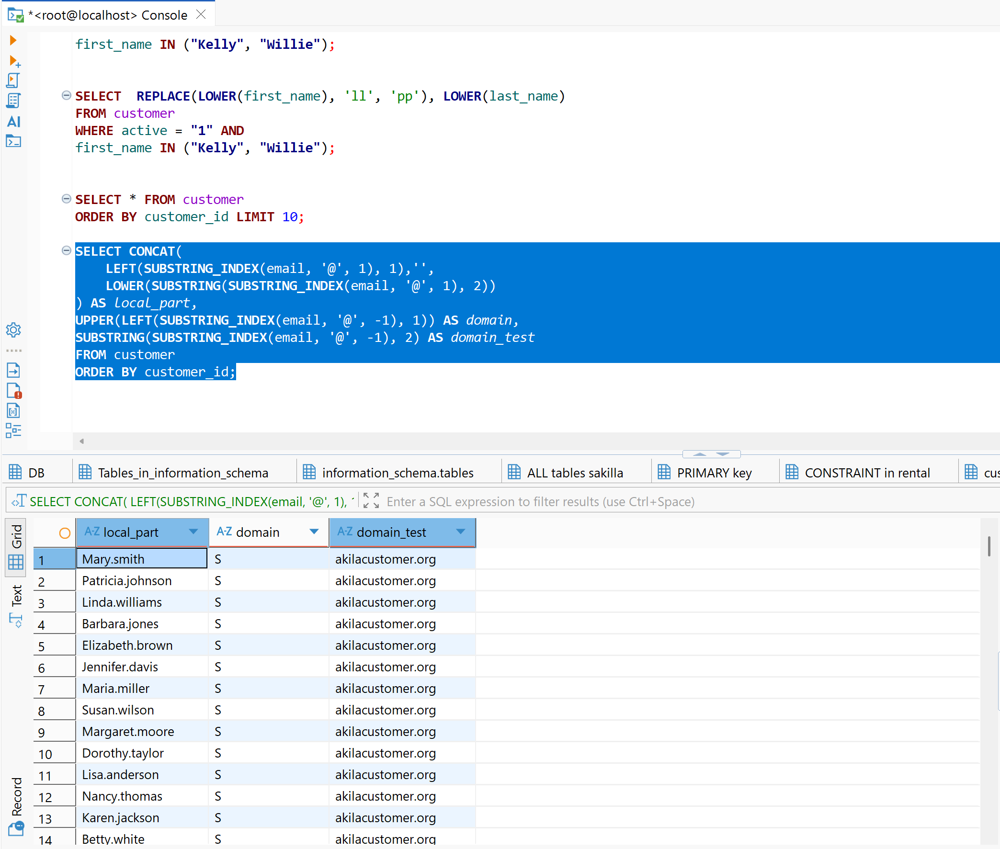

А теперь **`domain`**. Получается итоговый запрос:

    SELECT CONCAT(
        LEFT(SUBSTRING_INDEX(email, '@', 1), 1),'',
        LOWER(SUBSTRING(SUBSTRING_INDEX(email, '@', 1), 2))	
    ) AS local_part,
    CONCAT(
        UPPER(LEFT(SUBSTRING_INDEX(email, '@', -1), 1)),'',
        SUBSTRING(SUBSTRING_INDEX(email, '@', -1), 2)
    ) AS domain
    FROM customer 
    ORDER BY customer_id;

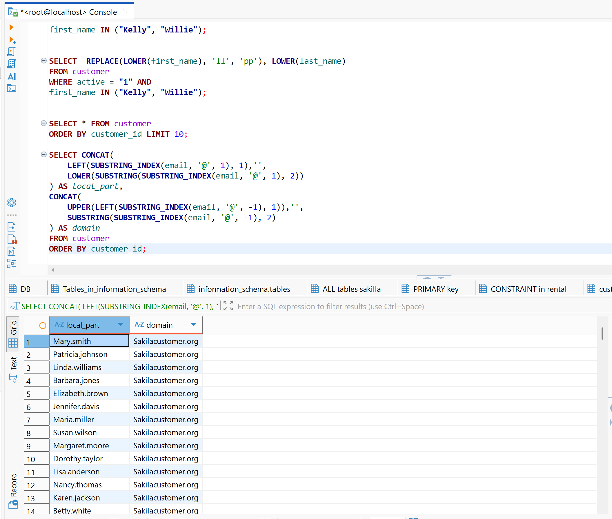

---
---
