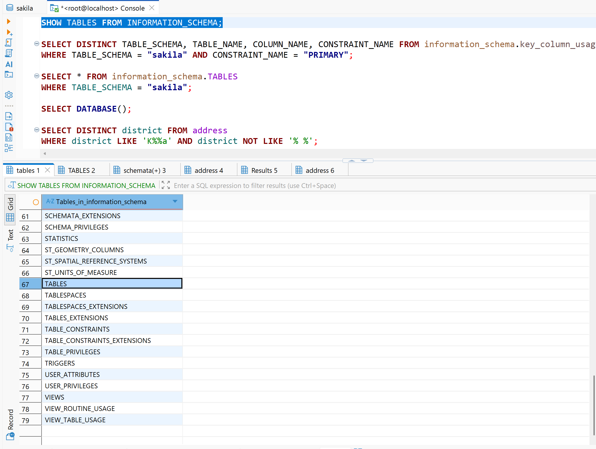
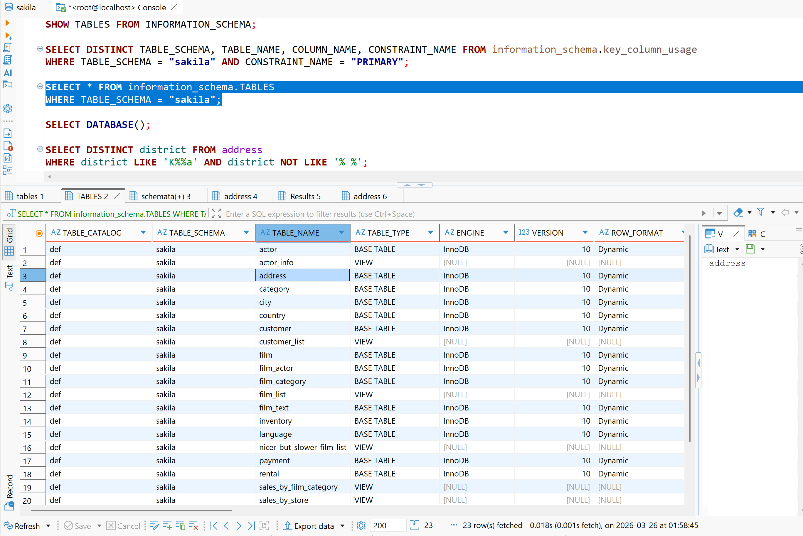
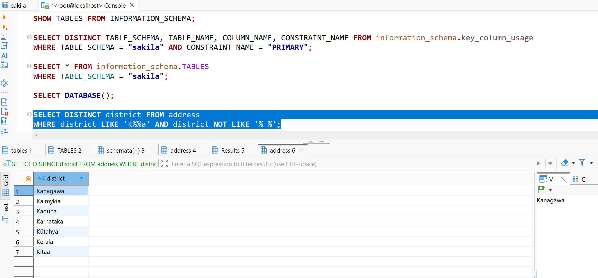
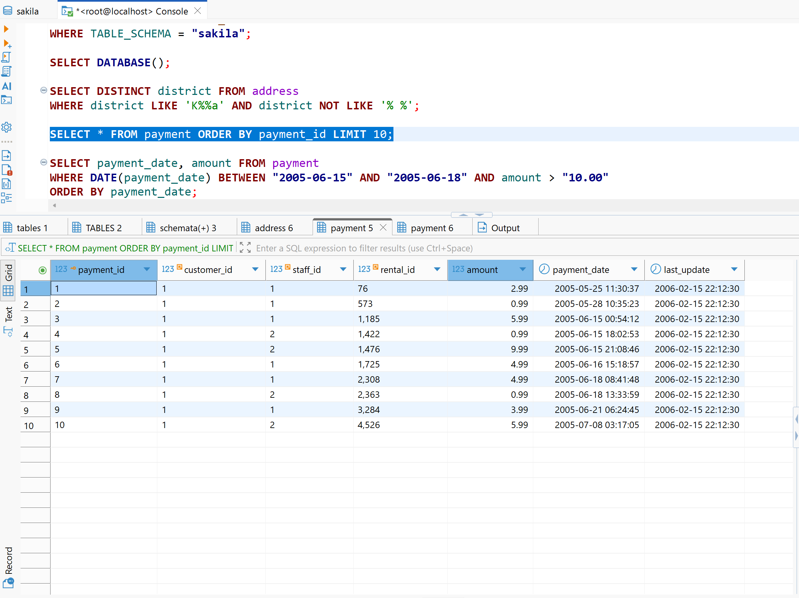
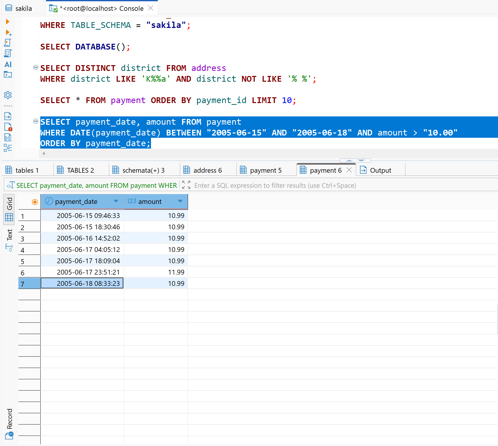

# Домашнее задание к занятию "`SQL. Часть 1`" - `Сидоров Борис`

---
---

Задание можно выполнить как в любом IDE, так и в командной строке.

### Задание 1

Получите уникальные названия районов из таблицы с адресами, которые начинаются на “K” и заканчиваются на “a” и не содержат пробелов.

---

### Решение 1
Первым делом мне нужно найти интересующую меня таблицу, над которой необходимо провести выборку по заданию. Будем исходить из того, что мне известна **`БД`** – это **`sakila`**.

Первым шагом выведу таблицы информационной схемы для поиска нужной мне схемы:

    SHOW TABLES FROM INFORMATION_SCHEMA;

Обращаясь к информационной схеме через **`SELECT FROM information_schema.TABLES`**, я могу в выводе получить весь список таблиц. Делать такой запрос через **`*`** неразумно, так как таблиц будет очень много. Лучше вывести по **`LIMIT`** несколько и понять, по какому столбцу лучше фильтровать выборку. Это будет столбец **`TABLE_SCHEMA`**, в качестве значения которого указывается наименование **`БД`**. По этому столбцу я буду делать выборку.

    SELECT * FROM information_schema.TABLES
    WHERE TABLE_SCHEMA = "sakila";

Я нашёл целевую таблицу, теперь могу с ней проводить операции.

Опущу подробности всех вариантов выборки, отмечу, что сперва я посмотрел, какие столбцы есть в этой таблице, указав **`LIMIT`**, нашёл столбец, в котором хранятся интересующие данные, вывел весь список, а дальше начал подбирать условие **`WHERE`**. Я использовал выражение **`LIKE`**, в котором можно гибко фильтровать шаблоны совпадений. Экспериментальным путём я подобрал два выражения **`LIKE`**, используя логическое **`AND`**, так чтобы в выборку попали данные, которые подходят под два условия. По итогу финальный запрос получился таким:

    SELECT DISTINCT district FROM address
    WHERE district LIKE 'K%%a' AND district NOT LIKE '% %';

В первом, используя **`%`**, указал желаемое начало строки и конец, а во втором – отрицание пустой строки в значении. Результат получился таким.

---
---

### Задание 2

Получите из таблицы платежей за прокат фильмов информацию по платежам, которые выполнялись в промежуток с 15 июня 2005 года по 18 июня 2005 года **включительно** и стоимость которых превышает 10.00.

---

### Решение 2
Определив, что целевая таблица является **`payment`**, я сделал выборку по всем столбцам, чтобы понять, в каких из них хранятся значения даты и стоимости. Дал лимит на **`10`** строк и сортировку **`ORDER BY`**, чтобы снизить нагрузку:

    SELECT * FROM payment ORDER BY payment_id LIMIT 10;

Вижу, что нужно осуществлять сортировку по столбцу **`payment_date`**, в котором хранятся данные с датой и временем, и столбцу **`amount`**, в котором хранятся данные с суммой.

Опущу подготовительные работы, в которых я сперва вывожу в **`SELECT`** два столбца с лимитом, затем пробую первые попытки отфильтровать в условии **`WHERE`** через **`BETWEEN`**. Самое главное, что в задании упоминается строгое правило: найти платежи в диапазоне дат включительно. А значит, помимо оператора **`BETWEEN`** нужно работать только с датой, чтобы совпадения были наиболее точными, ведь дата **`2005-06-18 00:00:01`** уже будет за пределами и не попадёт в выборку. Для этого в **`WHERE`** перед указанием столбца я буду использовать функцию **`DATE`**, которая поможет извлечь дату из времени. Остаётся добавить ещё одно логическое **`AND`** по столбцу **`amount`** и отсортировать в хронологии. Итоговый запрос получился таким:

    SELECT payment_date, amount FROM payment
    WHERE DATE(payment_date) BETWEEN "2005-06-15" AND "2005-06-18" AND amount > "10.00"
    ORDER BY payment_date;

---
---

