# Домашнее задание к занятию "`SQL. Часть 2`" - `Сидоров Борис`

---
---

## Задание 1

Одним запросом получите информацию о магазине, в котором обслуживается более 300 покупателей, и выведите в результат следующую информацию: 
- фамилия и имя сотрудника из этого магазина;
- город нахождения магазина;
- количество пользователей, закреплённых в этом магазине.

---

## Решение 1
Так как в задаче сказано вывести информацию, которая содержится в разных таблицах, то нужно понять, от какой таблицы нужно отталкиваться. В первом же предложении было сказано получить информацию о магазине, а это значит нужно посмотреть, какие связи есть с таблицей, связанной с информацией о магазине.

**Первым шагом** я просто выведу весь список таблиц в той базе, с которой нужно работать — в данном случае это БД **`sakila`**.

    SHOW TABLES FROM sakila;

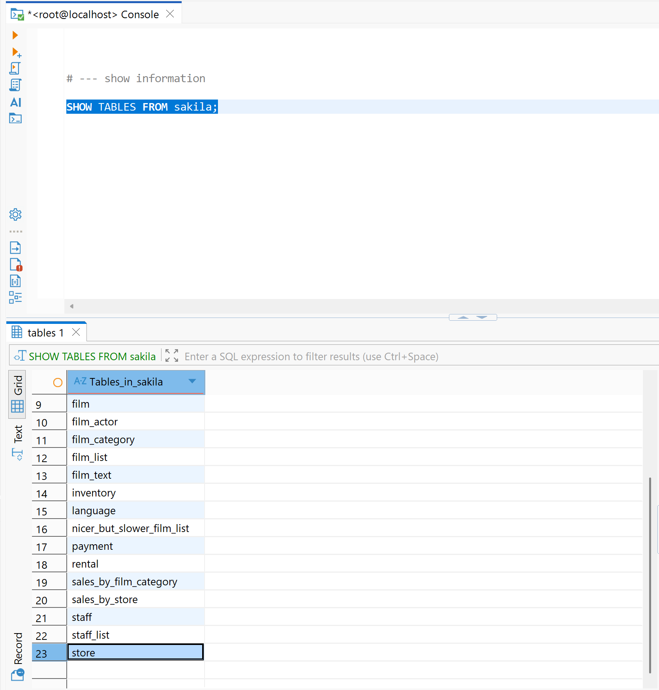

Тут уже по логике и наименованию таблиц понятно, что **`store`** скорее всего — это и есть таблица, где содержится информация о магазинах. Теперь я посмотрю, какие столбцы есть в этой таблице:

    SHOW COLUMNS FROM store FROM sakila;

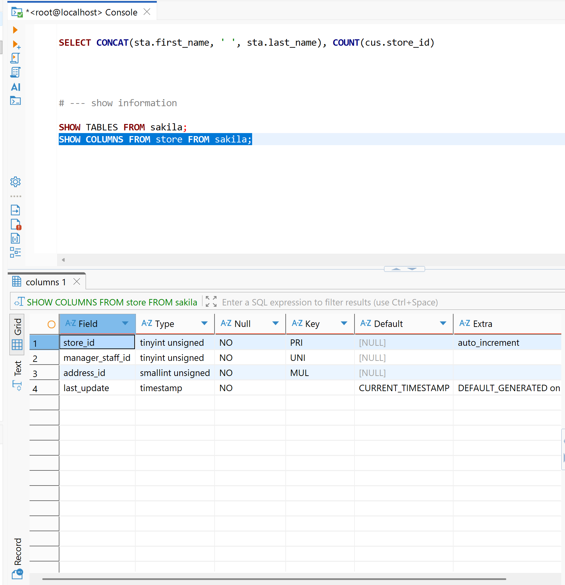

Вижу, что таблица состоит в основном из столбцов с ключами, то есть есть ограничения, за исключением столбца **`last_update`**, где, судя по всему, исходя из названия и типа данных, хранится время и дата. Всё же я посмотрю несколько строк для полноты картины. Сделаю простой **`SELECT`** через `*`, но с лимитом строк и отсортирую по первичному ключу — я уже вижу, что столбец с первичным ключом это **`store_id`**, ведь столбец **`Key`** прямо об этом говорит. Делаю запрос **`SELECT`** для просмотра содержимого, чтобы понять, какие данные там хранятся — скорее всего, там будут одни идентификаторы. Проверю:

    SELECT * FROM store
    ORDER BY store_id
    LIMIT 10;

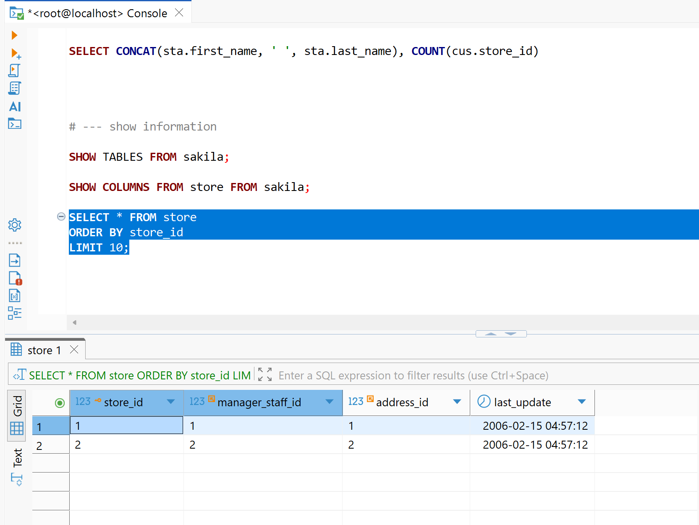

Так и есть, вижу только идентификаторы.

Для того чтобы понять, какие первичные и внешние ключи есть в этой таблице, лучше всего обратиться через **`SELECT`** к информационной схеме **`information_schema.KEY_COLUMN_USAGE`** — там можно полностью увидеть всю картину, какие ключи на какую таблицу ссылаются и по какому столбцу. Это будет идеальный вариант, так как очевидно, что итоговую выборку через **`SELECT`** придётся организовывать через **`JOIN`**. Ранее я уже практиковал обращение к этой информационной схеме, поэтому сделал для себя небольшой скрипт:

    SELECT
        TABLE_NAME, 
        COLUMN_NAME, 
        CONSTRAINT_NAME key_column,
        REFERENCED_TABLE_NAME REFERENCED_TABLE, 
        REFERENCED_COLUMN_NAME REFERENCED_COLUMN
    FROM information_schema.KEY_COLUMN_USAGE
    WHERE TABLE_SCHEMA = "имя_бд" 
    AND TABLE_NAME = "имя_таблицы";

В выборке **`SELECT`** я вызываю те столбцы, которые мне нужны для понимания, какие столбцы содержат ключи и куда они ссылаются в случае, если этот ключ будет являться внешним. В столбце **`TABLE_SCHEMA`** явно укажу целевую БД, а в столбце **`TABLE_NAME`** — целевую таблицу.

    SELECT
    	TABLE_NAME,
    	COLUMN_NAME,
    	CONSTRAINT_NAME AS `key_column`,
    	REFERENCED_TABLE_NAME AS `REFERENCED_TABLE`,
    	REFERENCED_COLUMN_NAME AS `REFERENCED_COLUMN`
    FROM information_schema.KEY_COLUMN_USAGE
    WHERE TABLE_SCHEMA = "sakila"
    AND TABLE_NAME = "store";

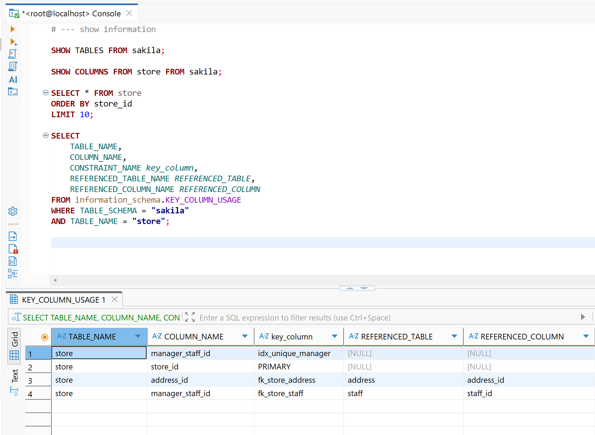

Картина уже более ясная — я вижу, что есть пара внешних ключей в таблице **`store`** по столбцам **`address_id`** и **`manager_staff_id`**.

Пожалуй, первым делом найду, кто закреплён за магазинами. Скорее всего, эту информацию я увижу в таблице **`staff`**, ведь на скриншоте чётко видно, что столбец **`manager_staff_id`** ссылается на таблицу **`staff`** через столбец **`staff_id`**.

**Первый JOIN** уже понятен, но сперва я также хочу посмотреть, что есть в таблице **`staff`**. Для этого я сделаю всё то же самое, что и по таблице **`store`** — посмотрю, какие есть колонки, и сделаю выборку на несколько строк, отсортировав по первичному ключу. Я уже вижу, что столбец с первичным ключом это **`staff_id`**, ведь столбец **`Key`** прямо об этом говорит. Делаю запрос **`SELECT`**:

    SHOW COLUMNS FROM staff FROM sakila;

    SELECT * FROM staff
    ORDER BY staff_id
    LIMIT 10;

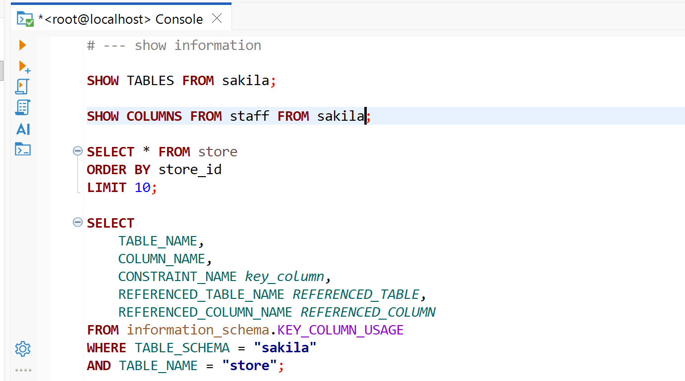

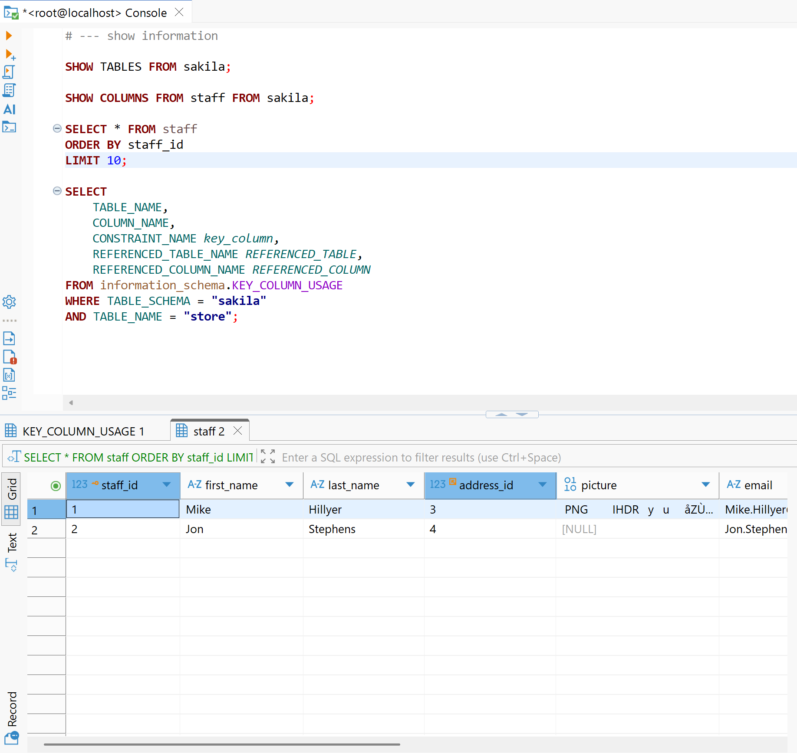

Вижу, что в таблице **`staff`** всего два сотрудника. Есть столбцы **`first_name`**, **`last_name`** — можно делать первый **`JOIN`** в итоговом запросе. **`JOIN`** буду делать через внешний ключ, который я увидел в информационной схеме таблицы **`store`**:

    SELECT sre.store_id, CONCAT(stf.first_name, ' ', stf.last_name)
    FROM store sre
    JOIN staff stf ON stf.staff_id = sre.manager_staff_id;

В запросе я добавил псевдонимы к таблицам, и, обращаясь к таблице **`staff`**, сделал склейку через функцию **`CONCAT`** по столбцам **`first_name`** и **`last_name`**. В итоге я получаю, кто закреплён за магазином номер 1 и 2.

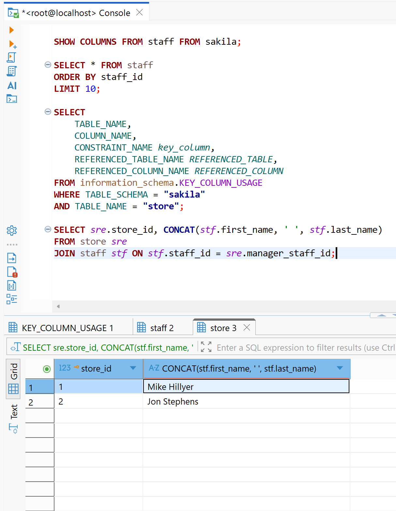

Далее мне нужно добраться до таблицы, где есть информация о городе. Возвращаюсь к внешним ключам таблицы **`store`** и вижу, что один из ключей ссылается на таблицу **`address`** по столбцу **`address_id`** таблицы **`store`**. Так как больше внешних ключей в таблице **`store`** я не вижу, то в любом случае нужно делать **`JOIN`** с таблицей **`address`**. Дописываю основной запрос **`SELECT`**:

    SELECT sre.store_id, CONCAT(stf.first_name, ' ', stf.last_name) name
    FROM store sre
    JOIN staff stf ON stf.staff_id = sre.manager_staff_id
    JOIN address adr ON adr.address_id = sre.address_id;

Но пока непонятно, в каком столбце хранится информация о городе. Как и раньше, я посмотрю все столбцы таблицы **`address`** и несколько строк информации:

    SHOW COLUMNS FROM address FROM sakila;

    SELECT * FROM address
    ORDER BY address_id
    LIMIT 10;

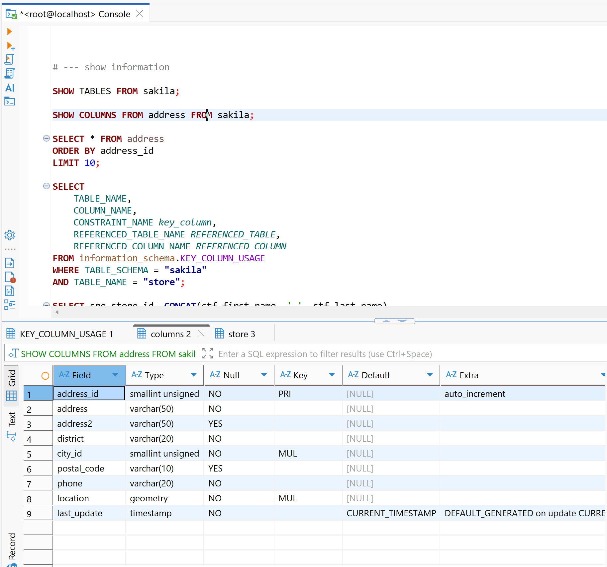

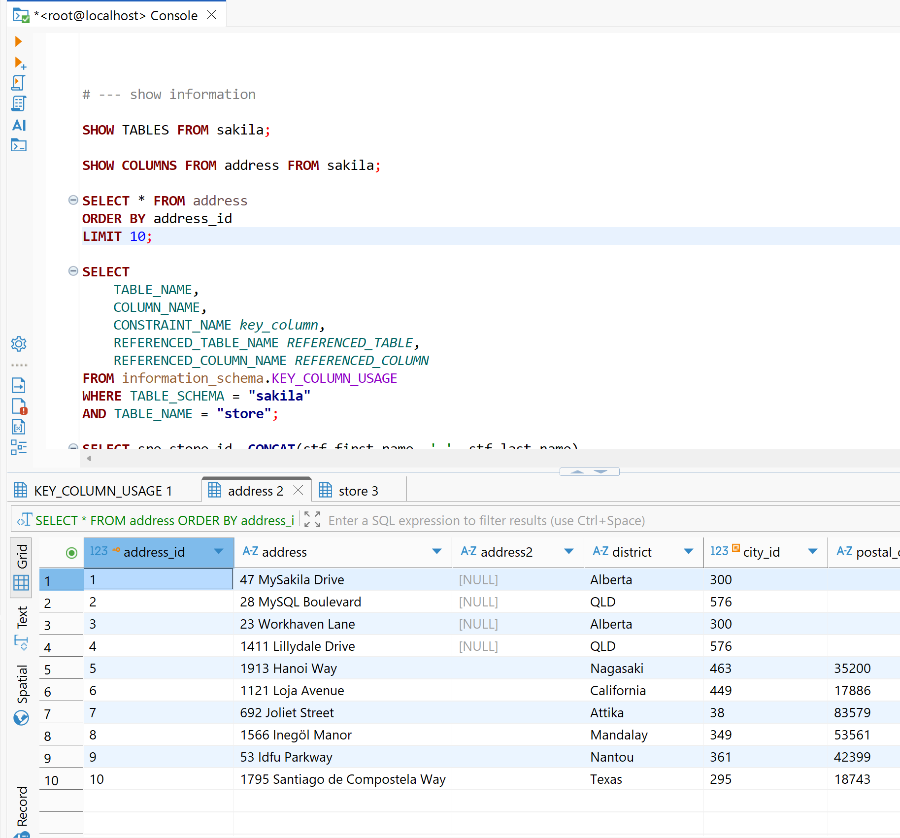

В таблице **`address`** я не вижу столбца, в котором содержится наименование города, что мне нужно по задаче, поэтому нужно двигаться дальше и искать внешние ключи уже в таблице **`address`**. Возможно, есть ещё таблица, где может находиться нужная мне информация.

Делаю запрос через информационную схему, но уже по таблице **`address`**:

    SELECT
    	TABLE_NAME,
    	COLUMN_NAME,
    	CONSTRAINT_NAME AS `key_column`,
    	REFERENCED_TABLE_NAME AS `REFERENCED_TABLE`,
    	REFERENCED_COLUMN_NAME AS `REFERENCED_COLUMN`
    FROM information_schema.KEY_COLUMN_USAGE
    WHERE TABLE_SCHEMA = "sakila"
    AND TABLE_NAME = "address";

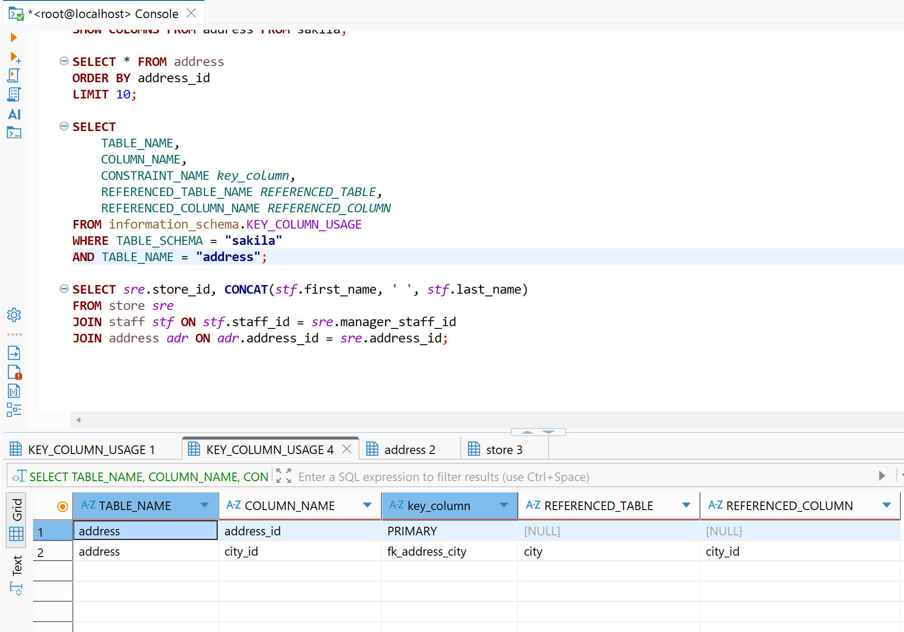

Вижу, что есть внешний ключ на таблицу **`city`**, ссылающийся на столбец **`city_id`**. Скорее всего, это то, что нужно. Есть понимание, какой **`JOIN`** и как его сделать, но пока непонятно, действительно ли в таблице **`city`** есть информация о городах. Проверю так же, как это делал с другими таблицами:

    SHOW COLUMNS FROM city FROM sakila;

    SELECT * FROM city
    ORDER BY city_id
    LIMIT 10;

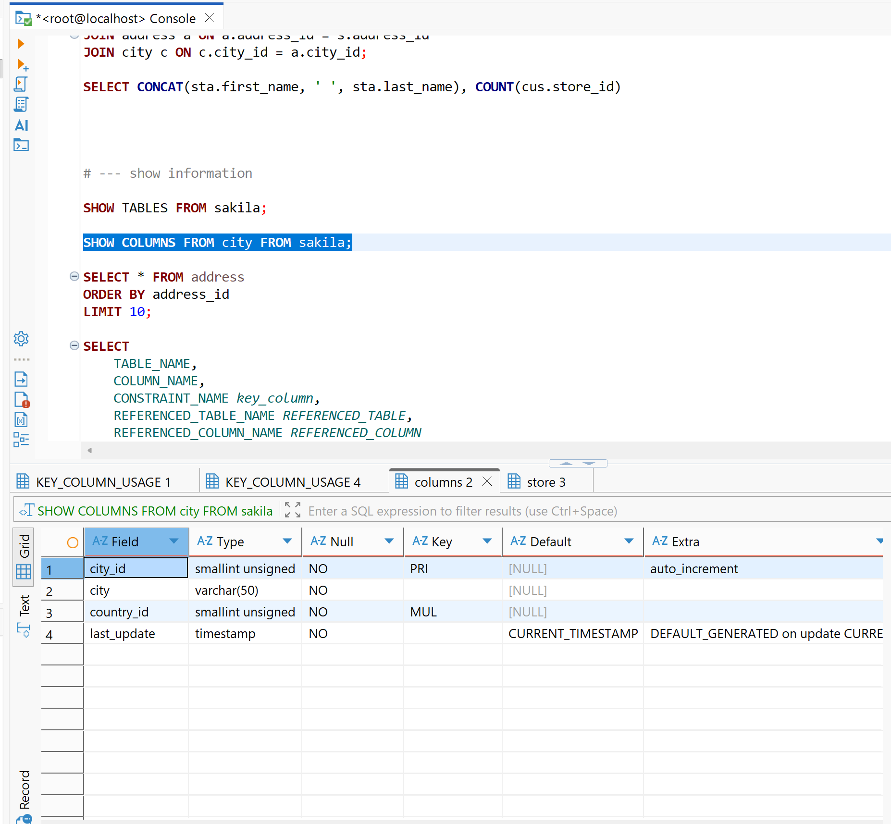

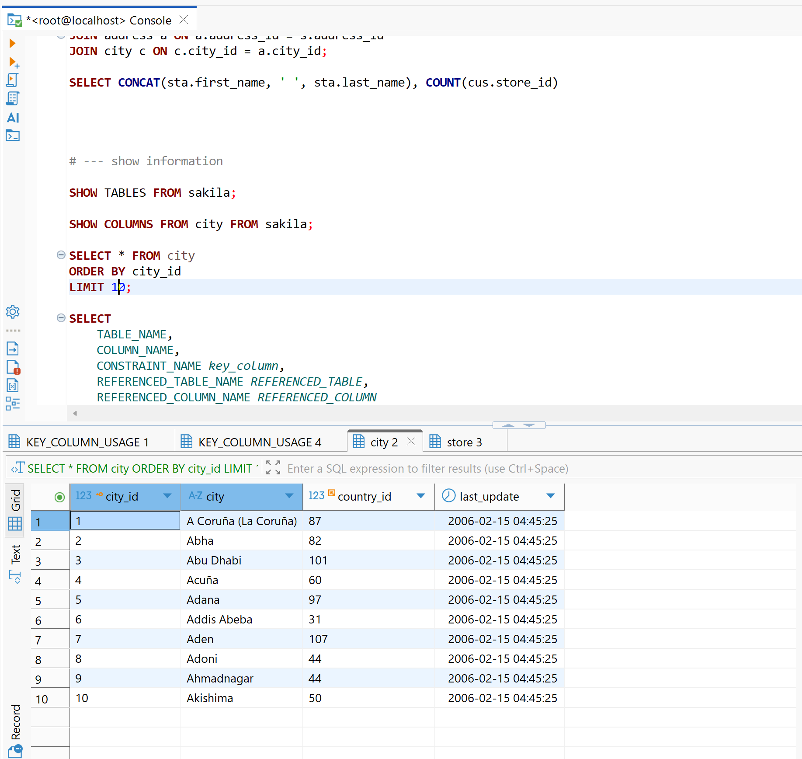

Да, действительно в таблице **`city`** есть столбец со списком городов — можно смело делать **`JOIN`**, и в **`SELECT`** добавлять столбец **`city`** из таблицы **`city`**. Теперь основной запрос выглядит так:

    SELECT sre.store_id, CONCAT(stf.first_name, ' ', stf.last_name) name, cty.city
    FROM store sre
    JOIN staff stf ON stf.staff_id = sre.manager_staff_id
    JOIN address adr ON adr.address_id = sre.address_id
    JOIN city cty ON cty.city_id = adr.city_id;

.png)

Таким образом, у меня есть данные об идентификаторе магазина, кто к какому магазину закреплён, и в каком городе находится магазин.

Далее нужно понять, сколько покупателей относятся к магазину 1 и 2. Внешних ключей в таблице **`store`** больше нет, но есть первичный ключ **`store_id`**, и, скорее всего, какая-то таблица может ссылаться на этот ключ. Это можно узнать, снова обратившись к информационной схеме, немного изменив запрос, добавив в **`WHERE`** по столбцу **`REFERENCED_COLUMN_NAME`** первичный ключ **`store_id`** и по столбцу **`REFERENCED_TABLE_NAME`** — таблицу **`store`**. Так я точно увижу, какие таблицы ссылаются на первичный ключ целевой таблицы **`store`**. Пробую сделать запрос:

    SELECT
    	TABLE_NAME,
    	COLUMN_NAME,
    	CONSTRAINT_NAME AS `key_column`,
    	REFERENCED_TABLE_NAME AS `REFERENCED_TABLE`,
    	REFERENCED_COLUMN_NAME AS `REFERENCED_COLUMN`
    FROM information_schema.KEY_COLUMN_USAGE
    WHERE REFERENCED_COLUMN_NAME = 'store_id'
    AND REFERENCED_TABLE_NAME = 'store';

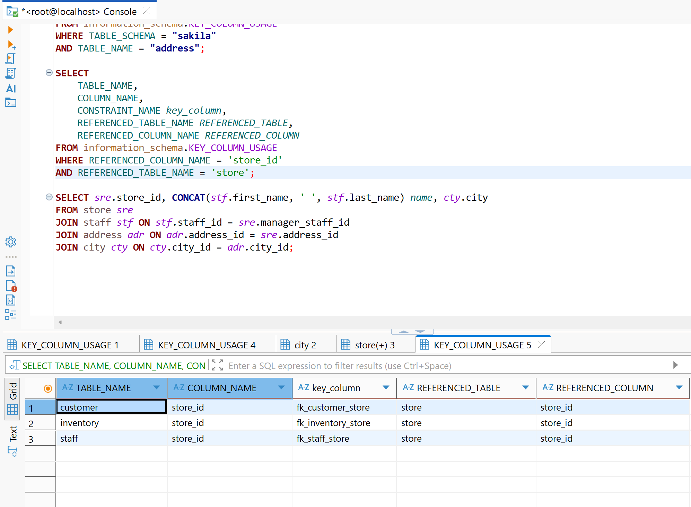

Вот теперь я вижу, какие таблицы ссылаются на **`store`**, и одна из них — **`customer`**. Скорее всего, это то, что нужно, но лучше проверить, что есть в этой таблице:

    SHOW COLUMNS FROM customer FROM sakila;

    SELECT * FROM customer
    ORDER BY customer_id
    LIMIT 10;

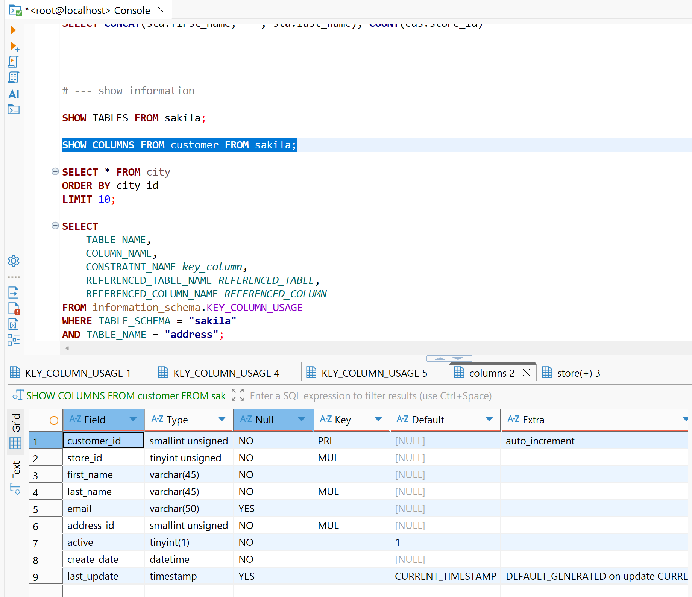

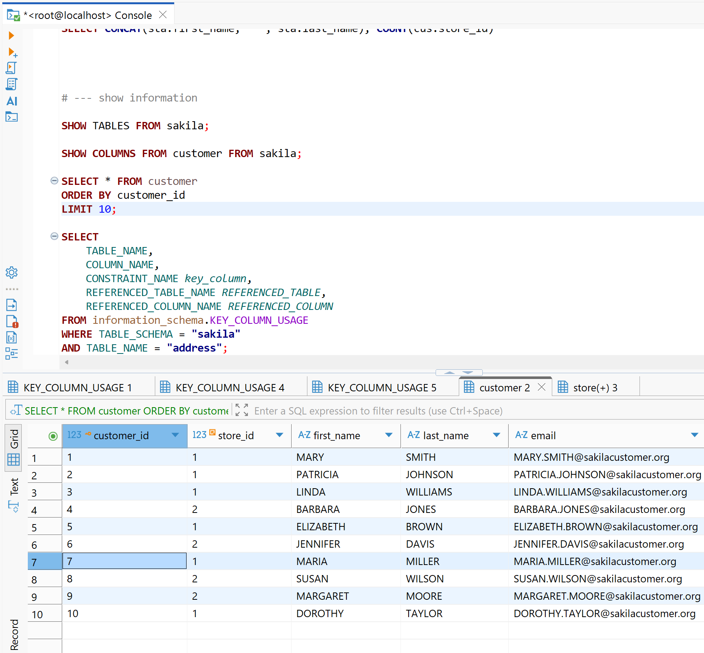

Да, это то, что нужно — это точно покупатели, которые ссылаются по столбцу **`store_id`**. Можно добавлять ещё один **`JOIN`**, и я уже знаю, по каким столбцам это делать. Дописываю основной запрос **`SELECT`**:

    SELECT sre.store_id, CONCAT(stf.first_name, ' ', stf.last_name) name, cty.city
    FROM store sre
    JOIN staff stf ON stf.staff_id = sre.manager_staff_id
    JOIN address adr ON adr.address_id = sre.address_id
    JOIN city cty ON cty.city_id = adr.city_id
    JOIN customer cus ON cus.store_id = sre.store_id;

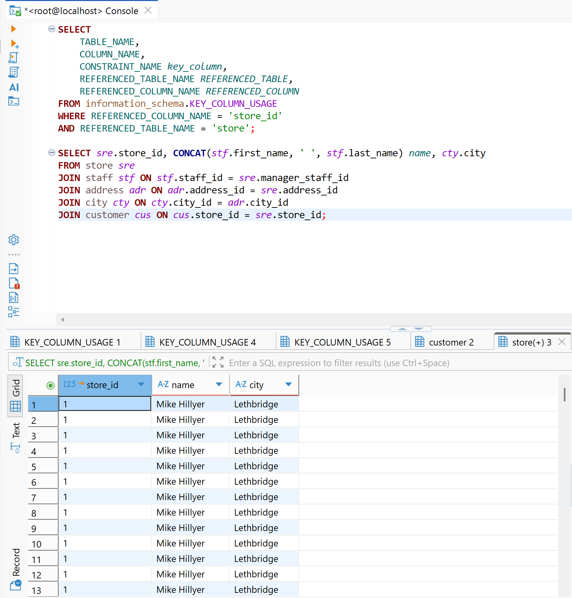

В выводе вижу много строк — это логично, так как покупателей много, и каждый покупатель уникален со своим **`id`**, поэтому каждый покупатель привязывается к конкретному магазину через ключ **`store_id`**. Значит, теперь мне нужно подсчитать количество ссылающихся покупателей. Это можно сделать через агрегирующую функцию **`COUNT`** по столбцу **`store_id`**, но для этого нужно сгруппировать вывод по этому столбцу, используя оператор **`GROUP BY`**. Дописываю основной запрос **`SELECT`**:

    SELECT COUNT(sre.store_id), CONCAT(stf.first_name, ' ', stf.last_name) name, cty.city
    FROM store sre
    JOIN staff stf ON stf.staff_id = sre.manager_staff_id
    JOIN address adr ON adr.address_id = sre.address_id
    JOIN city cty ON cty.city_id = adr.city_id
    JOIN customer cus ON cus.store_id = sre.store_id
    GROUP BY sre.store_id;

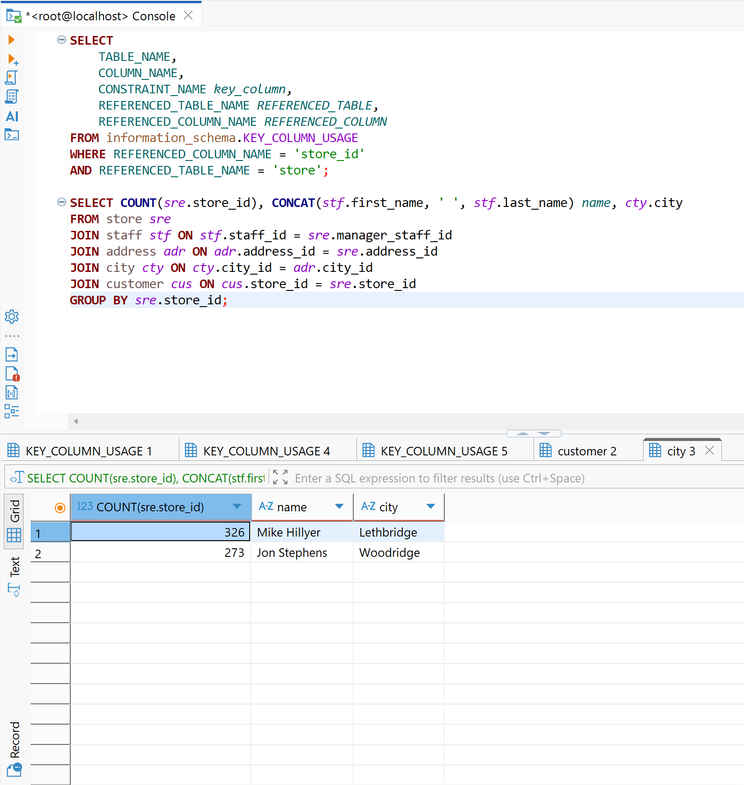

Почти готово, осталось отфильтровать вывод по условию, где покупателей будет больше 300, но есть проблема в том, что я в таком запросе не вижу идентификаторов магазина, а только результат агрегирующей функции **`COUNT()`**. Столбец **`store_id`** в таблице **`store`** — это основной столбец и он функционально зависимый, поэтому я его и указал в обычном виде в **`GROUP BY`**. Чтобы не ломать логику, я просто ещё раз добавлю столбец **`sre.store_id`** в **`SELECT`**, но без использования агрегатной функции **`COUNT()`**, так как этот столбец функционально зависимый — запрос выполнится без ошибки, просто добавится ещё один столбец **`store_id`**. Пробую выполнить запрос:

    SELECT sre.store_id, COUNT(sre.store_id), CONCAT(stf.first_name, ' ', stf.last_name) name, cty.city
    FROM store sre
    JOIN staff stf ON stf.staff_id = sre.manager_staff_id
    JOIN address adr ON adr.address_id = sre.address_id
    JOIN city cty ON cty.city_id = adr.city_id
    JOIN customer cus ON cus.store_id = sre.store_id
    GROUP BY sre.store_id;

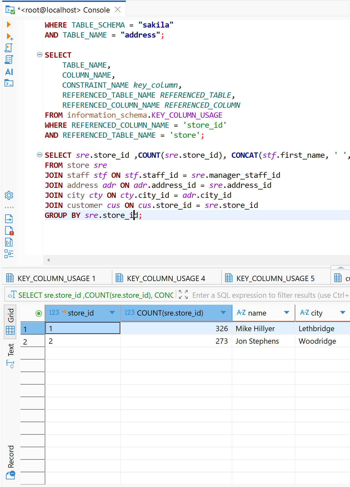

Вот теперь есть полная картина: уникальный номер магазина, количество связанных с этим магазином покупателей, имя и фамилия сотрудника, который закреплён за магазином, и город, где находится данный магазин. Названия магазина я не нашёл — в таблице **`store`** такого столбца нет, да и связующей таблицы, где бы находилась информация с названием, тоже отсутствует, поэтому выведу только цифровой идентификатор.

Осталось отфильтровать вывод по условию задачи, где количество пользователей, закреплённых за магазином, более 300. Оператор **`WHERE`** уже не подойдёт, так как в запросе присутствует оператор **`GROUP BY`**, поэтому буду использовать оператор **`HAVING`**. Итоговый запрос получился таким:

    SELECT sre.store_id, COUNT(sre.store_id), CONCAT(stf.first_name, ' ', stf.last_name) name, cty.city
    FROM store sre
    JOIN staff stf ON stf.staff_id = sre.manager_staff_id
    JOIN address adr ON adr.address_id = sre.address_id
    JOIN city cty ON cty.city_id = adr.city_id
    JOIN customer cus ON cus.store_id = sre.store_id
    GROUP BY sre.store_id
    HAVING COUNT(sre.store_id) > 300;

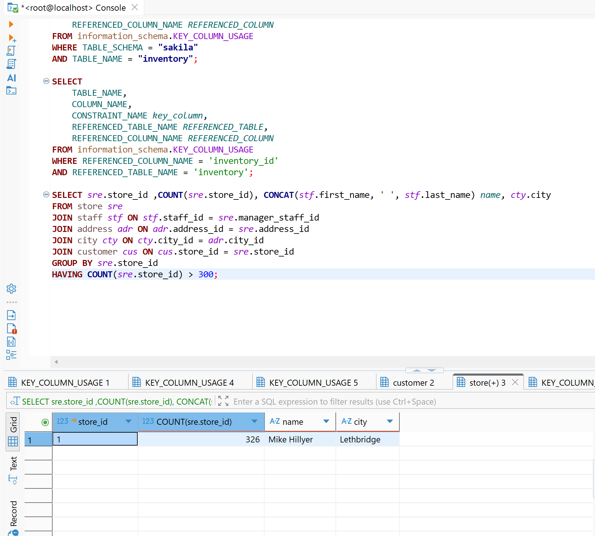

---
---

## Задание 2

Получите количество фильмов, продолжительность которых больше средней продолжительности всех фильмов.

---

## Решение 2
Задача связана с фильмами, значит сразу выведу все столбцы целевой таблицы **`film`** и выведу несколько строк для просмотра содержимого таблицы:

    SHOW COLUMNS FROM film FROM sakila;

    SELECT * FROM film
    ORDER BY film_id
    LIMIT 10;

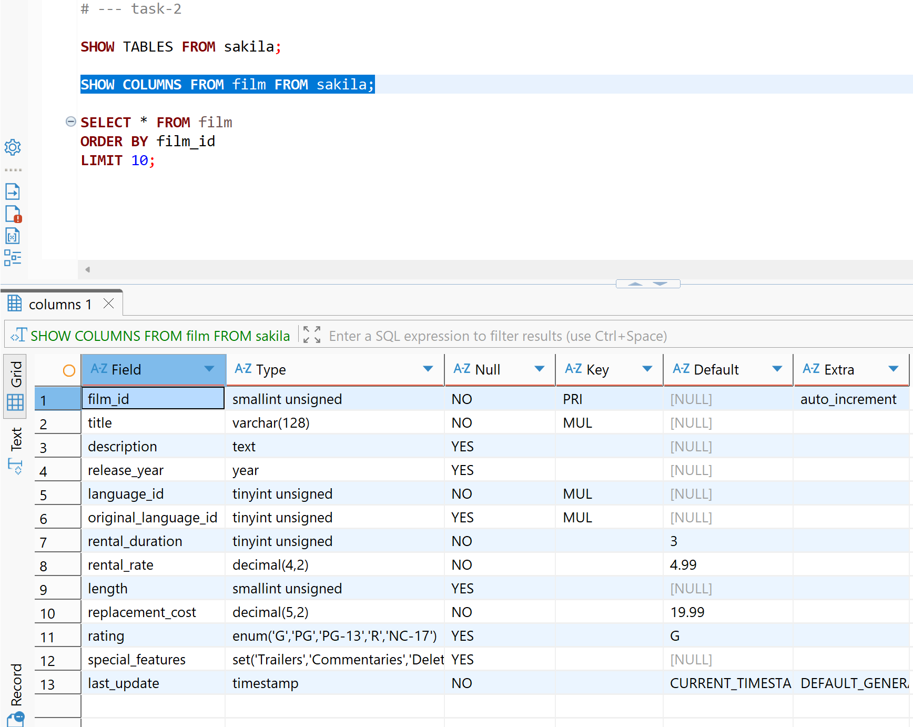

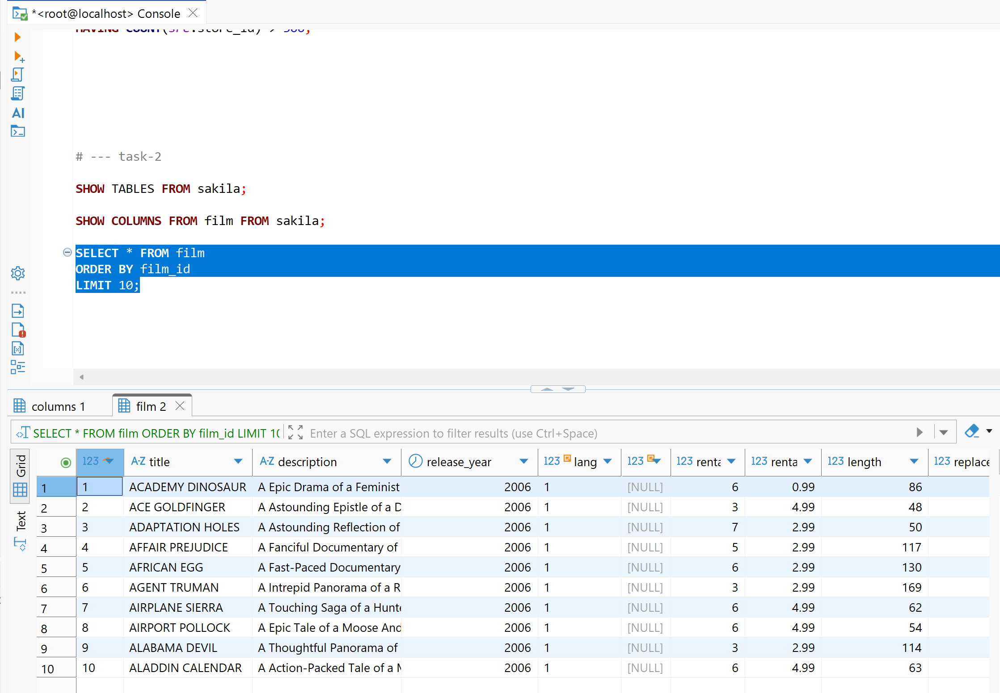

Вижу, что есть столбец **`length`**, в котором хранится значение длины фильма. Попробую в запросе сделать агрегирующую функцию **`AVG()`**, которая как раз и рассчитает среднее число всех значений в этом столбце:

    SELECT AVG(length) FROM film;

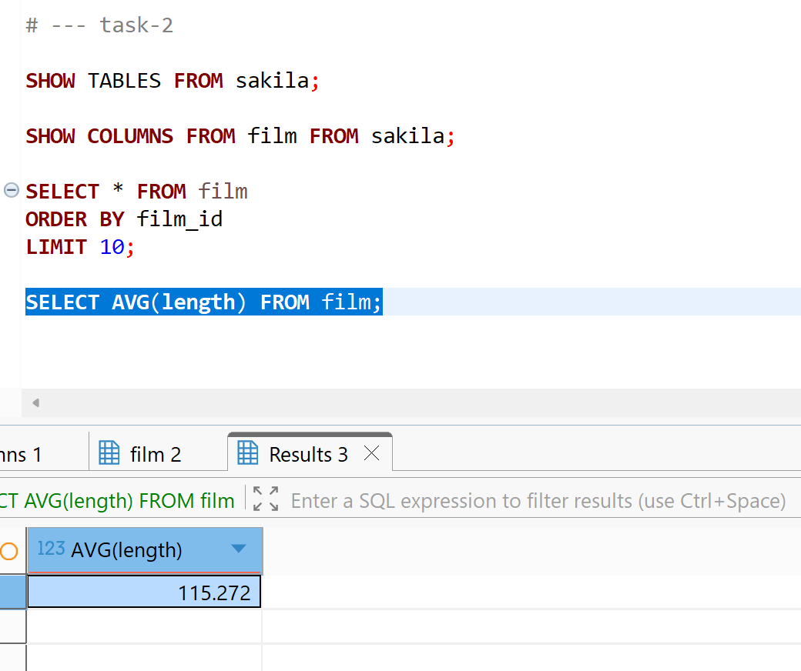

У меня есть это среднее значение. Теперь я посчитаю, а какое общее количество фильмов. Для этого я применю агрегирующую функцию **`COUNT()`** к первичному ключу, т.е. к столбцу **`film_id`**, в котором значения уникальны и не будут повторяться, а значит можно ориентироваться именно на этот столбец для подсчёта общего количества фильмов:

    SELECT COUNT(film_id) FROM film;

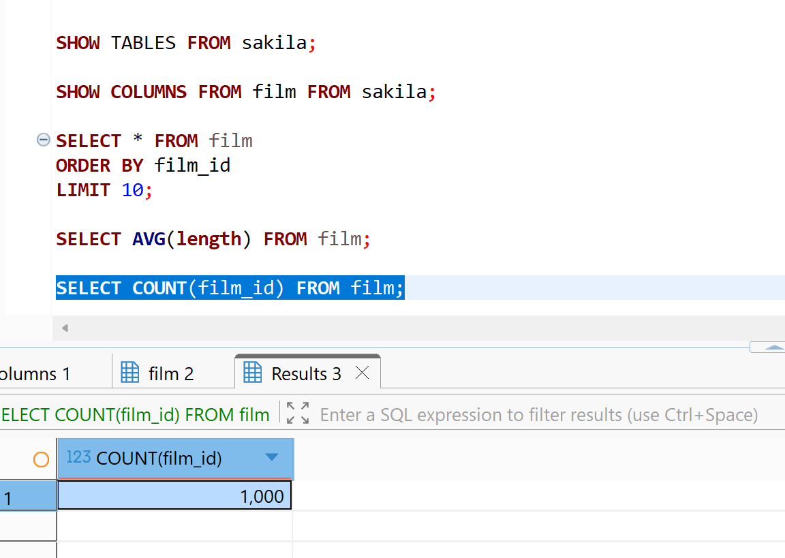

Вижу, что всего **`1000`** фильмов, число достаточно большое. Теперь я проверю, правильно ли сработает оператор **`WHERE`**, в котором я буду сравнивать столбец **`length`** с вложенным запросом, где вычисляли среднее значение продолжительности фильмов. Только поставлю лимит на **`50`** строк, чтобы точно быть уверенным, что в список не попадут позиции, где значение столбца **`length`** будет меньше **`115`**.

    SELECT film_id, title, length
    FROM film
    WHERE length > (SELECT AVG(length) FROM film)
    LIMIT 50;

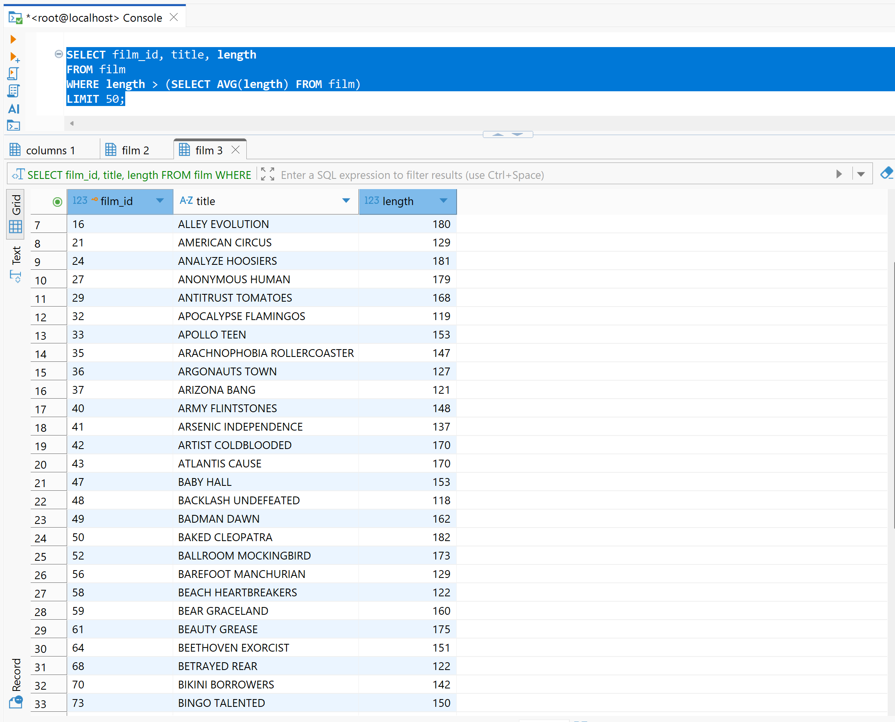

В выборке всё нормально, условие **`WHERE`** сработало. Остаётся теперь в запросе просто обернуть столбец **`film_id`** в агрегирующую функцию **`COUNT`**, применив отработанное **`WHERE`**, тем самым получу количество идентификаторов фильмов по заданному условию. Итоговый запрос получился таким:

    SELECT COUNT(film_id)
    FROM film
    WHERE length > (SELECT AVG(length) FROM film);

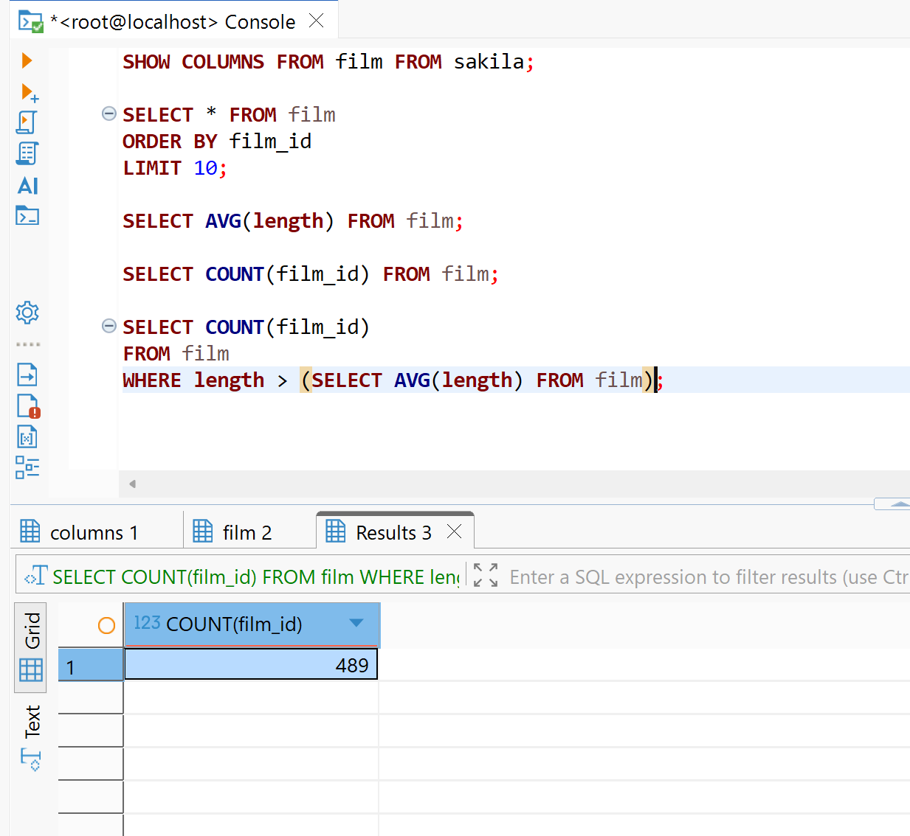

---
---

## Задание 3

Получите информацию, за какой месяц была получена наибольшая сумма платежей, и добавьте информацию по количеству аренд за этот месяц.

---

## Решение 3
В задаче сказано произвести выборку по суммам платежей, значит нужна таблица, где содержится эта информация. Посмотрев список таблиц в базе **`sakila`**, пришёл к выводу, что скорее всего это таблица **`payment`**. Как и раньше, выведу все столбцы и посмотрю в другом запросе несколько строк для наглядности:

    SHOW COLUMNS FROM payment FROM sakila;

    SELECT * FROM payment 
    ORDER BY payment_id
    LIMIT 10;

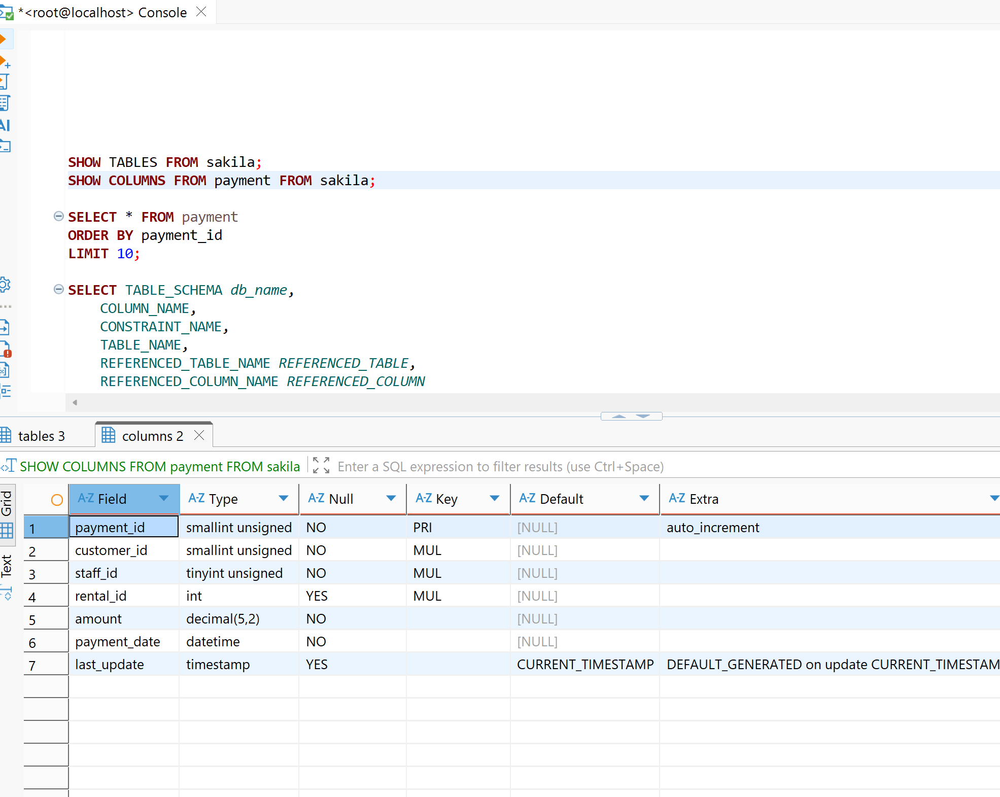

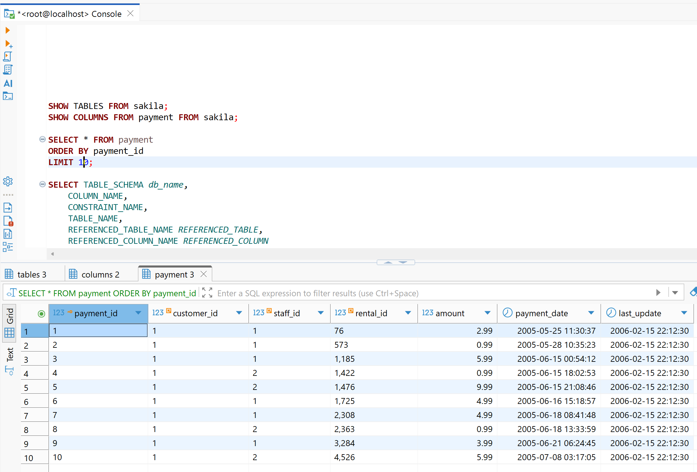

В таблице уже есть весь необходимый мне набор данных. Первым делом нужно что-то сделать с датами платежей, ведь в задании сказано вывести данные за конкретный месяц, а значит день и время мне не нужны. Поработаю над форматом данных этого столбца. Используя функцию для работы с датой **`DATE_FORMAT`**, я могу получить вывод, указывая только год и месяц. Попробую вывести несколько строк по столбцу **`payment_date`**, использовав эту функцию:

    SELECT DATE_FORMAT(payment_date, '%Y-%m')
    FROM payment
    LIMIT 10;

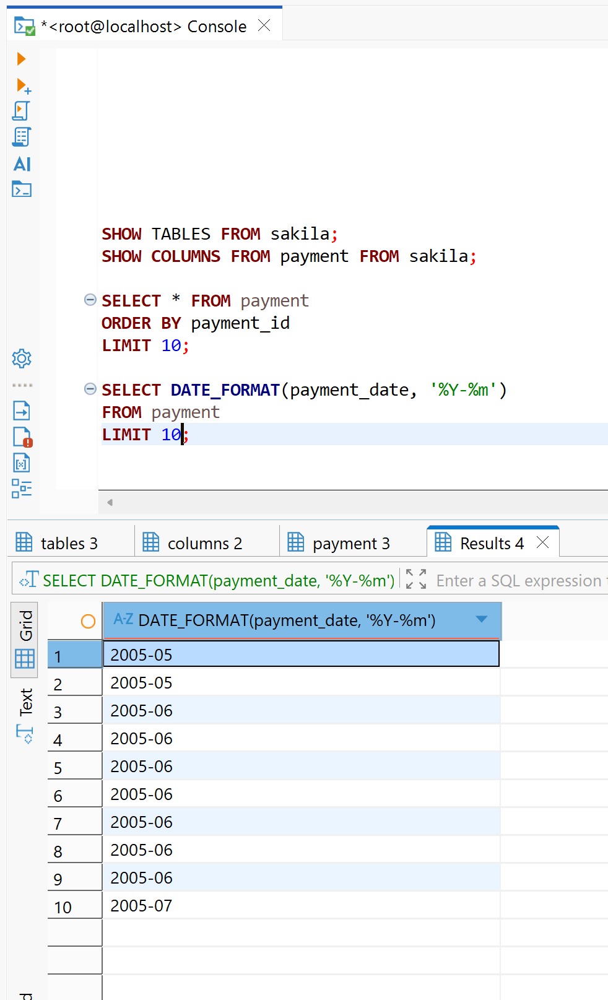

А теперь для полноты картины выведу ещё столбцы, которые требуются по задаче: это сумма **`amount`** и аренда **`rental_id`**. Опустив изучение внешнего ключа по данной таблице, я пришёл к выводу, что столбец **`rental_id`** является внешним ключом на идентификатор аренды, поэтому точно можно ориентироваться на этот столбец. В итоге получается такая картина:

    SELECT DATE_FORMAT(payment_date, '%Y-%m'), amount, rental_id 
    FROM payment
    LIMIT 10;

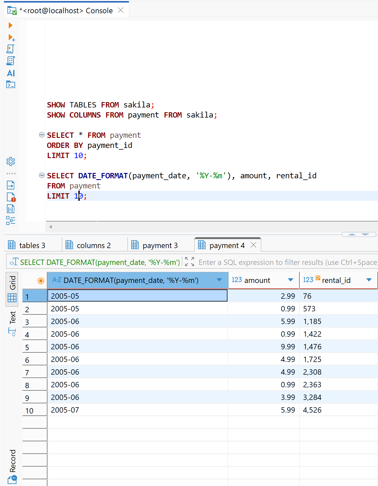

Так уже лучше. Имея данное представление, напрашивается следующим шагом провести агрегацию данных по суммам и арендам. Столбец **`amount`** оберну в функцию **`SUM()`**, а **`rental_id`** в **`COUNT()`**. Такая идея возникла вследствие условия задания, где сказано, что нужно найти данные в рамках одного месяца, а это значит, что нужно подсчитать все платежи за месяц, а также сколько таких платежей было. Поэтому **`SUM()`** и **`COUNT()`** — это самое очевидное решение. Так как столбец **`payment_date`** у меня уже в верном формате, мне остаётся сгруппировать задуманную выборку по этому столбцу в новом формате. Пробую написать запрос:

    SELECT DATE_FORMAT(payment_date, '%Y-%m'), SUM(amount), COUNT(rental_id)  
    FROM payment
    GROUP BY DATE_FORMAT(payment_date, '%Y-%m')
    LIMIT 10;

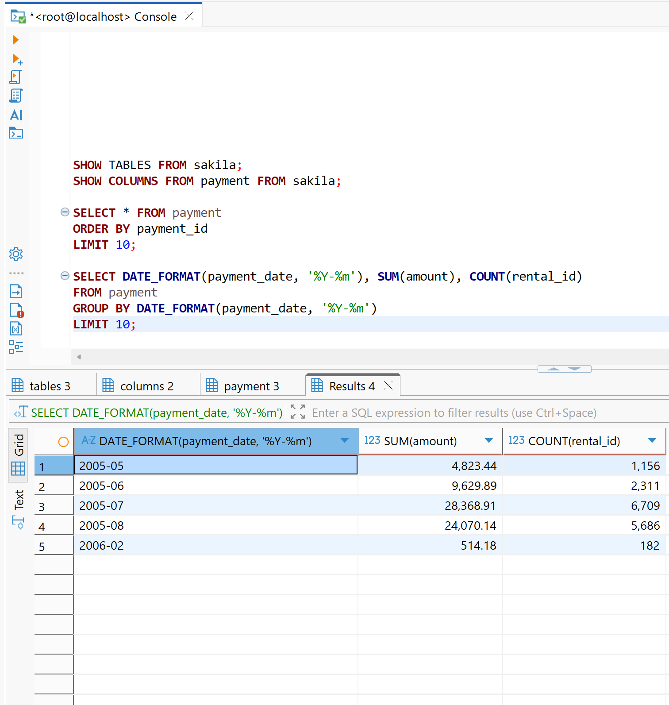

Я уже вижу финальный результат, но это только из-за того, что данных не так много в таблице. Теперь мне нужно как-то осуществить фильтрацию по максимальному значению суммы платежей за месяц. Применить агрегацию **`MAX`** к уже сгруппированным данным, да к тому же также подвергшимся агрегации, не получится — я получаю ошибку в выводе. Но я могу прибегнуть к вложенному запросу после **`FROM`**. Так я по сути получу некую абстракцию, виртуальную таблицу, только нужно будет задать вложенному запросу псевдоним, как я это делал с задачей, где было несколько **`JOIN`**. Попробую через **`SELECT`** и **`FROM`** получить результат только одного интересующего меня столбца **`SUM(amount)`**:

    SELECT total.sum
    FROM (
        SELECT SUM(amount) AS sum 
        FROM payment
        GROUP BY 
        DATE_FORMAT(payment_date, '%Y-%m')
    ) AS total;

Тут я делаю селект к результату вложенного запроса. После **`FROM`** **`total`** — это псевдоним виртуальной таблицы во вложенном запросе, где осуществляется группировка по дате в нужном мне формате, а **`sum`** — это псевдоним столбца виртуальной таблицы. Получается, что в основном **`SELECT`** я обращаюсь к виртуальной таблице **`total`** и столбцу **`sum`** по псевдонимам, практически так же, как это я делал в случае с **`JOIN`**.

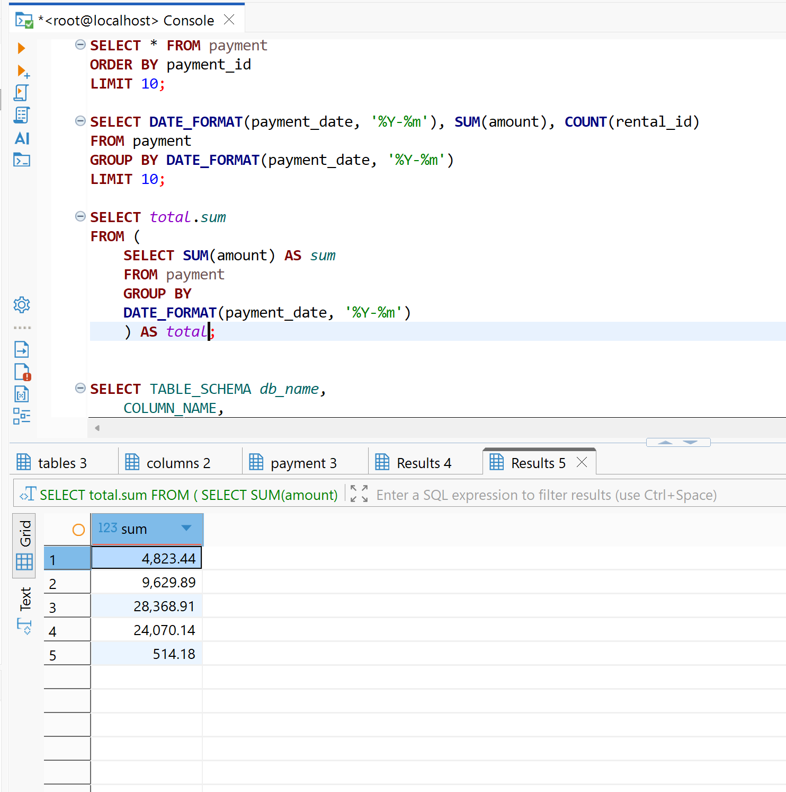

А что, если я сделаю не просто **`SELECT`**, а использую агрегирующую функцию **`MAX`**? Попробую:

    SELECT MAX(total.sum) 
    FROM (
        SELECT SUM(amount) AS sum 
        FROM payment
        GROUP BY 
        DATE_FORMAT(payment_date, '%Y-%m')
    ) AS total;

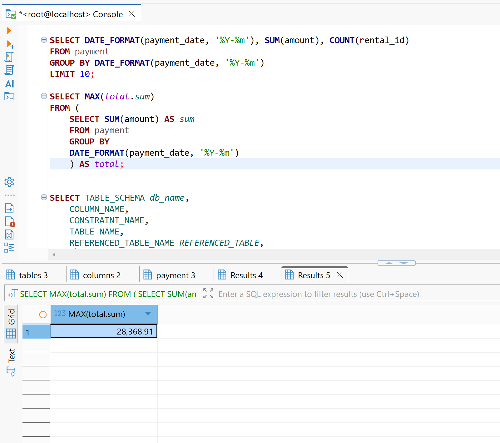

Я получил максимальное значение из нескольких строк. Проверив с предыдущим результатом, всё верно — это максимальная сумма за определённый месяц. Таким образом, получившийся запрос я могу использовать как значение, по которому смогу отфильтровать предыдущий запрос с группировкой, применив оператор **`HAVING`** и сравнивая по столбцу **`SUM(amount)`**. Попробую:

    SELECT DATE_FORMAT(payment_date, '%Y-%m'), SUM(amount), COUNT(rental_id)  
    FROM payment
    GROUP BY DATE_FORMAT(payment_date, '%Y-%m')
    HAVING SUM(amount) = 
        (
        SELECT MAX(total.sum) 
        FROM (
            SELECT SUM(amount) AS sum 
            FROM payment
            GROUP BY 
            DATE_FORMAT(payment_date, '%Y-%m')
        ) AS total
        );

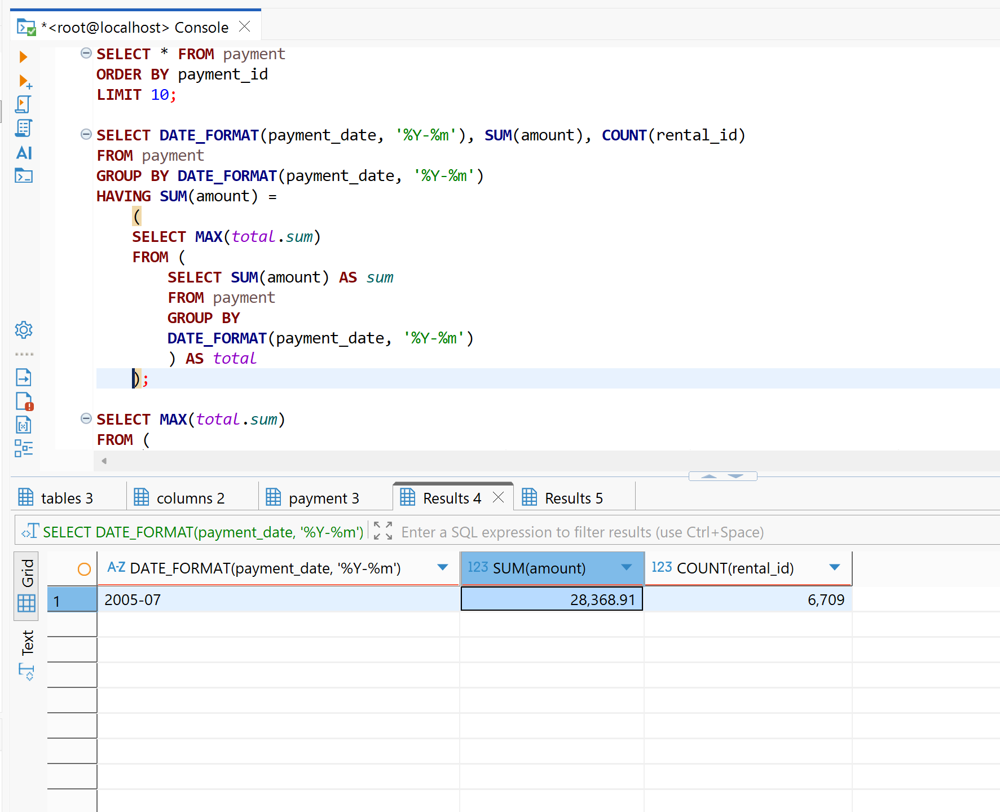

Получилось! Вот я и отфильтровал полученный результат, применив в **`HAVING`** комбинацию из вложенных запросов.

---
---

## Задание 4*

Посчитайте количество продаж, выполненных каждым продавцом. Добавьте вычисляемую колонку «Премия». Если количество продаж превышает 8000, то значение в колонке будет «Да», иначе должно быть значение «Нет».

---

## Решение 4
Данная задача также связана с таблицей **`payment`**. Вся необходимая информация у меня уже есть касательно столбцов. Первичный ключ **`payment_id`** — это по сути идентификатор продажи, которая связана внешним ключом с таблицей аренды по столбцу **`rental_id`**. В таблицу **`rental`** я даже не полезу, так как в задаче не указано выводить информацию по каждой продаже, а только количество этих самых продаж. Значит, столбец **`payment_id`** будет идентификатором одной продажи. Далее мне нужно найти связанных с продажами сотрудников, они же и будут являться продавцами. Информация о продавце есть уже в данной таблице в столбце **`staff_id`**. Сделаю предварительную выборку простым запросом **`SELECT`** для понимания:

    SELECT payment_id, staff_id, amount
    FROM payment
    LIMIT 10;

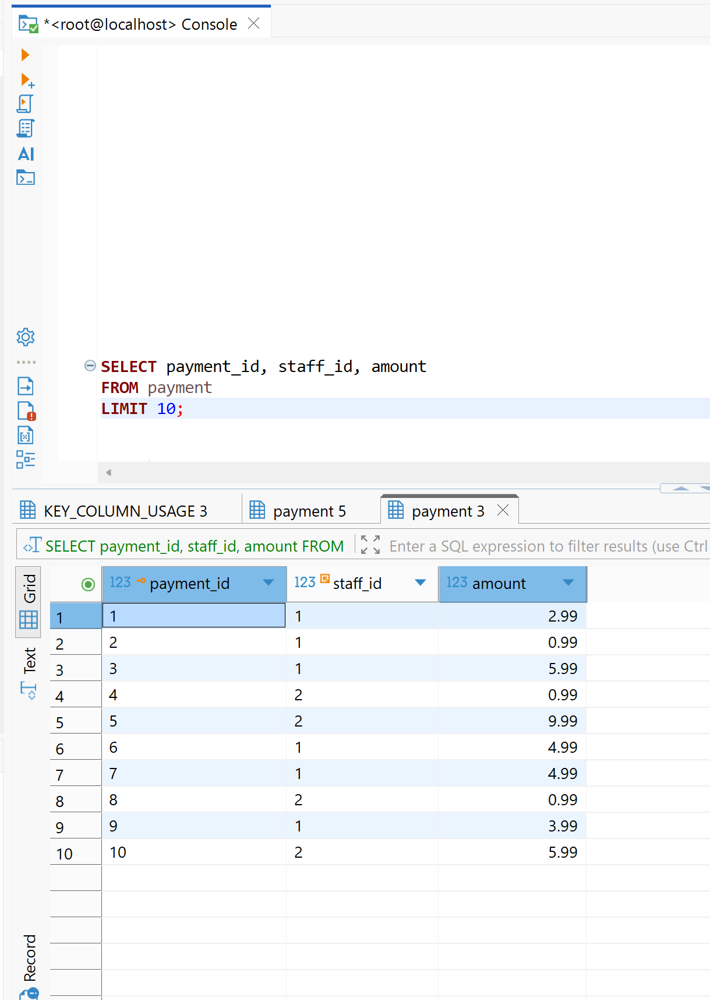

Логика тут понятна: каждый платёж закреплён за определённым сотрудником по столбцу **`staff_id`**. Теперь можно сгруппировать данные по идентификаторам сотрудников и подсчитать количество идентификаторов платежей, а также общую сумму выручки по столбцу **`amount`**:

    SELECT staff_id, COUNT(payment_id), SUM(amount) 
    FROM payment
    GROUP BY staff_id
    LIMIT 10;

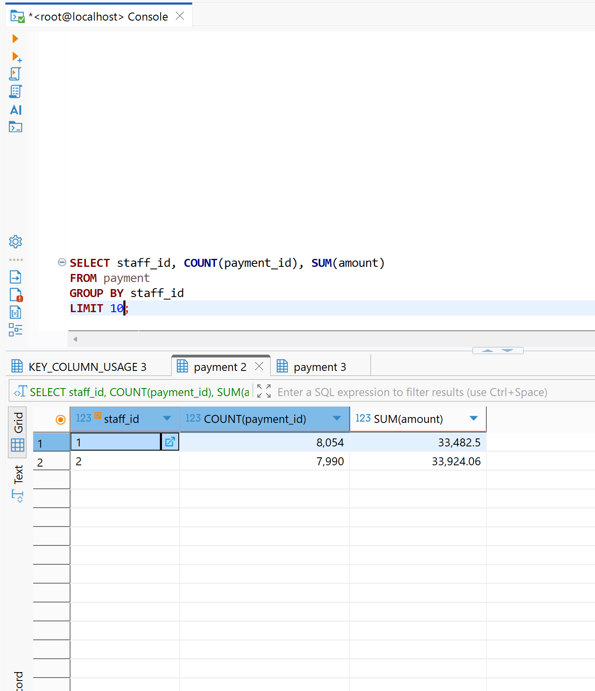

Вот уже виден результат. Но для понимания лучше, конечно, вместо номеров сотрудников вывести конкретные имя и фамилию. Для этого потребуется **`JOIN`** по внешнему ключу, который мне уже известен. Допишу запрос:

    SELECT CONCAT(s.first_name, ' ', s.last_name) name, 
        COUNT(p.payment_id) total_sold, 
        SUM(p.amount) total_amount
    FROM payment p
    JOIN staff s ON s.staff_id = p.staff_id 
    GROUP BY p.staff_id
    LIMIT 10;

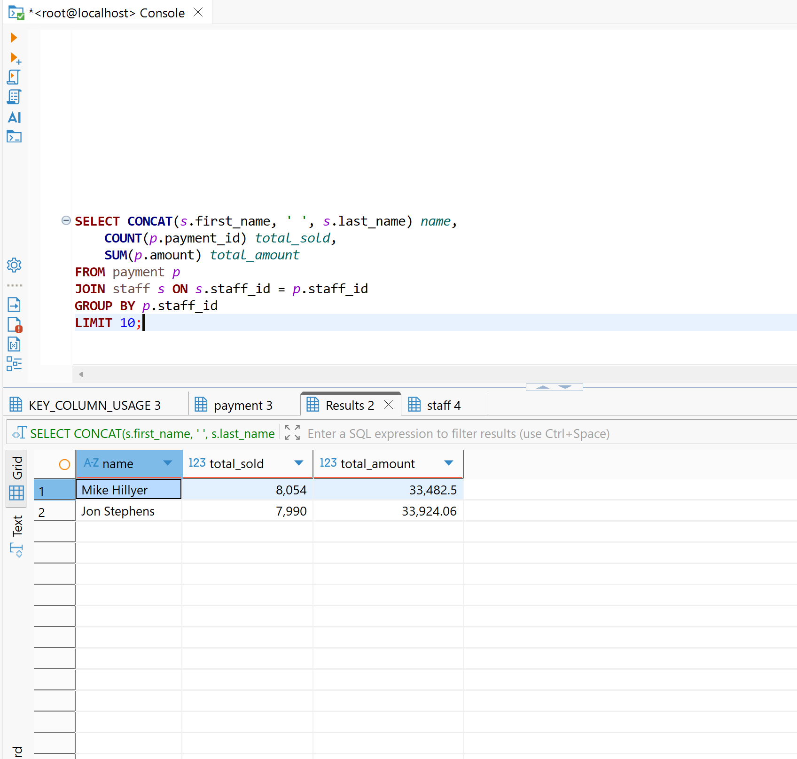

Запрос уже получился детальным и отображает итоговый результат. Осталось добавить условие, по которому будет принято решение, кому из сотрудников достанется премия. По условию задачи сказано: сотрудник, который сделает больше **`8000`** продаж, получает премию, хотя из предыдущего запроса видно, что денег больше заработал сотрудник, который сделал продаж чуть меньше, но всё же меньше **`8000`**. Буду добавлять выражение **`CASE`**, ориентируясь на количество продаж, так как это сказано в задании. Допишу запрос под финальный результат:

    SELECT CONCAT(s.first_name, ' ', s.last_name) name, 
        COUNT(p.payment_id) total_sold, 
        SUM(p.amount) total_amount,
        CASE 
            WHEN COUNT(p.payment_id) > '8000' THEN 'YES'
            ELSE 'NO'
        END AS Bonus
    FROM payment p
    JOIN staff s ON s.staff_id = p.staff_id 
    GROUP BY p.staff_id
    LIMIT 10;

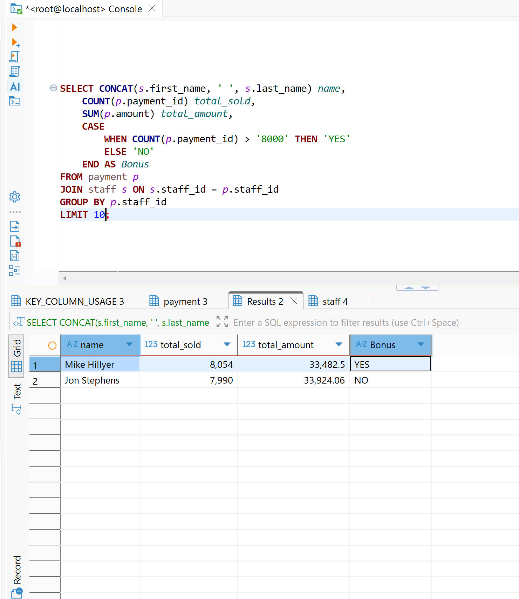

Готово, сотрудник **`Mike Hillyer`** получит премию, хотя, возможно, это и несправедливо.

---
---

## Задание 5*

Найдите фильмы, которые ни разу не брали в аренду.

---

## Решение 5
Если в задании речь идет о фильмах, то сразу пойду в таблицу **`film`** и посмотрю, какая там содержится информация и какие есть внешние ключи. Опущу весь процесс поиска – я подробно расписывал его в предыдущих заданиях.

Для того чтобы было от чего отталкиваться и были какие-либо исходные данные, посчитаю, сколько вообще есть в наличии фильмов в таблице **`film`**:

    SELECT COUNT(title) 
    FROM film;

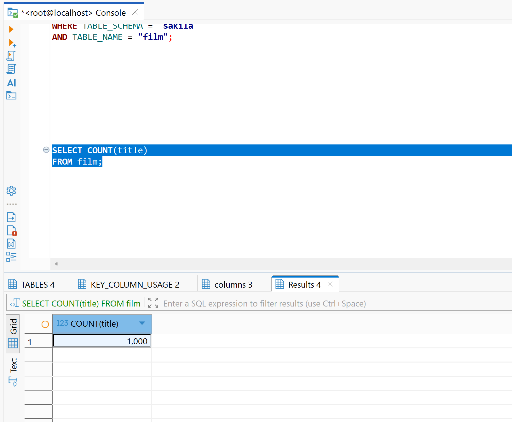

Вижу, что в наличии **1000** штук. В задании сказано найти фильмы, которые не брались в аренду. Значит, следующим шагом нужно найти связь до таблицы **`rental`** от таблицы **`film`**. Посмотрев внешние ключи в таблице **`film`**, я не увидел ключей, ссылающихся на таблицу **`rental`**; есть только ключи на таблицу **`language`**, но это не то:

    SELECT TABLE_SCHEMA db_name,
           COLUMN_NAME, 
           CONSTRAINT_NAME, 
           TABLE_NAME, 
           REFERENCED_TABLE_NAME REFERENCED_TABLE, 
           REFERENCED_COLUMN_NAME REFERENCED_COLUMN
    FROM information_schema.KEY_COLUMN_USAGE
    WHERE TABLE_SCHEMA = "sakila"
      AND TABLE_NAME = "film";

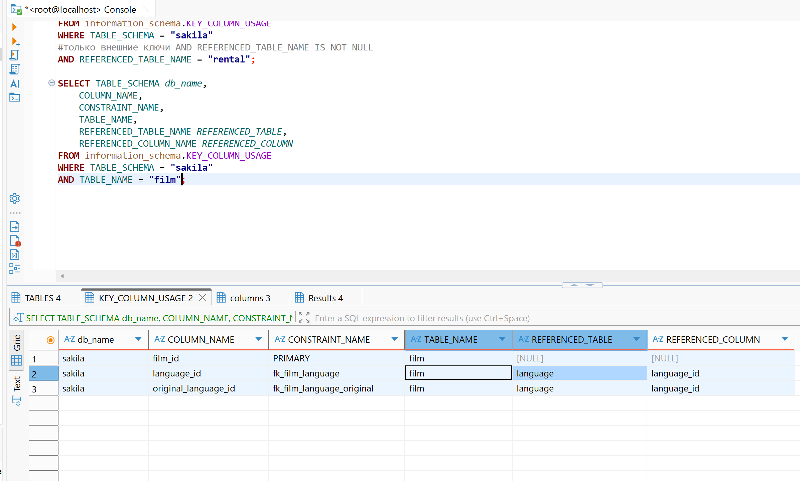

Пробую идти от обратного и посмотреть, какие таблицы ссылаются на **`film`**:

    SELECT TABLE_SCHEMA,
           TABLE_NAME,
           COLUMN_NAME, 
           CONSTRAINT_NAME,
           REFERENCED_TABLE_NAME, 
           REFERENCED_COLUMN_NAME
    FROM information_schema.KEY_COLUMN_USAGE
    WHERE TABLE_SCHEMA = "sakila"
      AND REFERENCED_TABLE_NAME = "film";

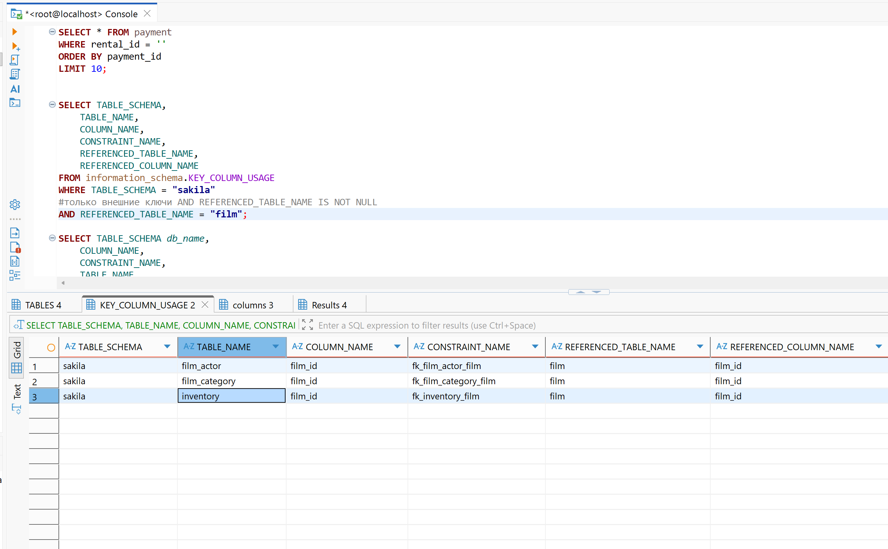

Вижу, что есть несколько таблиц, ссылающихся на первичный ключ таблицы **`film`**, и самая подходящая таблица – это **`inventory`**. Раз уж всё равно придётся вычислять фильмы, которые не участвовали в аренде, сделаю сразу первый **`JOIN`**. Только в этом случае это будет **`LEFT JOIN`**, так как мне нужно будет сверять со всем списком фильмов, а не с теми, которые также есть и в таблице **`inventory`**. Сразу проверю через **`COUNT`** + **`DISTINCT`**, что количество фильмов в выборке получается тоже:

    SELECT COUNT(DISTINCT f.title) 
    FROM film f
    LEFT JOIN inventory i ON i.film_id = f.film_id;

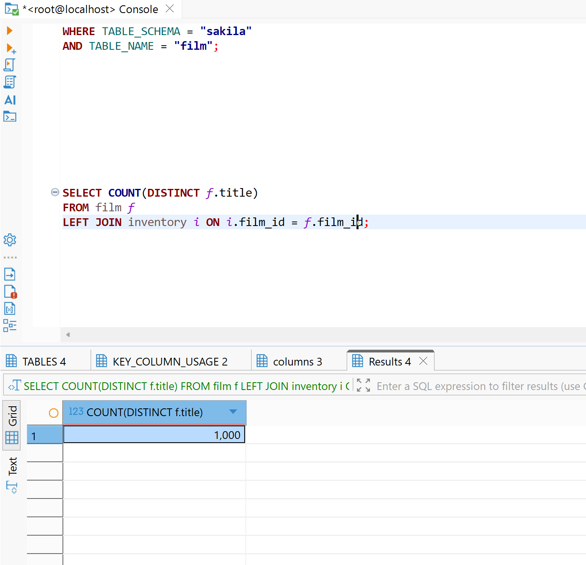

Так как таблица **`inventory`** – это всё же не аренда, нужно идти дальше и посмотреть, куда ссылается таблица **`inventory`**. Я проверил аналогичным способом, как в случае с **`film`**, и не увидел подходящей мне таблицы. Значит, ищу в обратном направлении:

    SELECT TABLE_SCHEMA,
           TABLE_NAME,
           COLUMN_NAME, 
           CONSTRAINT_NAME,
           REFERENCED_TABLE_NAME, 
           REFERENCED_COLUMN_NAME
    FROM information_schema.KEY_COLUMN_USAGE
    WHERE TABLE_SCHEMA = "sakila"
      AND REFERENCED_TABLE_NAME = "inventory";

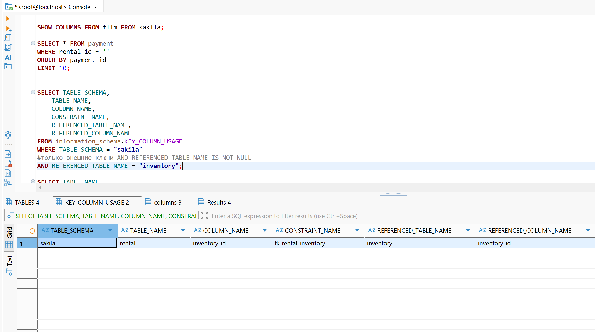

Вот и таблица **`rental`**. Делаю ещё один **`LEFT JOIN`**, чтобы сохранить полный список всех фильмов для корректной сверки:

    SELECT COUNT(DISTINCT f.title) 
    FROM film f
    LEFT JOIN inventory i ON i.film_id = f.film_id
    LEFT JOIN rental r ON r.inventory_id = i.inventory_id;

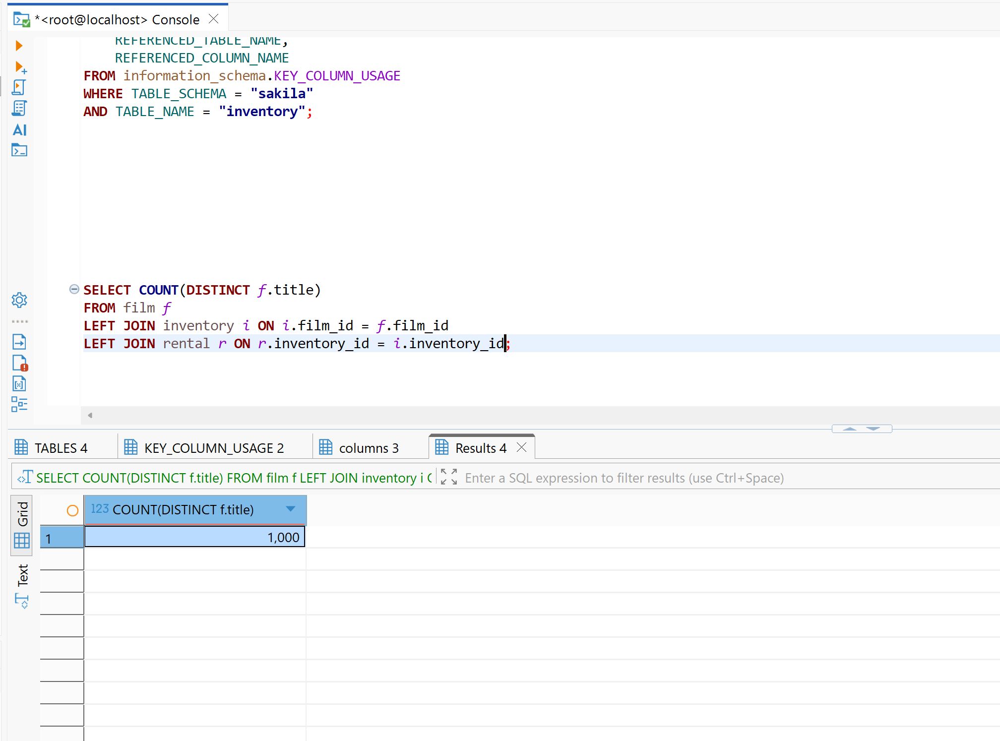

Все связи установлены, и можно проводить анализ. Логично всего будет проводить сверку в таблице **`rental`** по первичному ключу **`rental_id`**.

По логике работы **`LEFT JOIN`**, если есть фильмы, которые действительно никогда не брали в аренду, то напротив этих фильмов, если я запрошу **`SELECT`** по столбцу **`rental_id`**, будет **`NULL`**, так как записи через **`inventory_id`** нет. По сути мне достаточно сделать фильтрацию **`WHERE`**, где **`rental_id`** будет **`NULL`**:

    SELECT DISTINCT f.title 
    FROM film f
    LEFT JOIN inventory i ON i.film_id = f.film_id
    LEFT JOIN rental r ON r.inventory_id = i.inventory_id
    WHERE rental_id IS NULL;

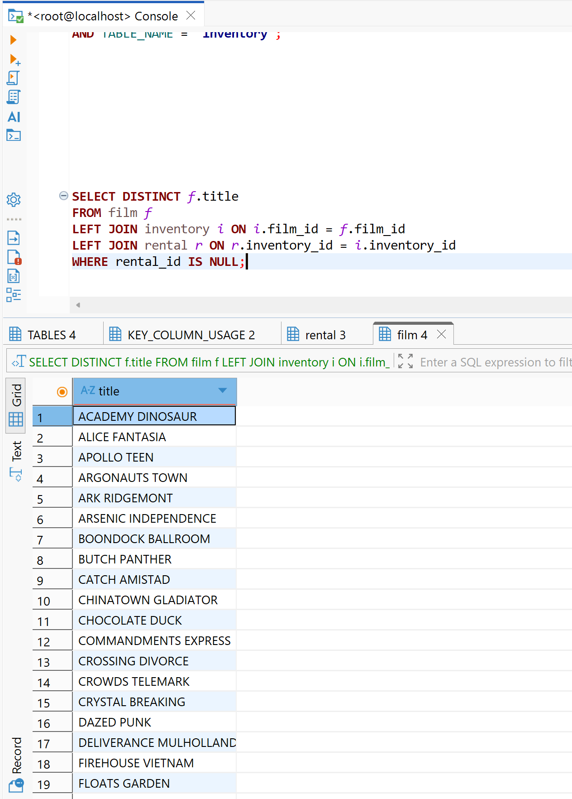

По сути задача уже решена, и полный список у меня есть. Но для полной наглядности и детализации я хочу попробовать сгруппировать фильмы и подсчитать количество аренд по каждому из них. Для этого группирую список по названию фильмов, а **`rental_id`** оберну в **`COUNT`** и отсортирую сперва по аренде, а потом по названию фильмов:

    SELECT f.title, COUNT(rental_id) AS rental
    FROM film f
    LEFT JOIN inventory i ON i.film_id = f.film_id
    LEFT JOIN rental r ON r.inventory_id = i.inventory_id
    GROUP BY f.title
    ORDER BY rental, f.title;

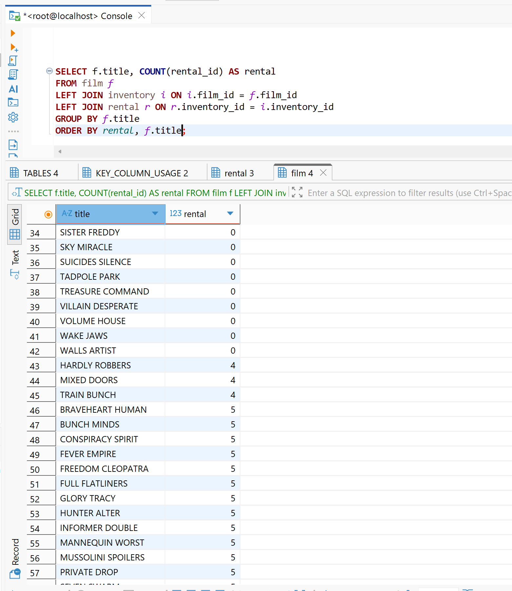

Вот в таком списке уже наглядно видно, что начиная с позиции **43** пошли фильмы, у которых есть самое минимальное количество аренд.