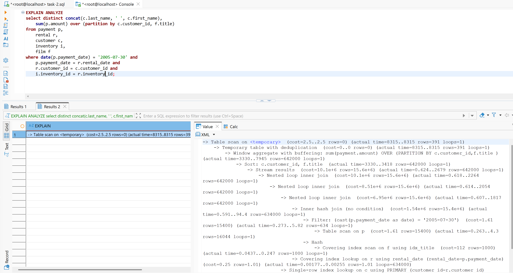
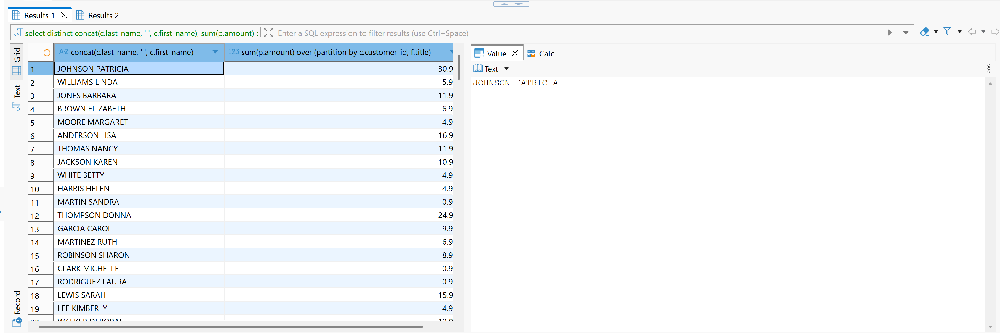
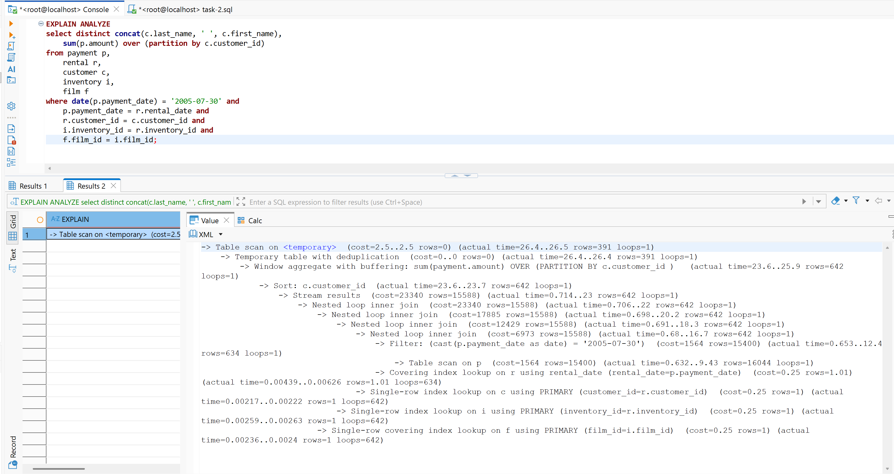
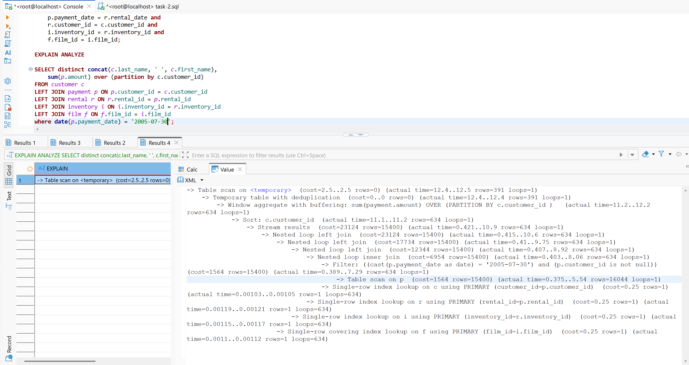

# Домашнее задание к занятию "`Индексы`" - `Сидоров Борис`

---
---

## Задание 1

Напишите запрос к учебной базе данных, который вернёт процентное отношение общего размера всех индексов к общему размеру всех таблиц.

---

## Решение 1
Для решения данной задачи нужно найти, где вообще хранятся значения размера таблицы и индексов. Эти данные можно получить, обратившись к таблице **`INFORMATION_SCHEMA.TABLES`** – там есть столбцы **`DATA_LENGTH`** и **`INDEX_LENGTH`**:

    SELECT TABLE_NAME, 
           TABLE_TYPE, 
           DATA_LENGTH, 
           INDEX_LENGTH
    FROM INFORMATION_SCHEMA.TABLES
    WHERE TABLE_SCHEMA = 'sakila' AND
          TABLE_TYPE = 'BASE TABLE'
    LIMIT 10;


В этой выборке наглядно видно, что значение в **`DATA_LENGTH`** не всегда равно значению **`INDEX_LENGTH`**, а это значит, что размер индексов – это отдельная величина. Самое главное, что даже любые ограничения (такие как внешние ключи) будут являться вторичным индексом, и их величина будет храниться в **`INDEX_LENGTH`**, даже если по сути это не индекс в узком смысле, которые создаются для оптимизации поиска информации в таблице. В свою очередь первичный ключ, это кластерный индекс или простыми словами первичный ключ это и есть сама таблица, даже если он составной, все остальное уже будет вторичным индексом.

Теперь можно произвести подсчёт по **`DATA_LENGTH`** и **`INDEX_LENGTH`** через функцию **`SUM`**. Опущу все лишние столбцы в выборке и преобразую всю сумму в мегабайты, поделив два раза на **`1024`** и округлив до сотых через функцию **`ROUND`**:

    SELECT ROUND((SUM(DATA_LENGTH) / 1024 / 1024), 2) data_length, 
           ROUND((SUM(INDEX_LENGTH) / 1024 / 1024), 2) index_length	
    FROM INFORMATION_SCHEMA.TABLES
    WHERE TABLE_SCHEMA = 'sakila' AND
          TABLE_TYPE = 'BASE TABLE'
    LIMIT 10;


Итак, есть данные, с которыми можно работать. Для вычисления процентного соотношения нужно часть разделить на целое и умножить на **`100`**. Целым будет выступать **`data_length`**, а частью – **`index_length`**. Получился такой итоговый запрос:

    SELECT ROUND((SUM(DATA_LENGTH) / 1024 / 1024), 2) data_length, 
           ROUND((SUM(INDEX_LENGTH) / 1024 / 1024), 2) index_length,
           ROUND((SUM(INDEX_LENGTH) / SUM(DATA_LENGTH)) * 100, 1) percentage
    FROM INFORMATION_SCHEMA.TABLES
    WHERE TABLE_SCHEMA = 'sakila' AND
          TABLE_TYPE = 'BASE TABLE';


**`54.7`** – это процент размера индексов от размера всех данных.

---
---

## Задание 2

Выполните explain analyze следующего запроса:
```sql
select distinct concat(c.last_name, ' ', c.first_name), sum(p.amount) over (partition by c.customer_id, f.title)
from payment p, rental r, customer c, inventory i, film f
where date(p.payment_date) = '2005-07-30' and p.payment_date = r.rental_date and r.customer_id = c.customer_id and i.inventory_id = r.inventory_id
```
- перечислите узкие места;
- оптимизируйте запрос: внесите корректировки по использованию операторов, при необходимости добавьте индексы.

---

## Решение 2
Сперва выполню команду без аналитики, а затем уже с **`EXPLAIN ANALYZE`**:

    EXPLAIN ANALYZE
    select distinct concat(c.last_name, ' ', c.first_name), 
        sum(p.amount) over (partition by c.customer_id, f.title)
    from payment p, 
        rental r, 
        customer c, 
        inventory i, 
        film f
    where date(p.payment_date) = '2005-07-30' and 
        p.payment_date = r.rental_date and 
        r.customer_id = c.customer_id and 
        i.inventory_id = r.inventory_id;





В результате выполнения **`EXPLAIN ANALYZE`** первое, что бросается в глаза, – это сколько строк было обработано во вложенных циклах **`inner`**: **642000**, что впоследствии привело к ощутимой стоимости запроса на этапе агрегации. А всё началось на этапе фильтрации по столбцам **`rental_date = p.payment_date`**:

    -> Inner hash join (no condition)  (cost=1.54e+6 rows=15.4e+6) (actual time=0.591..94.4 rows=634000 loops=1)

Получается, что после фильтрации в таблице **`payment`** было прочитано **643** строки, а по таблице **`film`** с использованием индекса – **1000** строк:

    -> Filter: (cast(p.payment_date as date) = '2005-07-30')  (cost=1.61 rows=15400) (actual time=0.273..5.82 rows=634 loops=1)
                                            -> Table scan on p  (cost=1.61 rows=15400) (actual time=0.263..4.3 rows=16044 loops=1)
                                        -> Hash
                                            -> Covering index scan on f using idx_title  (cost=112 rows=1000) (actual time=0.0437..0.247 rows=1000 loops=1)

Вот поэтому дальше и произошло то, что **1000** строк перемножились на **643**, и при обработке операции в условии **`p.payment_date = r.rental_date`** было произведено **634000** циклов. А всё из‑за того, что в **`FROM`** фигурирует таблица **`film`**, но в условии **`WHERE`** она никак не была связана по ключу. Поэтому на каждые **643** строки, найденные в таблице **`payment`**, приходилось обращаться не напрямую по индексу (т.е. по первичному ключу), а перебирать все **1000** строк таблицы **`film`**. Вот и получается, что дальше СУБД работала с **643000** строк вместо **643**.

Теперь, чтобы исправить запрос, достаточно добавить в **`WHERE`** условие **`f.film_id = i.film_id`**, чтобы поиск шёл по ключу, а не по всей таблице **`film`**, а также из оконной функции **`OVER`** в партиции убрать упоминание о столбце **`title`**. Вот что получается в итоге:

    EXPLAIN ANALYZE
    select distinct concat(c.last_name, ' ', c.first_name), 
        sum(p.amount) over (partition by c.customer_id)
    from payment p, 
        rental r, 
        customer c, 
        inventory i, 
        film f
    where date(p.payment_date) = '2005-07-30' and 
        p.payment_date = r.rental_date and 
        r.customer_id = c.customer_id and 
        i.inventory_id = r.inventory_id and
        f.film_id = i.film_id;



Вместо **8** секунд запрос отработал за **26** миллисекунд.

Но всё равно делать связь таблиц в условии **`WHERE`** – не лучшая идея; лучше использовать **`LEFT JOIN`**:

    SELECT distinct concat(c.last_name, ' ', c.first_name), 
        sum(p.amount) over (partition by c.customer_id)
    FROM customer c
    LEFT JOIN payment p ON p.customer_id = c.customer_id
    LEFT JOIN rental r ON r.rental_id = p.rental_id
    LEFT JOIN inventory i ON i.inventory_id = r.inventory_id
    LEFT JOIN film f ON f.film_id = i.film_id
    where date(p.payment_date) = '2005-07-30';



Так запрос отработал ещё быстрее – за **12.5** миллисекунд.

Есть ещё одна важная деталь – это сканирование всей таблицы **`payment`**, так как по столбцу **`payment_date`** нет индекса, и была просканирована вся таблица полностью – все **16 044** строки:

    -> Table scan on p  (cost=1564 rows=15400) (actual time=0.375..5.54 rows=16044 loops=1)

А если бы строк было гораздо больше, запрос выполнялся бы в разы дольше.

---
---

## Задание 3*

Самостоятельно изучите, какие типы индексов используются в PostgreSQL. Перечислите те индексы, которые используются в PostgreSQL, а в MySQL — нет.

*Приведите ответ в свободной форме.*

---

## Решение 3
Я начну перечислять все типы индексов, начиная с уже известной мне **`СУБД`** такой, как **`MySQL`**, а потом перейду на **`PostgreSQL`**, тем самым в конце подытожив, я и отвечу на вопрос об уникальности индексов такой **`СУБД`**, как **`PostgreSQL`**.

**`MySQL`**. В официальной документации нет чёткой классификации, в документации все типы разбросаны в одной главе. Попытаюсь всё собрать и структурировать.

Если глобально разделить на типы, то в **`MySQL`** можно выделить несколько таких типов:

- **`B-tree`** – так называемые Би-деревья. По сути, это один из самых распространённых типов, именно с ними я и сталкивался в домашнем задании. Сюда входят и первичный ключ, и внешний – то есть любое ограничение будет являться индексом с типом **`B-tree`**.

- **Пространственные индексы** – созданы для пространственных данных. Эти индексы относятся к типу **`R-tree`**. Принцип работы индекса основан не на точном поиске, а на поиске соседей или с использованием механизмов координат.

- **Таблицы `Memory`**, к которым относятся **`HASH`** индексы. Особая специфика этого типа индекса заключается в работе непосредственно в памяти, и чаще всего они используются для данных, хранящихся в кэше. Поиск по этому индексу возможен только по точному совпадению **`=`** или **`<=>`** (специальный оператор равенства, корректно работающий с **`NULL`**), а также **`IN`**.

- **Полнотекстовый индекс** – **`FULLTEXT Indexes`**. Этот индекс – по сути мощный инструмент, но только с ограничением по типу данных, связанному с текстом: **`CHAR`**, **`VARCHAR`** и **`TEXT`**. Суть этого типа индекса в том, что по ключевым словам будут возвращены связанные с этим индексом другие столбцы, где есть упоминание этого ключевого слова в строке. Это инвертированный тип индексов для работы с массивом данных.

Таким образом, в **`MySQL`** можно выделить глобально **4** типа индексов:  
**`B-tree`**, **`R-tree`**, **`HASH`**, **`FULLTEXT`**.

Теперь касательно **`СУБД PostgreSQL`**.  
В документации **`PostgreSQL`** в явном виде перечислены все виды индексов:  
**`B-tree`**, **`Hash`**, **`GiST`**, **`SP-GiST`**, **`GIN`**, **`BRIN`**, **`extension bloom`**.

На первый взгляд, явно можно сказать, что **`B-tree`** и **`Hash`** также есть и в **`MySQL`**.  
Из документации касательно **`GIN`** индексов сказано, что это инвертированные индексы, и по описанию этот тип очень похож на **`FULLTEXT`** в **`MySQL`**, но всё же это не одно и то же.  
Касательно индексов **`GiST`**, **`SP-GiST`** – это вообще целая экосистема для разработки различных типов индексов и по сути это следующая ступень развития **`R-tree`**.  
**`BRIN`** - помогают работать с большими таблицами, где очень много данных, но главное, что они четко структурированы
 **`extension bloom`** – таких индексов также нет в **`MySQL`** и этот тип индексов хорошо работают с таблицами в которых очень много столбцов с разными типами данных.

Итак, индексы, которые есть в **`PostgreSQL`**, но отсутствуют в **`MySQL`**:  
**`GiST`**, **`SP-GiST`**, **`GIN`**, **`BRIN`**, **`extension bloom`**.