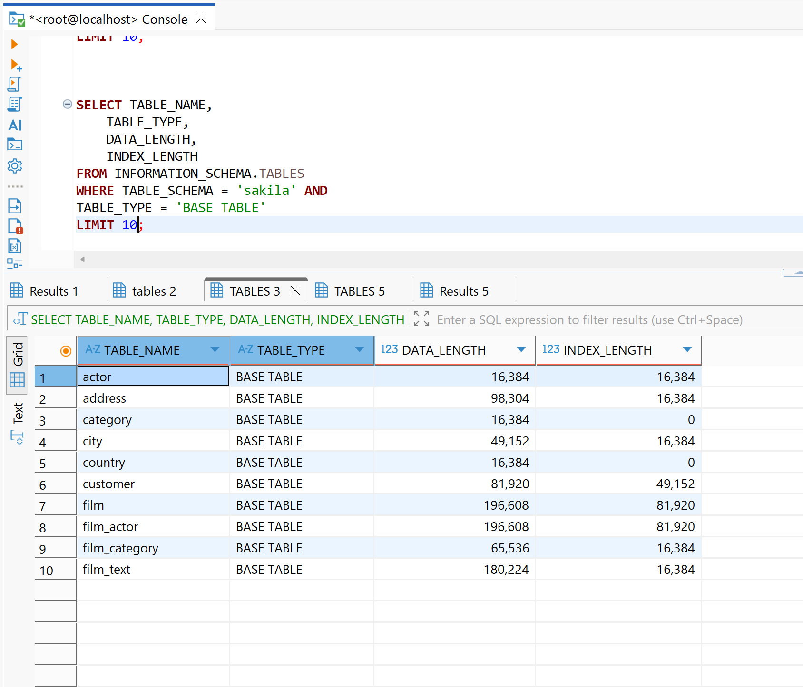
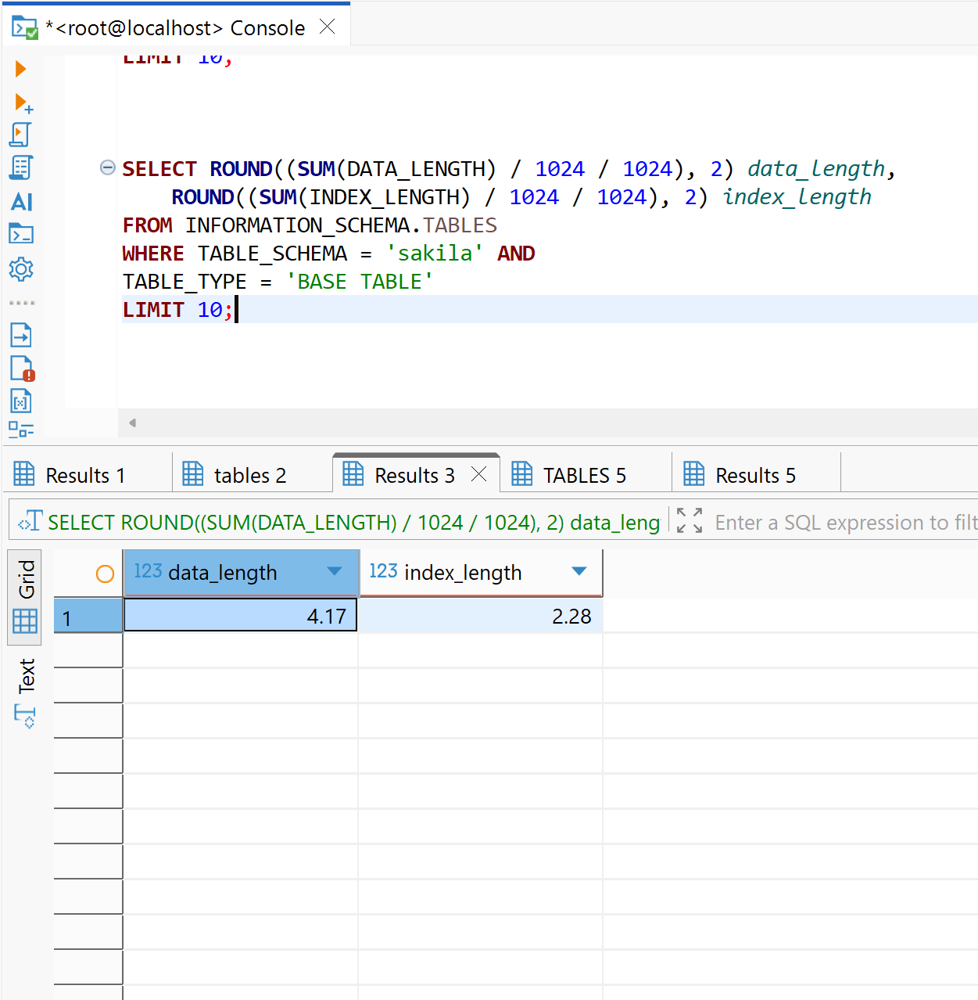
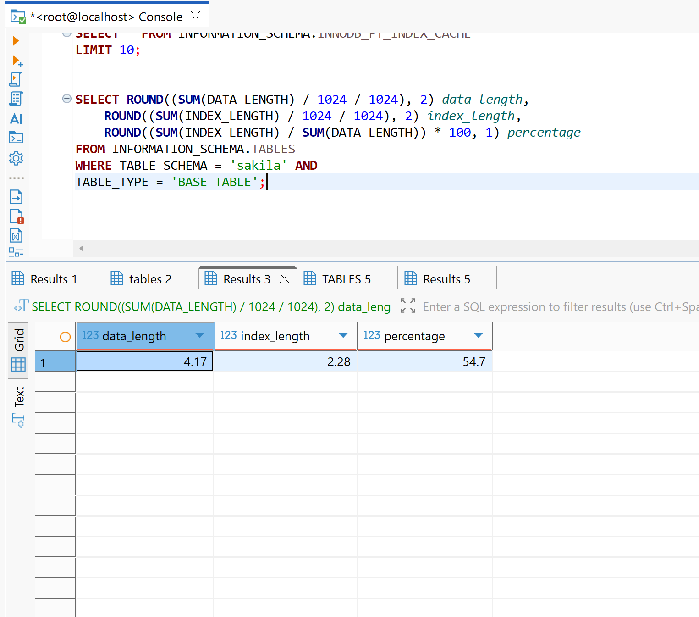

# Домашнее задание к занятию "`Индексы`" - `Сидоров Борис`

---
---

## Задание 1

Напишите запрос к учебной базе данных, который вернёт процентное отношение общего размера всех индексов к общему размеру всех таблиц.

---

## Решение 1
Для решения данной задачи нужно найти, где вообще хранятся значения размера таблицы и индексов. Эти данные можно получить, обратившись к таблице **`INFORMATION_SCHEMA.TABLES`** – там есть столбцы **`DATA_LENGTH`** и **`INDEX_LENGTH`**:

    SELECT TABLE_NAME, 
           TABLE_TYPE, 
           DATA_LENGTH, 
           INDEX_LENGTH
    FROM INFORMATION_SCHEMA.TABLES
    WHERE TABLE_SCHEMA = 'sakila' AND
          TABLE_TYPE = 'BASE TABLE'
    LIMIT 10;

В этой выборке наглядно видно, что значение в **`DATA_LENGTH`** не всегда равно значению **`INDEX_LENGTH`**, а это значит, что размер индексов – это отдельная величина. Самое главное, что даже любые ограничения (такие как внешние ключи) будут являться вторичным индексом, и их величина будет храниться в **`INDEX_LENGTH`**, даже если по сути это не индекс в узком смысле, который создаётся для оптимизации поиска информации в таблице.

Теперь можно произвести подсчёт по **`DATA_LENGTH`** и **`INDEX_LENGTH`** через функцию **`SUM`**. Опущу все лишние столбцы в выборке и преобразую всю сумму в мегабайты, поделив два раза на **`1024`** и округлив до сотых через функцию **`ROUND`**:

    SELECT ROUND((SUM(DATA_LENGTH) / 1024 / 1024), 2) data_length, 
           ROUND((SUM(INDEX_LENGTH) / 1024 / 1024), 2) index_length	
    FROM INFORMATION_SCHEMA.TABLES
    WHERE TABLE_SCHEMA = 'sakila' AND
          TABLE_TYPE = 'BASE TABLE'
    LIMIT 10;

Итак, есть данные, с которыми можно работать. Для вычисления процентного соотношения нужно часть разделить на целое и умножить на **`100`**. Целым будет выступать **`data_length`**, а частью – **`index_length`**. Получился такой итоговый запрос:

    SELECT ROUND((SUM(DATA_LENGTH) / 1024 / 1024), 2) data_length, 
           ROUND((SUM(INDEX_LENGTH) / 1024 / 1024), 2) index_length,
           ROUND((SUM(INDEX_LENGTH) / SUM(DATA_LENGTH)) * 100, 1) percentage
    FROM INFORMATION_SCHEMA.TABLES
    WHERE TABLE_SCHEMA = 'sakila' AND
          TABLE_TYPE = 'BASE TABLE';

**`54.7`** – это процент размера индексов.

---
---

