# Домашнее задание к занятию "`Репликация и масштабирование. Часть 1`" - `Сидоров Борис`

---
---

## Задание 1

На лекции рассматривались режимы репликации master-slave, master-master, опишите их различия.

*Ответить в свободной форме.*

---

## Решение 1
Самое ключевое различие в данных подходах – это возможность осуществлять запись и чтение данных на разных серверах.

Допустим, у нас есть сервер, на котором развернута **`СУБД`**, пока без настроенной репликации. Обращаясь к **`БД`** на данном сервере под **`УЗ`**, у которой есть соответствующие привилегии, мы можем производить как чтение данных (различные запросы **`SELECT`**), так и запись данных (запросы **`INSERT`**, **`UPDATE`**, **`DELETE`**, **`ALTER`** – любые запросы, связанные с изменением данных в **`БД`**). Такой сервер у нас один, и он по умолчанию уже является **`master`**.

И вот наступила задача настроить репликацию в целях отказоустойчивости работы **`СУБД`**. Поднимаем новый инстанс **`СУБД`** – он будет выступать в роли **`slave`**. Настраиваем этот инстанс на репликацию данных из основного инстанса, то есть источником данных будет **`master`** **`СУБД`**. Получается, что у нас есть основной инстанс (**`master`**), через который происходит и чтение, и запись данных, и появился ещё один инстанс (**`slave`**), который выступает в роли резерва. На этот инстанс будет происходить копирование всех изменённых данных из **`master`**. Цель инстанса **`slave`** – быть максимально таким же, как **`master`**, при классической настройке репликации, когда репликация настроена на все **`БД`** в **`СУБД`**, все таблицы и все столбцы (полная копия инстанса **`master`**). Это нужно, чтобы **`slave`** в любую секунду был готов принять на себя роль **`master`**. Но до этого момента на **`slave`** должна быть возможность осуществлять только запросы на чтение, иначе **`slave`** перестанет быть копией инстанса **`master`**. Если же в **`slave`** дать возможность вносить изменения в какую-либо **`БД`**, то когда наступит момент переключения в режим **`master`**, данные на **`slave`** будут отличаться от данных инстанса **`master`**, и **`БД`** перестанет адекватно работать – получится рассинхрон данных, и приложения уже не будут работать так, как должны по логике. Это был подход **`master -> slave`**.

В режиме **`master – master`** ключевое отличие будет в том, что наш новый инстанс, который мы развернём (назовём его **`master2`**), будет не только постоянно мониторить изменения в первом инстансе, но и первый инстанс, который работал изначально (назовём его **`master1`**), также будет мониторить изменения нового инстанса **`master2`**. Получается такая картина, что оба инстанса друг друга мониторят и копируют любые изменения, происходящие в них. Таким образом, и в инстанс **`master1`**, и в инстанс **`master2`** можно осуществлять любые запросы – как на чтение, так и на запись данных.

---
---

## Задание 2

Выполните конфигурацию master-slave репликации, примером можно пользоваться из лекции.

*Приложите скриншоты конфигурации, выполнения работы: состояния и режимы работы серверов.*

---

## Решение 2
# Настройка репликации MySQL вручную (master-slave)

Задача состоит в том, чтобы поднять сервер репликации, который будет корректно дублировать работу с данными (`INSERT`, `UPDATE`, `DELETE` и прочее) на `master`-сервере.

## MySQL

В презентации были показаны примеры развертывания модели `master -> slave` при старте путём добавления конфигурационных файлов и файлов скриптов в единый `docker`-образ. Причём сделано так, чтобы наши кастомные скрипты, в которых описаны шаги по подготовке `СУБД` как для `master`, так и для `slave` контейнера, размещались в специальной директории `/docker-entrypoint-initdb.d/`. Это возможно благодаря тому, что в официальной сборке `mysql` разработчики образа предусмотрели возможность размещения таких кастомных скриптов в указанной директории, реализуя это через основной скрипт, который является точкой входа и запускает инициализацию `СУБД`. Я из любопытства посмотрел на `GitHub` основной скрипт, указанный в официальной сборке под названием `docker-entrypoint.sh`, и там действительно в основной функции `main()` есть шаг, в котором вызывается функция `docker_process_init_files` с аргументом – содержимым директории `/docker-entrypoint-initdb.d/*`. В свою очередь, в функции `docker_process_init_files` описана проверка шаблонов через `case` (там описано, что делать для каждого расширения файлов: `.sql`, `.sql.bz2`, `sql.gz` и прочее). Поэтому скрипты сработают, и на выходе мы получим подготовленную `СУБД` для каждой роли. Я мог бы повторить шаги из презентации, и у меня наверняка всё бы заработало, но я не считаю такой подход в обучении правильным, так как пропускаю сам процесс настройки как администратор `БД`. Поэтому я буду настраивать репликацию вручную.

Допустим, у меня уже есть рабочая `СУБД` с какими-то данными, и она вполне себе функционирует.

И вот у меня есть задача развернуть ещё один сервер `СУБД`, который будет выступать в роли реплики для разгрузки основного сервера. В документации описаны разные способы настройки репликации. Я буду использовать самый простой и классический, основанный на файле бинарного лога и позиции в нём. Благодаря этим данным реплика поймёт, с какого момента нужно начинать читать данный файл и выполнять операции по изменению данных.

Первым делом, раз у меня будет несколько инстансов, нужно каждому серверу присвоить уникальный номер (идентификатор). Это делается через команду `SET GLOBAL server_id = 2;` либо путём изменения конфигурационного файла и перезапуска. Так или иначе, прописать эти параметры в конфигурационный файл в любом случае необходимо, потому что после перезапуска они сбросятся. Я сделал это в специальной директории, следуя лучшим практикам, а не редактировал основной конфигурационный файл.

Далее мне нужно подготовить дамп моего основного сервера, в котором будут содержаться все необходимые команды, а также координаты бинарного лога. Они помогут серверу реплики догнать основной сервер, а также сервер поймёт, с какого места нужно запускать саму репликацию. Насколько я понял, ранее был движок `MyISAM`, в котором требовалось вручную блокировать всю `СУБД` или `БД` на изменение данных, а затем выполнять процесс дампа. Сейчас этот процесс стал проще благодаря движку `InnoDB`, и весь процесс можно выполнить одной транзакцией, а блокировка будет снята автоматически после завершения дампа.

Бинарный лог обычно включён по умолчанию, но всегда можно проверить содержимое системной переменной.

Запускаю процесс создания дампа с дополнительными ключами, которые позволят сделать это одной транзакцией и передать внутрь дампа координаты бинарного лога для сервера репликации:

    mysqldump -u -p --all-databases --source-data --single-transaction > source_data.db

Удобно, что у меня проброшен неименованный том для директории `files`, и этот дамп я могу передать серверу реплики.

Пришла пора поднимать сервер реплики. Выполню следующую команду:

    docker run -d -p 3307:3306 \
    --network=mysql \
    -v DB02-mysql:/var/lib/mysql \
    --mount type=bind,src=./files,dst=/files \
    --mount type=bind,src=./configs,dst=/etc/mysql/conf.d \
    --env-file .env \
    --name DB02-mysql-8.0.45 \
    mysql:8.0.45-debian

Порт для проброса использую `3307`, так как `3306` уже занят основным сервером. Для файлов `БД` создаю именованный том, следуя лучшим практикам, а для динамических файлов – простую привязку хостовых директорий (для файлов и для файлов конфигураций). Немаловажно, что контейнеры работают в одной `docker`-сети и могут общаться между собой по доменному имени.

Я сразу подготовлю конфигурационный файл для сервера реплики, в котором будет просто прописан его `id`, а в директорию для файлов скопирую полученный дамп с основного сервера.

В файле `.env` хранится переменная со значением пароля для `root` `mysql`. Запускаю `docker run`.

Теперь подключусь к серверу реплики, проверю, что она чистая перед выполнением импорта дампа.

Теперь можно импортировать дамп.

С этого момента можно приступить к настройке конфигурации реплики. Я пропустил шаг по созданию специального пользователя для реплики на основном сервере (мастере) – там я выполнил копию команды из официальной документации.

Для конфигурации на реплике используется команда `CHANGE REPLICATION SOURCE TO`, в которой указываем как основные поля (`SOURCE_HOST`, `SOURCE_USER`, `SOURCE_PASSWORD`), так и дополнительные. У меня будет очень простая конфигурация без `SSL` – допустим, у меня закрытая сеть без внешнего доступа, поэтому нет требования настраивать зашифрованное соединение (для упрощения настройки и контроля обновления истекших сертификатов). Получается такая минимальная конфигурация:

    CHANGE REPLICATION SOURCE TO
        SOURCE_HOST='DB01-mysql-8.0.45',
        SOURCE_USER='repl',
        SOURCE_PASSWORD='password',

Следующие данные для реплики очень важны, и без них вообще никак. В пунктах `SOURCE_LOG_FILE`, `SOURCE_LOG_POS` мне нужно указать файл бинарного лога и позицию в этом логе. Так как сервер уже работает и там уже осуществляются какие-то операции, смотреть статус мастера бессмысленно, но я выполнял дамп с ключом `--source-data`, и там должна быть эта информация. Посмотрю любым редактором с хоста дамп-файл.

Вот теперь у меня есть недостающие данные. Указываю их в конфигурации реплики. 

Получается такая настройка:

    CHANGE REPLICATION SOURCE TO
        SOURCE_HOST='DB01-mysql-8.0.45',
        SOURCE_USER='repl',
        SOURCE_PASSWORD='password',
        SOURCE_LOG_FILE='binlog.000017',
        SOURCE_LOG_POS=2608;

Запускаю реплику и смотрю статус.

Реплика не запустилась, так как подключиться по пользователю `repl` не получилось из-за того, что на мастере включён плагин `caching_sha2_password` и пароли не передаются в открытом виде – это даже хорошо. Несмотря на то что `SSL` отключено, пароли шифруются ключами `RSA`, и на сервере хранятся в зашифрованном виде. Чтобы подключиться к серверу, я могу либо скопировать публичный ключ с мастера и передать его на реплику, указав в настройках путь до этого ключа, либо запросить публичный ключ с мастера и им уже зашифровать пароль, который прописал в настройках. Я выберу вариант запроса публичного ключа с сервера – это проще при конфигурации реплик, если вдруг их будет много. Но если требования будут очень строгими, лучше уже включить полноценное зашифрованное соединение через `SSL`.

Итак, останавливаю реплику и дописываю пункт по запросу публичного ключа `RSA`.

Проверяю статус.

Вижу, что теперь реплика работает. Проверю это, создав несколько `БД` на мастере.

Теперь проверю на сервере реплики бинарный лог `18403aaef6d7-relay-bin.000002`, который сейчас используется начиная с позиции `657` (эти данные я взял из статуса реплики ещё до создания новых `БД` на мастере). По идее, я в журнале должен увидеть запросы, которые инициировали создание новых `БД`. Это можно сделать, используя встроенную утилиту `mysqlbinlog`. Получается такая команда:

    mysqlbinlog /var/lib/mysql/18403aaef6d7-relay-bin.000002 --start-position=657 -v | grep -i -A5 create

Сразу отфильтрую по слову `create`.

Вот из лога видно, что было создано две схемы `new_db1`, `new_db2` через клиент `DBeaver`, что и было сделано на самом деле.

Теперь проверю для наглядности через `DBeaver`, появились ли новые `БД` на реплике.

Видно, что `БД` появились, реплика настроена и функционирует.

Осталось внести изменения на сервере реплики, которые не позволят выполнять `DDL` и `DML` команды, чтобы не допустить рассинхрона, даже для пользователя `root`. Это можно сделать, выполнив команды:

    SET GLOBAL read_only = ON;
    SET GLOBAL super_read_only = ON;

Всё работает, но только до перезагрузки сервера. Для того чтобы эти настройки не слетали, нужно отредактировать конфигурационный файл и дописать две строчки.

После перезагрузки параметры сохранились.

**GTID**

Ранее была произведена настройка сервера репликации классическим способом, основанная на позиции бинарного лога, а также все транзакции были анонимными. В **`MySQL`** существует более современный подход, основанный на идентификаторе глобальной транзакции. Включён ли этот режим, можно посмотреть, проверив значение системной переменной **`gtid_mode`**.

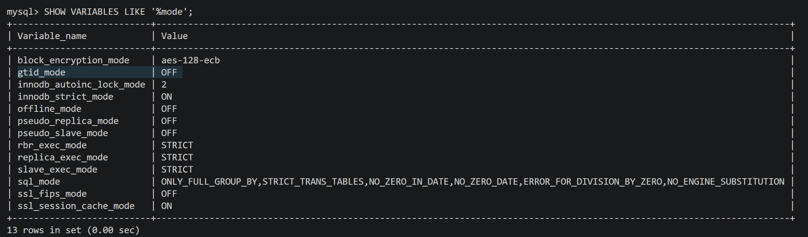

Этот режим упрощает добавление новых серверов репликации, где не нужно будет указывать номер бинарного лога и его позицию, а просто в конфигурации реплики добавить пункт **`SOURCE_AUTO_POSITION = 1`**. Также **`GTID`** позволяет реализовывать отказоустойчивые групповые репликации, где реплика сможет выступать в роли мастера без ручного редактирования, а также развернуть высокоуровневое решение **`InnoDB Claster`**. Поэтому стоит попробовать перейти на **`GTID`**.

Почитав документацию, я понял, что это можно сделать, так сказать, “на горячую” уже с настроенной репликацией, использующей анонимные транзакции. Для имитации такого процесса я попросил нейросеть написать небольшую процедуру, которая будет добавлять раз в 5 секунд записи в таблицу **`actor`** **`БД`** **`sakila`**:

    DELIMITER $$

    CREATE PROCEDURE generate_load()
    BEGIN
        DECLARE v_id INT DEFAULT 202;
        DECLARE v_name VARCHAR(45);
        
        -- Бесконечный цикл
        WHILE TRUE DO
            -- Формируем имя с номером для наглядности
            SET v_name = CONCAT('test', v_id);
            
            -- Вставляем новую строку
            INSERT INTO actor (actor_id, first_name, last_name, last_update)
            VALUES (v_id, v_name, 'load_test', NOW());
            
            -- Увеличиваем счётчик
            SET v_id = v_id + 1;
            
            -- Пауза 30 секунд
            DO SLEEP(30);
            
            -- Если достигли 300, удаляем все вставленные строки (202-300)
            IF v_id > 300 THEN
                DELETE FROM actor WHERE actor_id BETWEEN 202 AND 300;
                SET v_id = 202;  -- Сбрасываем счётчик
            END IF;
        END WHILE;
    END$$

    DELIMITER ;

Я проверил на мастере – всё работает, и реплика все операции дублирует и сохраняет копию мастера. Можно сказать, что **`БД`** находится под нагрузкой (пусть и незначительной).

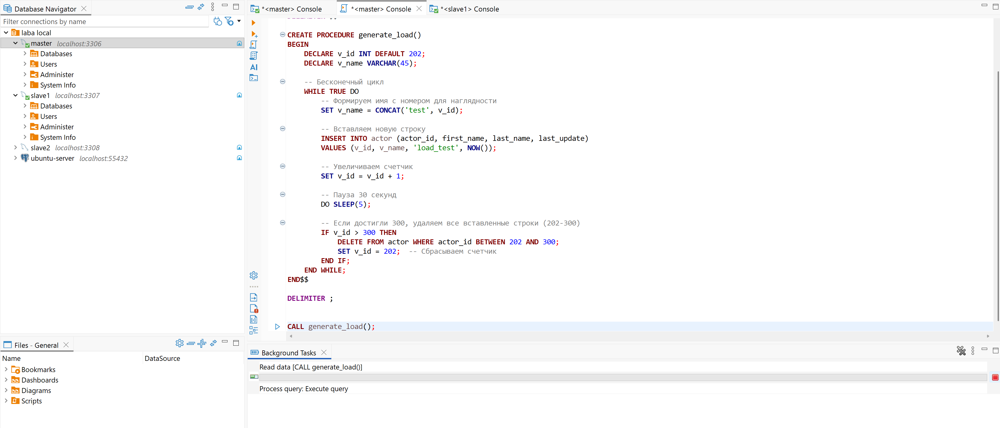

Процесс переключения состоит в том, что мы сначала плавно разрешим принимать помимо анонимных транзакций ещё и **`GTID`**, затем сам перейду на **`GTID`**, но также буду принимать и анонимные. А перед полным переходом, когда анонимных транзакций уже не останется (условно у нас были приложения, которые работали именно с анонимными транзакциями, и мы все их перевели на **`GTID`**), я принудительно начну запись в новом бинарном логе, куда будут попадать исключительно **`GTID`**-транзакции, а все старые удалю. После этого перейду полностью в режим **`GTID`** и сделаю запрет на приём анонимных.

Итак, первым шагом по инструкции сказано выполнить проверку на серверах, которая будет сигнализировать, если у нас есть приложения, которые не способны работать с **`GTID`** (это можно проверить в логах **`СУБД`**).

1. Выполняю первый шаг – выполняю команду на всех серверах:

    SET @@GLOBAL.ENFORCE_GTID_CONSISTENCY = WARN;

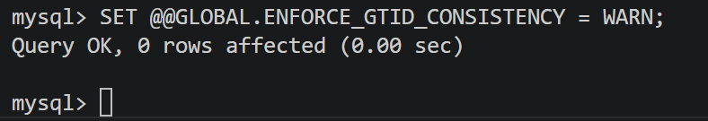

На этом шаге, если у нас есть несовместимость с **`GTID`** по каким-либо приложениям, мы можем это увидеть в логах.

2. Далее нужно выполнить команду:

    SET @@GLOBAL.ENFORCE_GTID_CONSISTENCY = ON;

После выполнения на всех серверах те приложения, которые выдавали ошибку в логах после первого шага, ещё могли работать с нашей **`БД`** – мы просто видели сигнал, что с **`GTID`** они работать не смогут. После того как я выполню вторую команду, все проблемные транзакции начинают блокироваться и не выполняются на **`СУБД`**.

3. Выполняю команду:

    SET @@GLOBAL.GTID_MODE = OFF_PERMISSIVE;

Этим я разрешаю принимать помимо анонимных транзакций ещё и **`GTID`**-транзакции, но сам сервер будет генерировать пока анонимные транзакции.

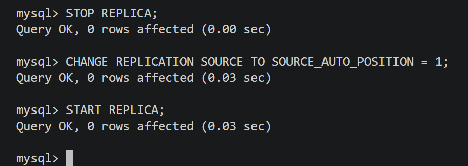

На этом этапе полезно проверить переменную **`GTID_OWNED`**:

    SELECT @@GLOBAL.GTID_OWNED;

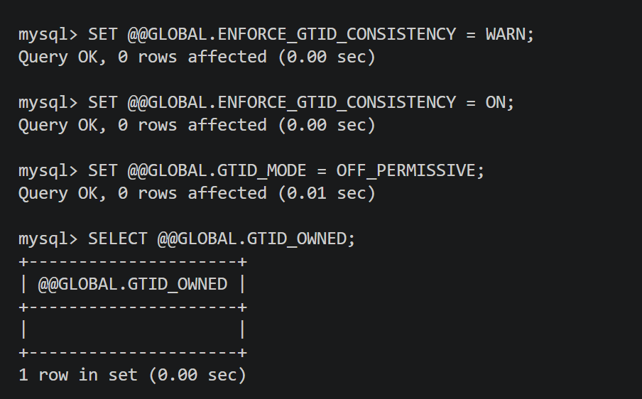

Если она пуста, то это значит, что если были какие-либо **`GTID`**-транзакции, которые сервер начал принимать, они были обработаны, и можно смело переходить к следующему шагу.

4. Далее выполняю команду:

    SET @@GLOBAL.GTID_MODE = ON_PERMISSIVE;

После ввода этой команды наш сервер полностью перейдёт в режим **`GTID`** и сам начнёт генерировать **`GTID`**-транзакции. В то же время анонимным транзакциям доступ ещё не закрыт – они могут поступать, и сервер будет с ними работать. На этом этапе нужно всё полностью перевести на **`GTID`**, ведь дальше мы будем запрещать анонимные транзакции. Для этого сказано проверять статус переменной:

    SHOW STATUS LIKE 'ONGOING_ANONYMOUS_TRANSACTION_COUNT';

Эта переменная хранит значение – сколько на данный момент есть выполняющихся анонимных транзакций. Нужно дождаться, пока счётчик не станет **`0`**.

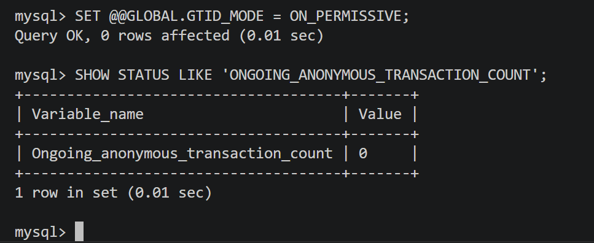

Также с этого момента наш сервер сам уже генерирует **`GTID`**-транзакции, и на реплике мы по идее должны увидеть последнюю из них в статусе реплики.

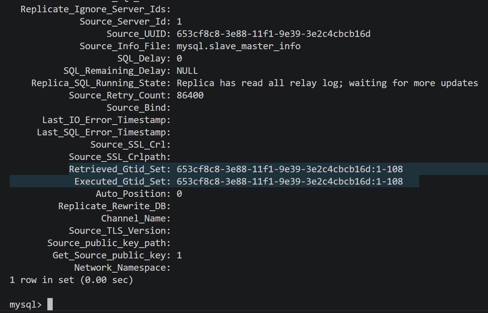

Вижу, что реплика успешно обрабатывает уже **`GTID`**-транзакции.

5. Данный этап – проверочный и финальный перед полным переключением на режим **`GTID`**, где анонимные транзакции уже не будут доступны. В документации сказано, что лучше всего дать поработать в таком режиме, пока все бинарные логи, содержащие записи об анонимных транзакциях, не будут удалены, а также когда старые бекапы, где были анонимные транзакции, больше не понадобятся. Я ускорю этот процесс, так как в продакшене это может длиться несколько месяцев или больше – всё зависит от инфраструктуры и политики компании.

Для того чтобы перевести все записи в новый бинарный лог, существует команда **`FLUSH LOGS`** – после неё создастся новый инкрементный лог, и дальше все записи будут продолжаться именно в него. Посмотрю, какие логи сейчас есть на текущий момент, командой:

    SHOW BINARY LOGS;

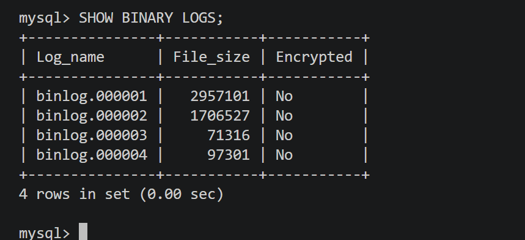

Вижу, что последний номер – **`000004`**. Теперь выполню:

    FLUSH LOGS;

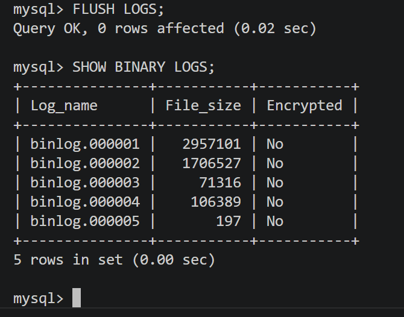

Начиная с лога **`000005`** я уверен, что там есть только **`GTID`**-транзакции. Теперь затру все логи до номера **`000005`**:

    PURGE BINARY LOGS TO 'binlog.000005';

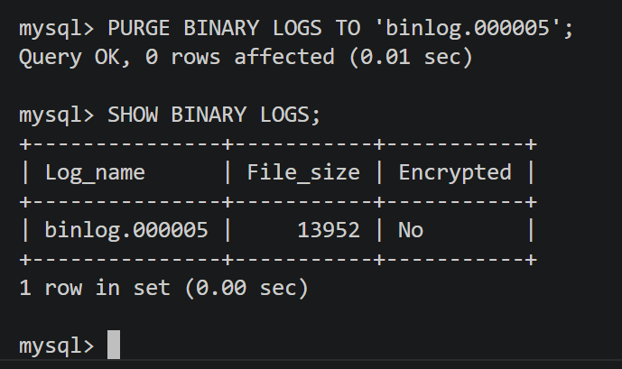

То же самое проделаю и на реплике.  
Теперь сделаю полный бекап перед полным переключением на **`GTID`**. Воспользуюсь утилитой **`mysqldump`**, только добавлю в дамп информацию о выполненных **`GTID`**-транзакциях ключом **`--set-gtid-purged=ON`**, а ключик **`--source-data=2`** комментирует координаты бинарного лога (если вдруг они потребуются для новых реплик):

    mysqldump -u root -p --all-databases --single-transaction --source-data=2 --set-gtid-purged=ON > /files/source_data_with_gtid.sql

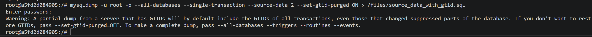

6. Финальный этап. Перевожу полностью **`СУБД`** в режим **`GTID`**:

    SET @@GLOBAL.GTID_MODE = ON;

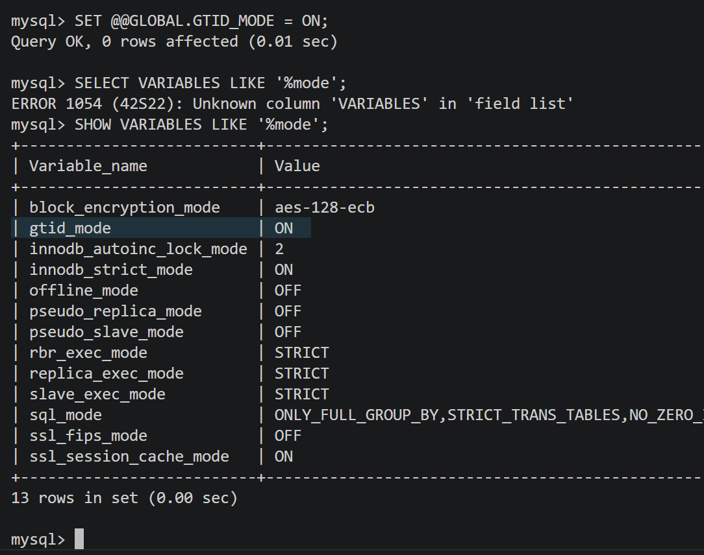

С этого момента **`СУБД MySQL`** работает в режиме **`GTID`**.

7. Теперь необходимо отредактировать конфигурационный файл, добавив в него пару строчек как на мастере, так и на сервере:

    gtid_mode=ON
    enforce_gtid_consistency=ON

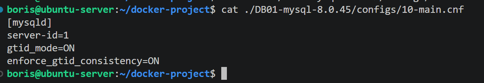

8. Теперь в настройках клиента реплики допишем строку, связанную с автопозиционированием на основе **`GTID`**, предварительно остановив реплику.

Готово. **`СУБД`** полностью переведены в режим **`GTID`**, и можно добавлять новый сервер, уже используя автопозиционирование, не заморачиваясь с координатами файлов.

Подниму **3-й** сервер с конфигурационным файлом, в котором он уже будет работать в режиме **`GTID`**.

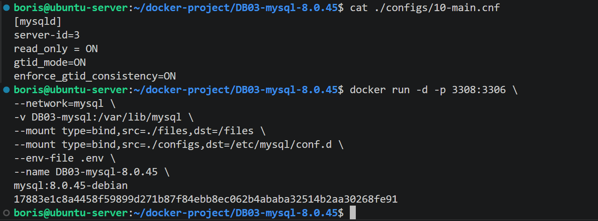

Импортирую бекап, который делал перед полным включением, и настраиваю реплику уже с **`GTID`**.

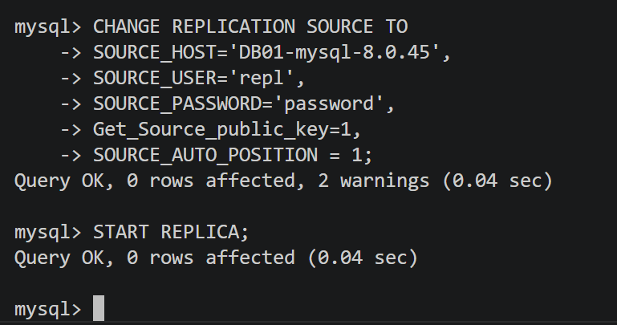

Репликация работает.

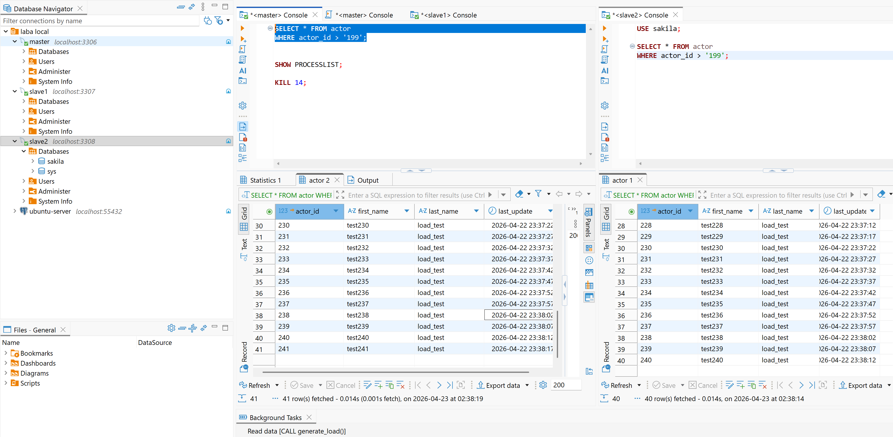

---
---

## Задание 3* 

Выполните конфигурацию master-master репликации. Произведите проверку.

*Приложите скриншоты конфигурации, выполнения работы: состояния и режимы работы серверов.*

---

## Решение 3
Так как я перевел **`СУБД MySQL`** в режим глобального идентификатора транзакции, мне гораздо проще стало производить настройку репликации, так как нет необходимости думать о номере бинарного лога и его позиции.

Соответственно, перевести с топологии **`master - slave`** на **`master - master`** не составит особого труда. Так как данная топология подразумевает чтение и запись с двух источников, мне нужно на одной из работающих реплик отредактировать конфигурационный файл, удалив строки на запрет записи как для обычных, так и для суперпользователя. Я выбрал в качестве второго сервера мастера сервер **`DB02-mysql-8.0.45`**. Редактирую конфигурационный файл:

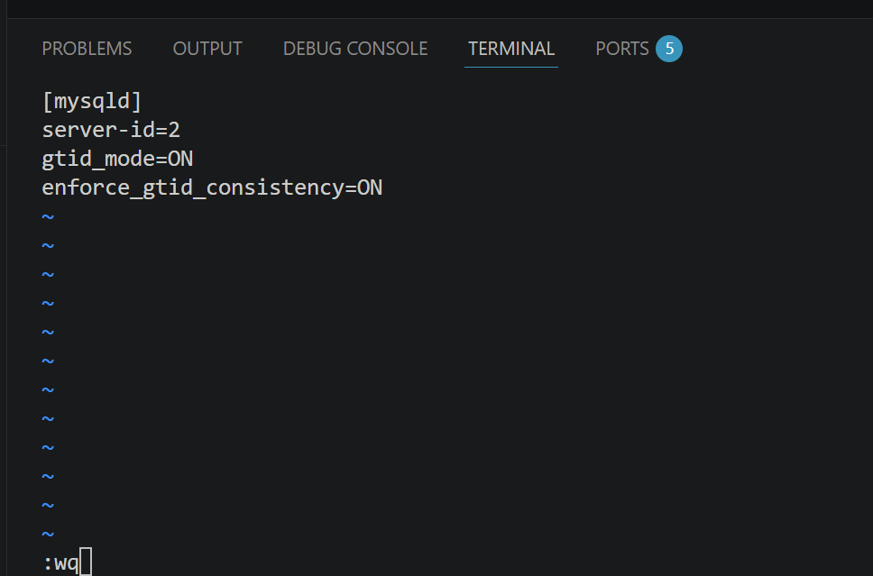

Перезапускаю сервер.

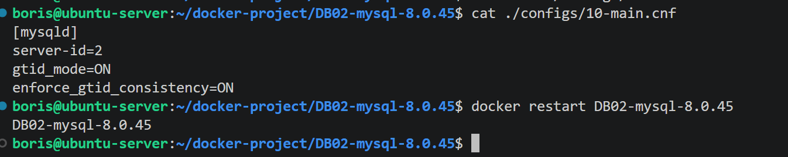

Ситуация такова, что смысл работы топологии **`master - master`** в том, что оба сервера реплицируют друг друга, т.е. мне на основном мастере нужно настроить реплику к серверу реплики, чтобы мастер также считывал все транзакции на сервере реплики и применял их у себя. Для этого я создам на сервере реплики учётную запись и выдам права, аналогично шагу при настройке обычной реплики. Именно под этой учётной записью будет подключаться мастер к реплике.

Выполняю команды для создания **`УЗ`** и выдачи прав для управления репликой на сервере реплики!

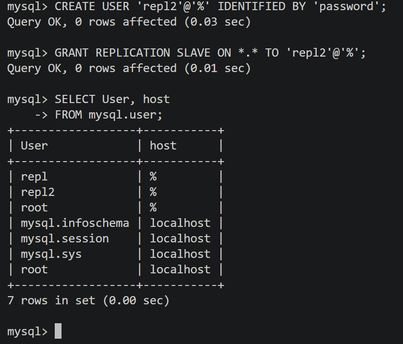

Далее я просто настраиваю реплику на сервере мастера:

    mysql> CHANGE REPLICATION SOURCE TO
        -> SOURCE_HOST='DB02-mysql-8.0.45',
        -> SOURCE_USER='repl2',
        -> SOURCE_PASSWORD='password',
        -> SOURCE_AUTO_POSITION = 1,
        -> Get_Source_public_key=1;

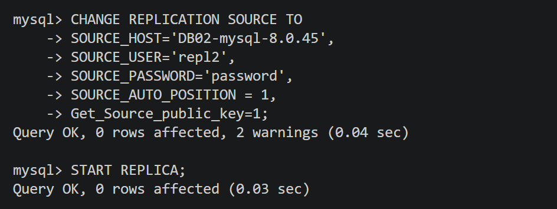

Проверяю статус реплики.

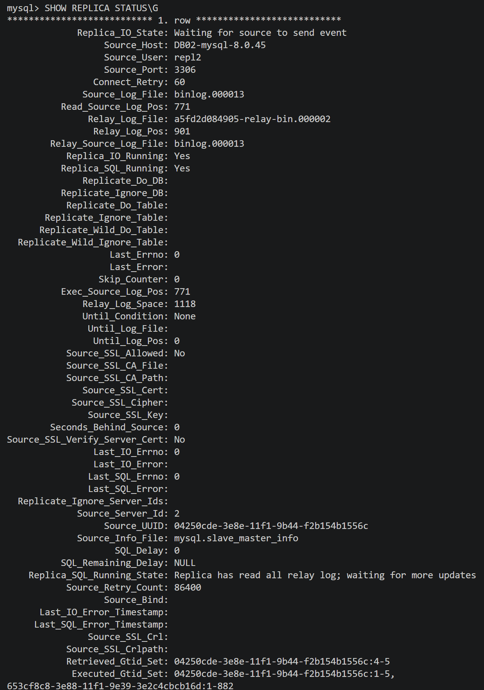

Готово, теперь у меня два сервера **`СУБД MySQL`**, которые реплицируют друг друга, и в то же время есть доступ на выполнение команд записи.

Создам новую **`БД`** на бывшем сервере реплики.

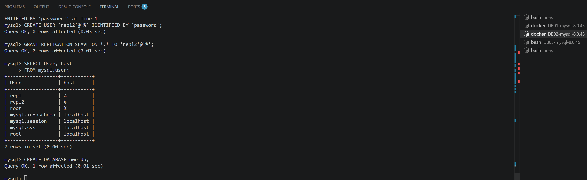

Посмотрю, появилась ли новая **`DB`** на сервере мастере.

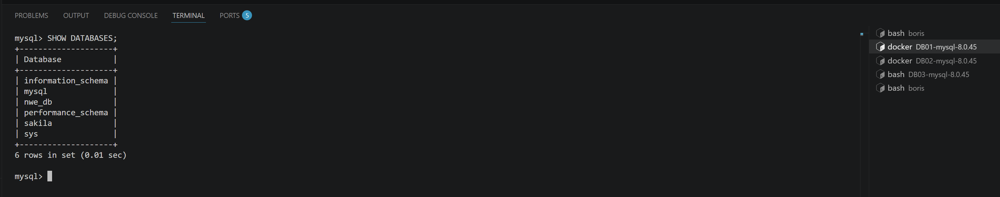

Да, новая **`DB`** появилась. Проверю бинарный лог и позицию на этом сервере, какие операции были выполнены. Посмотрю сперва статус реплики на этом сервере.

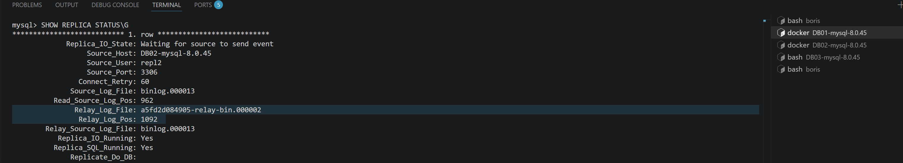

А теперь считаю данные с лога.

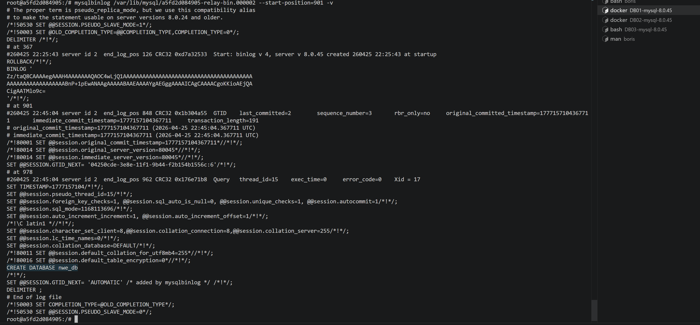

Видно, что транзакция была считана с бывшего сервера реплики и применена команда по созданию новой **`DB`**.

Топология **`master - master`** работает.

**Скрины для отчётности.** Сперва скрины, отображающие, какие есть реплики на каждом сервере:
**`DB01-mysql-8.0.45`** (бывший первичный мастер)

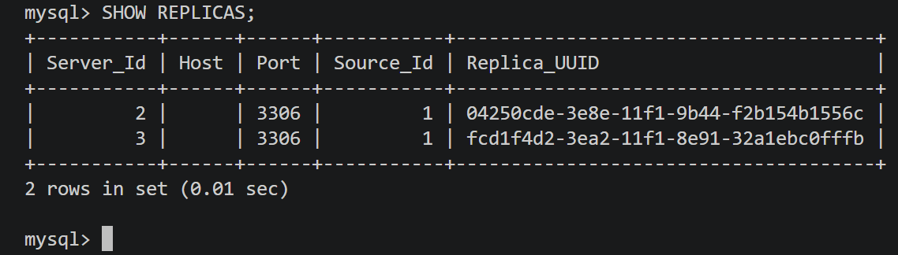

Напомню, что на основном первичном мастере был добавлен ещё один сервер реплики после перехода на **`GTID`**, поэтому тут видно два сервера реплики.

**`DB02-mysql-8.0.45`** (бывший сервер реплики)

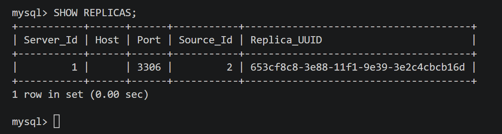

Далее содержимое конфигурационных файлов:

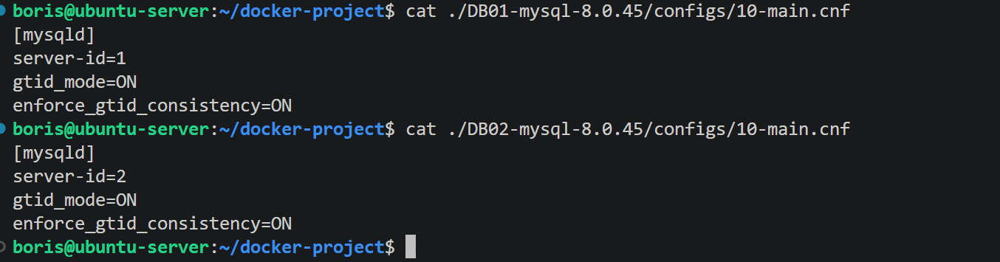

И статус работающей реплики:
**`DB01-mysql-8.0.45`**

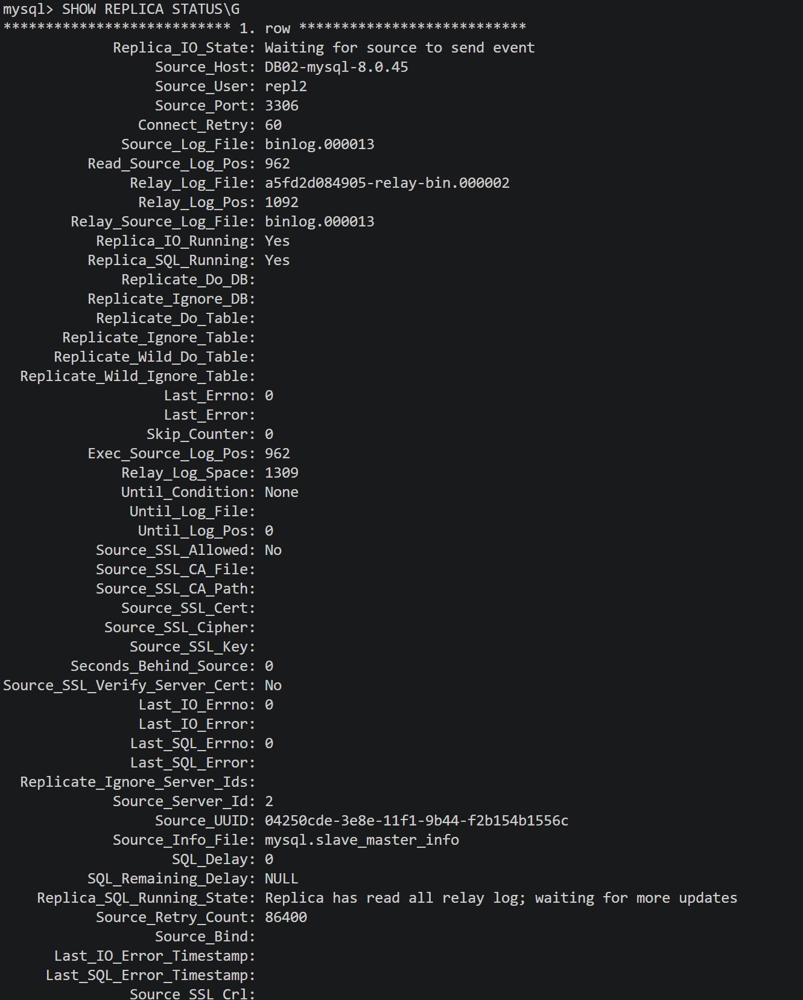

**`DB02-mysql-8.0.45`**

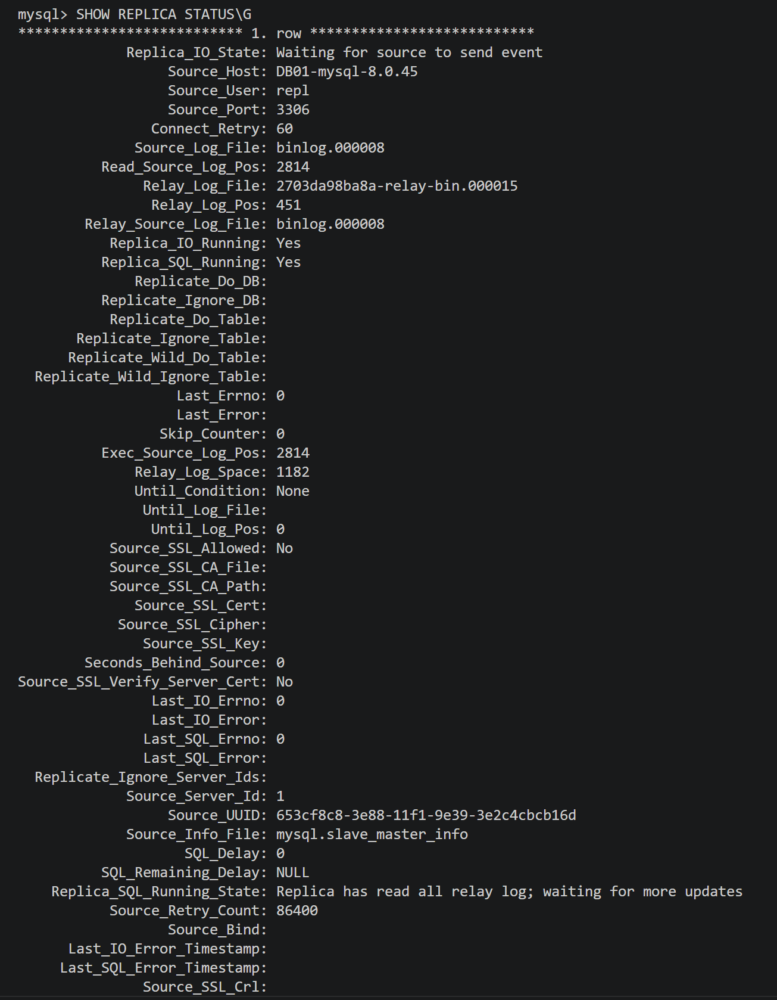

---