# Домашнее задание к занятию "`Репликация и масштабирование. Часть 1`" - `Сидоров Борис`

---
---

## Задание 1

На лекции рассматривались режимы репликации master-slave, master-master, опишите их различия.

*Ответить в свободной форме.*

---

## Решение 1
Самое ключевое различие в данных подходах – это возможность осуществлять запись и чтение данных на разных серверах.

Допустим, у нас есть сервер, на котором развернута **`СУБД`**, пока без настроенной репликации. Обращаясь к **`БД`** на данном сервере под **`УЗ`**, у которой есть соответствующие привилегии, мы можем производить как чтение данных (различные запросы **`SELECT`**), так и запись данных (запросы **`INSERT`**, **`UPDATE`**, **`DELETE`**, **`ALTER`** – любые запросы, связанные с изменением данных в **`БД`**). Такой сервер у нас один, и он по умолчанию уже является **`master`**.

И вот наступила задача настроить репликацию в целях отказоустойчивости работы **`СУБД`**. Поднимаем новый инстанс **`СУБД`** – он будет выступать в роли **`slave`**. Настраиваем этот инстанс на репликацию данных из основного инстанса, то есть источником данных будет **`master`** **`СУБД`**. Получается, что у нас есть основной инстанс (**`master`**), через который происходит и чтение, и запись данных, и появился ещё один инстанс (**`slave`**), который выступает в роли резерва. На этот инстанс будет происходить копирование всех изменённых данных из **`master`**. Цель инстанса **`slave`** – быть максимально таким же, как **`master`**, при классической настройке репликации, когда репликация настроена на все **`БД`** в **`СУБД`**, все таблицы и все столбцы (полная копия инстанса **`master`**). Это нужно, чтобы **`slave`** в любую секунду был готов принять на себя роль **`master`**. Но до этого момента на **`slave`** должна быть возможность осуществлять только запросы на чтение, иначе **`slave`** перестанет быть копией инстанса **`master`**. Если же в **`slave`** дать возможность вносить изменения в какую-либо **`БД`**, то когда наступит момент переключения в режим **`master`**, данные на **`slave`** будут отличаться от данных инстанса **`master`**, и **`БД`** перестанет адекватно работать – получится рассинхрон данных, и приложения уже не будут работать так, как должны по логике. Это был подход **`master -> slave`**.

В режиме **`master – master`** ключевое отличие будет в том, что наш новый инстанс, который мы развернём (назовём его **`master2`**), будет не только постоянно мониторить изменения в первом инстансе, но и первый инстанс, который работал изначально (назовём его **`master1`**), также будет мониторить изменения нового инстанса **`master2`**. Получается такая картина, что оба инстанса друг друга мониторят и копируют любые изменения, происходящие в них. Таким образом, и в инстанс **`master1`**, и в инстанс **`master2`** можно осуществлять любые запросы – как на чтение, так и на запись данных.

---
---

## Задание 2

Выполните конфигурацию master-slave репликации, примером можно пользоваться из лекции.

*Приложите скриншоты конфигурации, выполнения работы: состояния и режимы работы серверов.*

---

## Решение 2
# Настройка репликации MySQL вручную (master-slave)

Задача состоит в том, чтобы поднять сервер репликации, который будет корректно дублировать работу с данными (`INSERT`, `UPDATE`, `DELETE` и прочее) на `master`-сервере.

## MySQL

В презентации были показаны примеры развертывания модели `master -> slave` при старте путём добавления конфигурационных файлов и файлов скриптов в единый `docker`-образ. Причём сделано так, чтобы наши кастомные скрипты, в которых описаны шаги по подготовке `СУБД` как для `master`, так и для `slave` контейнера, размещались в специальной директории `/docker-entrypoint-initdb.d/`. Это возможно благодаря тому, что в официальной сборке `mysql` разработчики образа предусмотрели возможность размещения таких кастомных скриптов в указанной директории, реализуя это через основной скрипт, который является точкой входа и запускает инициализацию `СУБД`. Я из любопытства посмотрел на `GitHub` основной скрипт, указанный в официальной сборке под названием `docker-entrypoint.sh`, и там действительно в основной функции `main()` есть шаг, в котором вызывается функция `docker_process_init_files` с аргументом – содержимым директории `/docker-entrypoint-initdb.d/*`. В свою очередь, в функции `docker_process_init_files` описана проверка шаблонов через `case` (там описано, что делать для каждого расширения файлов: `.sql`, `.sql.bz2`, `sql.gz` и прочее). Поэтому скрипты сработают, и на выходе мы получим подготовленную `СУБД` для каждой роли. Я мог бы повторить шаги из презентации, и у меня наверняка всё бы заработало, но я не считаю такой подход в обучении правильным, так как пропускаю сам процесс настройки как администратор `БД`. Поэтому я буду настраивать репликацию вручную.

Допустим, у меня уже есть рабочая `СУБД` с какими-то данными, и она вполне себе функционирует.

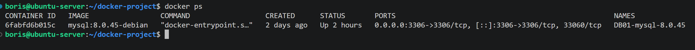

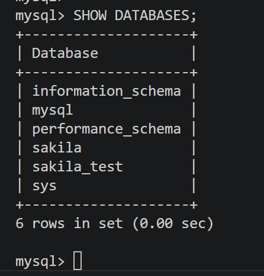

И вот у меня есть задача развернуть ещё один сервер `СУБД`, который будет выступать в роли реплики для разгрузки основного сервера. В документации описаны разные способы настройки репликации. Я буду использовать самый простой и классический, основанный на файле бинарного лога и позиции в нём. Благодаря этим данным реплика поймёт, с какого момента нужно начинать читать данный файл и выполнять операции по изменению данных.

Первым делом, раз у меня будет несколько инстансов, нужно каждому серверу присвоить уникальный номер (идентификатор). Это делается через команду `SET GLOBAL server_id = 2;` либо путём изменения конфигурационного файла и перезапуска. Так или иначе, прописать эти параметры в конфигурационный файл в любом случае необходимо, потому что после перезапуска они сбросятся. Я сделал это в специальной директории, следуя лучшим практикам, а не редактировал основной конфигурационный файл.

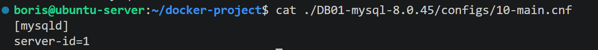

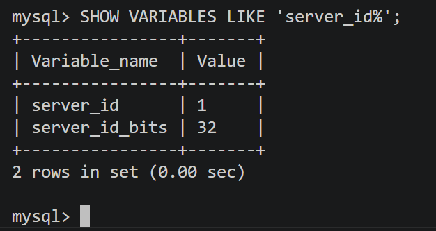

Далее мне нужно подготовить дамп моего основного сервера, в котором будут содержаться все необходимые команды, а также координаты бинарного лога. Они помогут серверу реплики догнать основной сервер, а также сервер поймёт, с какого места нужно запускать саму репликацию. Насколько я понял, ранее был движок `MyISAM`, в котором требовалось вручную блокировать всю `СУБД` или `БД` на изменение данных, а затем выполнять процесс дампа. Сейчас этот процесс стал проще благодаря движку `InnoDB`, и весь процесс можно выполнить одной транзакцией, а блокировка будет снята автоматически после завершения дампа.

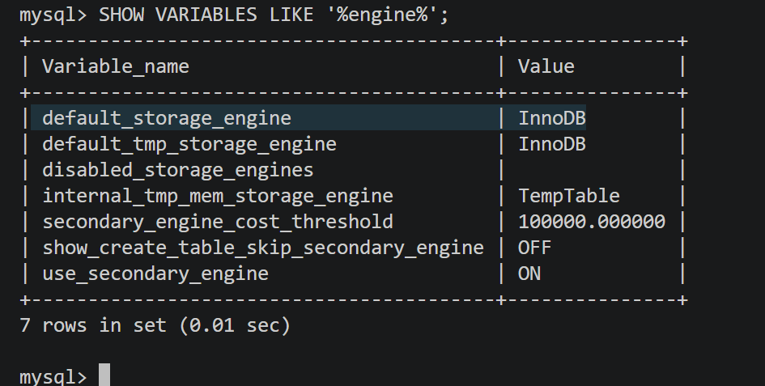

Бинарный лог обычно включён по умолчанию, но всегда можно проверить содержимое системной переменной.

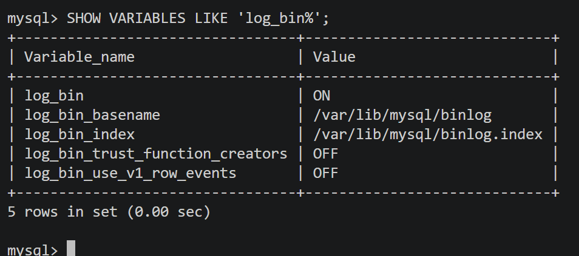

Запускаю процесс создания дампа с дополнительными ключами, которые позволят сделать это одной транзакцией и передать внутрь дампа координаты бинарного лога для сервера репликации:

    mysqldump -u -p --all-databases --source-data --single-transaction > source_data.db

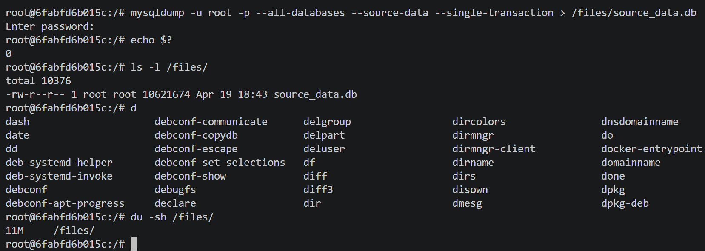

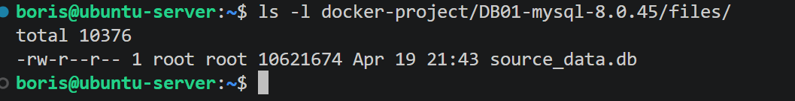

Удобно, что у меня проброшен неименованный том для директории `files`, и этот дамп я могу передать серверу реплики.

Пришла пора поднимать сервер реплики. Выполню следующую команду:

    docker run -d -p 3307:3306 \
    --network=mysql \
    -v DB02-mysql:/var/lib/mysql \
    --mount type=bind,src=./files,dst=/files \
    --mount type=bind,src=./configs,dst=/etc/mysql/conf.d \
    --env-file .env \
    --name DB02-mysql-8.0.45 \
    mysql:8.0.45-debian

Порт для проброса использую `3307`, так как `3306` уже занят основным сервером. Для файлов `БД` создаю именованный том, следуя лучшим практикам, а для динамических файлов – простую привязку хостовых директорий (для файлов и для файлов конфигураций). Немаловажно, что контейнеры работают в одной `docker`-сети и могут общаться между собой по доменному имени.

Я сразу подготовлю конфигурационный файл для сервера реплики, в котором будет просто прописан его `id`, а в директорию для файлов скопирую полученный дамп с основного сервера.

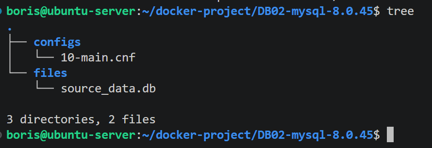

В файле `.env` хранится переменная со значением пароля для `root` `mysql`. Запускаю `docker run`.

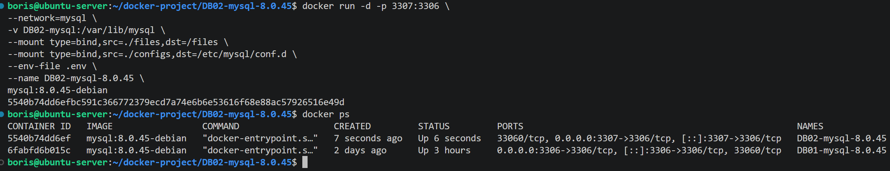

Теперь подключусь к серверу реплики, проверю, что она чистая перед выполнением импорта дампа.

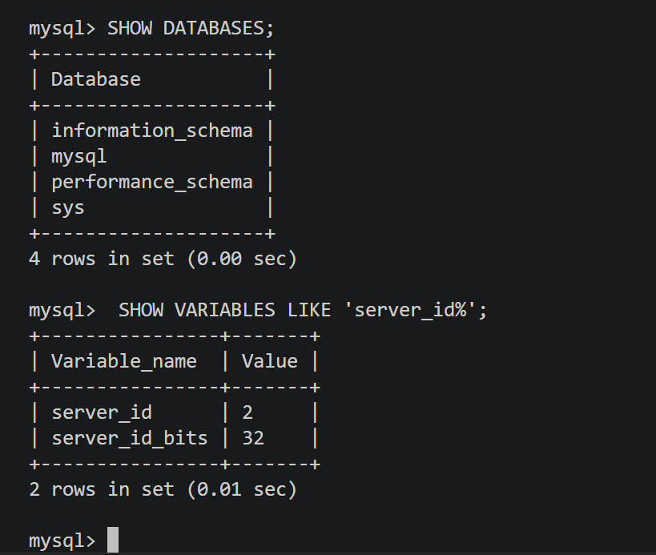

Теперь можно импортировать дамп.

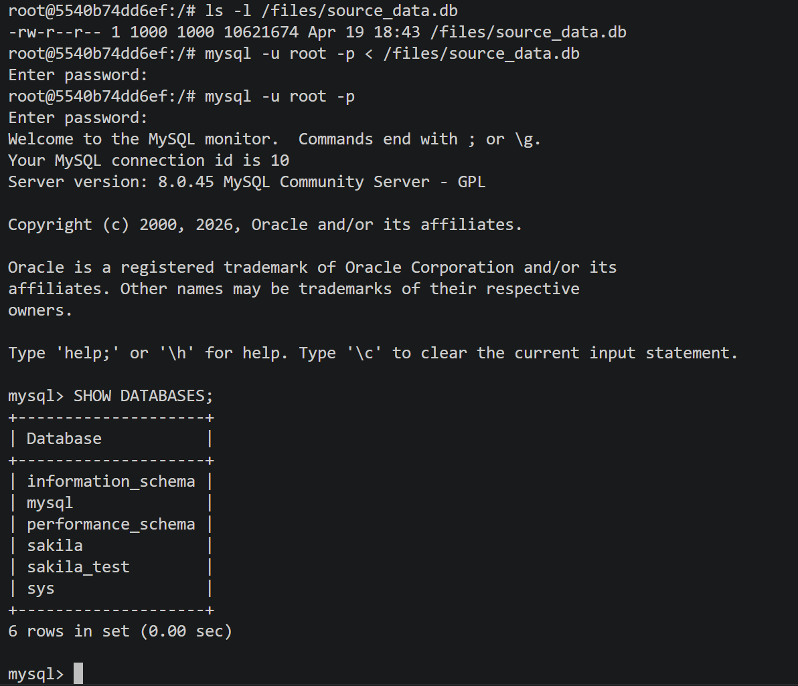

С этого момента можно приступить к настройке конфигурации реплики. Я пропустил шаг по созданию специального пользователя для реплики на основном сервере (мастере) – там я выполнил копию команды из официальной документации.

Для конфигурации на реплике используется команда `CHANGE REPLICATION SOURCE TO`, в которой указываем как основные поля (`SOURCE_HOST`, `SOURCE_USER`, `SOURCE_PASSWORD`), так и дополнительные. У меня будет очень простая конфигурация без `SSL` – допустим, у меня закрытая сеть без внешнего доступа, поэтому нет требования настраивать зашифрованное соединение (для упрощения настройки и контроля обновления истекших сертификатов). Получается такая минимальная конфигурация:

    CHANGE REPLICATION SOURCE TO
        SOURCE_HOST='DB01-mysql-8.0.45',
        SOURCE_USER='repl',
        SOURCE_PASSWORD='password',

Следующие данные для реплики очень важны, и без них вообще никак. В пунктах `SOURCE_LOG_FILE`, `SOURCE_LOG_POS` мне нужно указать файл бинарного лога и позицию в этом логе. Так как сервер уже работает и там уже осуществляются какие-то операции, смотреть статус мастера бессмысленно, но я выполнял дамп с ключом `--source-data`, и там должна быть эта информация. Посмотрю любым редактором с хоста дамп-файл.

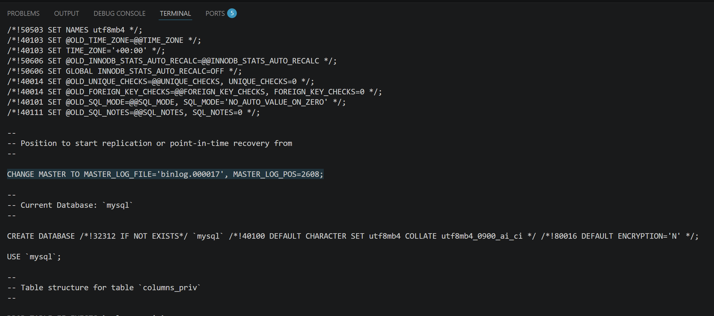

Вот теперь у меня есть недостающие данные. Указываю их в конфигурации реплики. 

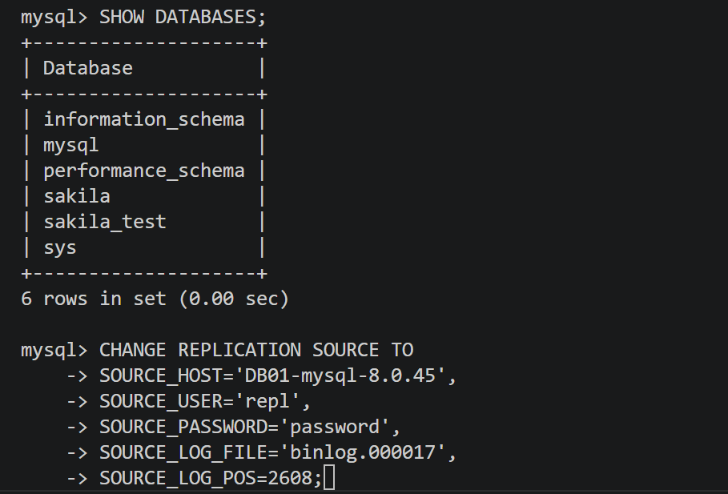

Получается такая настройка:

    CHANGE REPLICATION SOURCE TO
        SOURCE_HOST='DB01-mysql-8.0.45',
        SOURCE_USER='repl',
        SOURCE_PASSWORD='password',
        SOURCE_LOG_FILE='binlog.000017',
        SOURCE_LOG_POS=2608;

Запускаю реплику и смотрю статус.

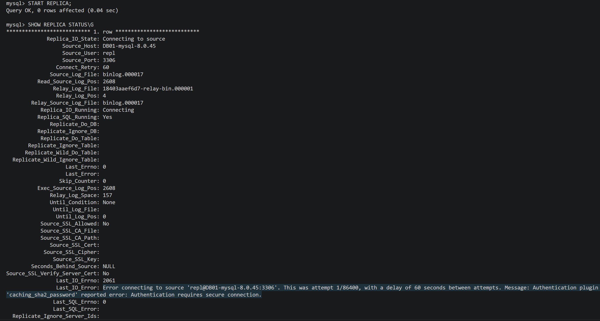

Реплика не запустилась, так как подключиться по пользователю `repl` не получилось из-за того, что на мастере включён плагин `caching_sha2_password` и пароли не передаются в открытом виде – это даже хорошо. Несмотря на то что `SSL` отключено, пароли шифруются ключами `RSA`, и на сервере хранятся в зашифрованном виде. Чтобы подключиться к серверу, я могу либо скопировать публичный ключ с мастера и передать его на реплику, указав в настройках путь до этого ключа, либо запросить публичный ключ с мастера и им уже зашифровать пароль, который прописал в настройках. Я выберу вариант запроса публичного ключа с сервера – это проще при конфигурации реплик, если вдруг их будет много. Но если требования будут очень строгими, лучше уже включить полноценное зашифрованное соединение через `SSL`.

Итак, останавливаю реплику и дописываю пункт по запросу публичного ключа `RSA`.

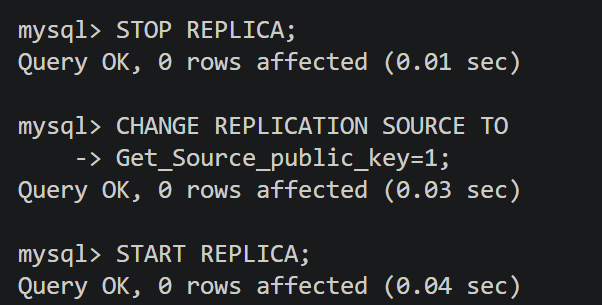

Проверяю статус.

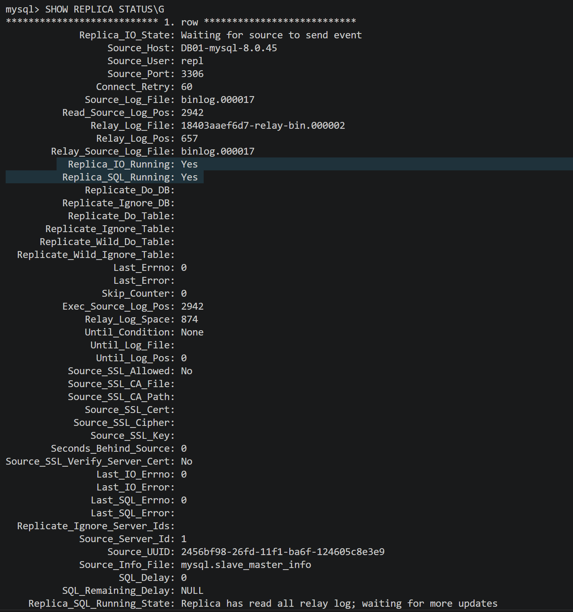

Вижу, что теперь реплика работает. Проверю это, создав несколько `БД` на мастере.

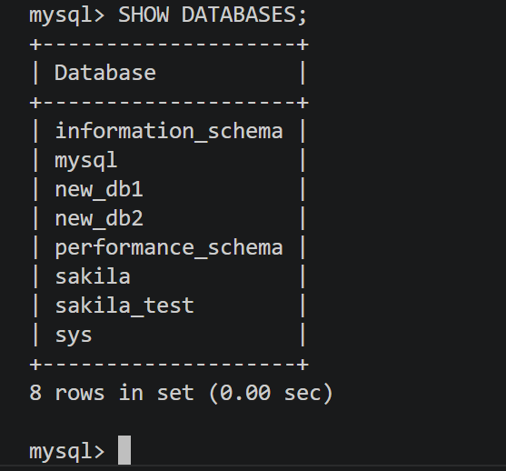

Теперь проверю на сервере реплики бинарный лог `18403aaef6d7-relay-bin.000002`, который сейчас используется начиная с позиции `657` (эти данные я взял из статуса реплики ещё до создания новых `БД` на мастере). По идее, я в журнале должен увидеть запросы, которые инициировали создание новых `БД`. Это можно сделать, используя встроенную утилиту `mysqlbinlog`. Получается такая команда:

    mysqlbinlog /var/lib/mysql/18403aaef6d7-relay-bin.000002 --start-position=657 -v | grep -i -A5 create

Сразу отфильтрую по слову `create`.

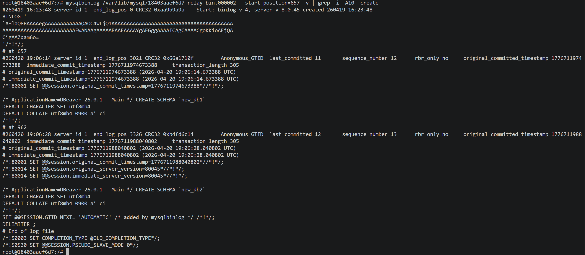

Вот из лога видно, что было создано две схемы `new_db1`, `new_db2` через клиент `DBeaver`, что и было сделано на самом деле.

Теперь проверю для наглядности через `DBeaver`, появились ли новые `БД` на реплике.

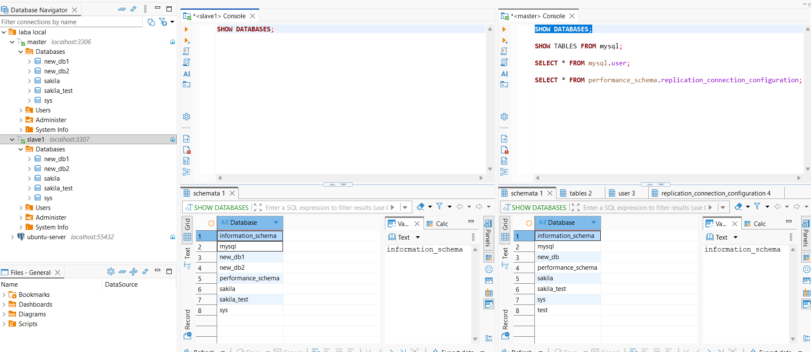

Видно, что `БД` появились, реплика настроена и функционирует.

Осталось внести изменения на сервере реплики, которые не позволят выполнять `DDL` и `DML` команды, чтобы не допустить рассинхрона, даже для пользователя `root`. Это можно сделать, выполнив команды:

    SET GLOBAL read_only = ON;
    SET GLOBAL super_read_only = ON;

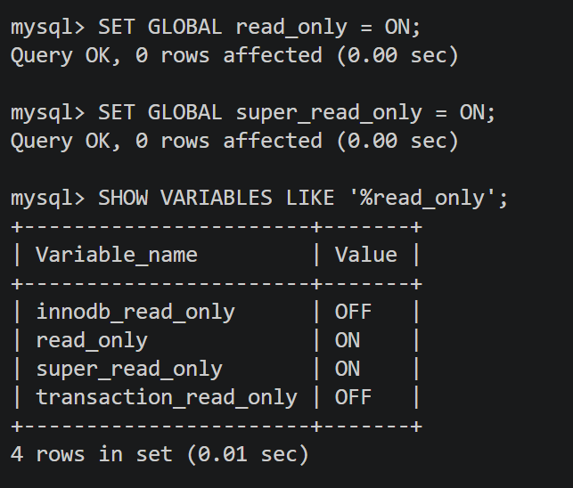

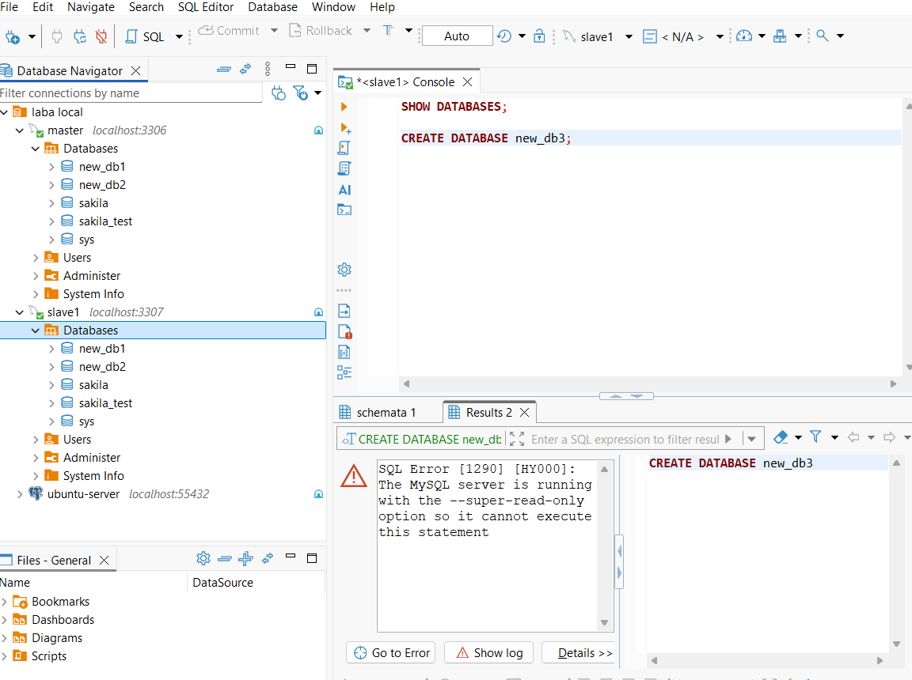

Всё работает, но только до перезагрузки сервера. Для того чтобы эти настройки не слетали, нужно отредактировать конфигурационный файл и дописать две строчки.

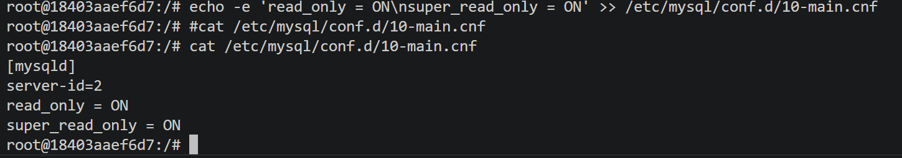

После перезагрузки параметры сохранились.

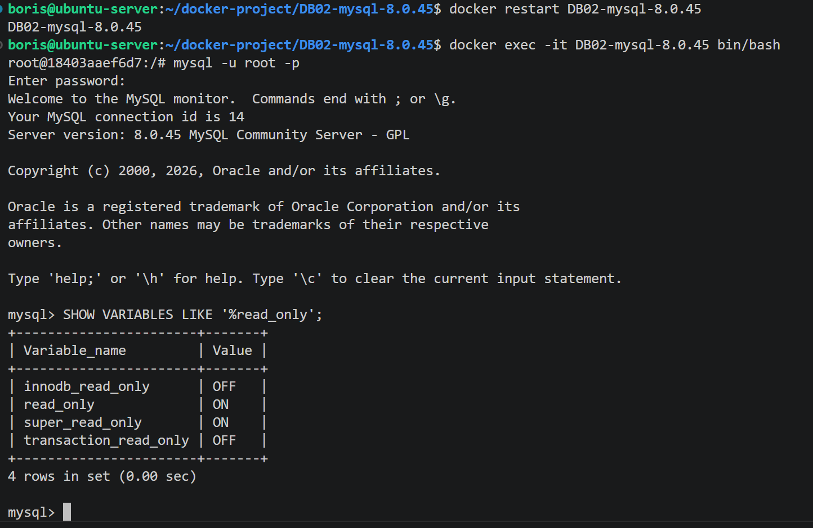

