# Домашнее задание к занятию "`Репликация и масштабирование. Часть 2`" - `Сидоров Борис`

## Задание 1

Опишите основные преимущества использования масштабирования методами:

- активный master-сервер и пассивный репликационный slave-сервер; 
- master-сервер и несколько slave-серверов;

*Дайте ответ в свободной форме.*

---

## Решение 1
- Основным преимуществом репликации в топологии **`master-slave`** является снижение нагрузки на основной сервер **`СУБД`** (**`master`**, он же **`source`** – источник). Конечно, мы можем добавить вычислительной мощности нашему основному серверу, на котором развернута **`СУБД`**, если фиксируем, что сервер упирается в какой-то из параметров аппаратной составляющей (это будет **вертикальное масштабирование**). Но постоянно прибегать к подобным решениям не получится, если наша база данных будет постоянно расти в объемах. Более того, есть риск, что на какое-то время наша **`СУБД`** перестанет функционировать, если произойдет какой-либо форс-мажор. Даже если мы позаботились о резервном копировании и сохранили данные, на какое-то время **`СУБД`** будет недоступна, и приложения перестанут работать, а это значит финансовые потери или, еще хуже, репутационные потери, если проект ориентирован на массового потребителя.

Так вот, даже минимальная топология репликации **`master -> slave`** позволяет нам распределить нагрузку между двумя серверами. Мы поднимаем сервер **`СУБД`** на другой **`ВМ`** (или, еще лучше, на другом железе) и настраиваем его как реплику основного сервера. На основном сервере мы настраиваем приложения на работу с запросами, связанными с **`INSERT`**, **`UPDATE`**, **`DELETE`** (то есть запросы на изменение данных в **`БД`**), а на реплику направляются запросы на чтение данных и анализ **`БД`**. Тем самым мы можем снять нагрузку с основного сервера, перенаправив все запросы, связанные с чтением данных, на сервер реплики, который будет точной копией основного сервера. Более того, если вдруг наш основной сервер выйдет из строя, появляется возможность переключить сервер реплики в режим **`master`**, и он уже будет являться основным – так мы достигаем **отказоустойчивости**.

Важно понимать, что если рассматривать стандартную **асинхронную репликацию**, то сервер **`СУБД`** реплики может отставать от **`master`** по содержимому данных в **`БД`**, и при переключении режима с реплики на **`master`** есть немалая вероятность потерять данные. Для некоторых проектов это может быть неприемлемо. Таким образом, при настройке репликации нужно также учитывать, какой тип выбрать для того или иного проекта.

- Второй вариант топологии, когда у нас в распоряжении несколько серверов **`СУБД`** – реплик, открывает пространство для маневров. Мы можем второй сервер реплики использовать как источник для снятия резервных копий, на время заблокировав его для чтения, не нагружая другой сервер реплики. Дальше – больше: когда у нас в топологии есть **3** сервера **`СУБД`**, можно настраивать **групповую репликацию**, где реализуется настоящая отказоустойчивость. В случае сбоя основного сервера переключение из режима **`slave`** в режим **`master`** среди двух реплик будет происходить автоматически, и для клиентских приложений не будет заметно, что в нашей инфраструктуре случился какой-то сбой. Однако этот подход – уже совсем другая технология, которая выходит за рамки обычной асинхронной репликации.

Нельзя забывать, что разворачивая новый сервер **`СУБД`** в качестве реплики, мы также увеличиваем затраты на обслуживание этого сервера. Помимо затрат на аппаратные мощности, мы увеличиваем нагрузку на отдел поддержки, так как за этим сервером тоже нужно следить и вовремя обслуживать. Мораль в том, что как и вертикальное масштабирование, горизонтальное должно быть максимально эффективным: больше серверов не всегда лучше.

---
---

## Задание 2
Разработайте план для выполнения горизонтального и вертикального шаринга базы данных. База данных состоит из трёх таблиц: 

- пользователи, 
- книги, 
- магазины (столбцы произвольно). 

Опишите принципы построения системы и их разграничение или разбивку между базами данных.

*Пришлите блоксхему, где и что будет располагаться. Опишите, в каких режимах будут работать сервера.* 

---

## Решение 2
По заданию у меня будет **`DB`**, состоящая из **3** таблиц. Для визуализации разверну сервер **`СУБД PostgreSQL`** и создам такую **`DB`**.

Поднимаю сервер, как это делал ранее при настройке репликации для **`СУБД MySQL`**. Напишу такую команду:

    docker run -d -p 5433:5432 \
    --network=postgre \
    -v DB01-postgre:/var/lib/postgresql \
    --mount type=bind,src=./files,dst=/files \
    --env-file .env \
    --name DB01-postgre-18 \
    postgres:18-bookworm

Помимо файлов с данными для **`СУБД`** я подмонтирую ещё директорию **`files`** на всякий случай для проброса дампов, если потребуется в будущем.

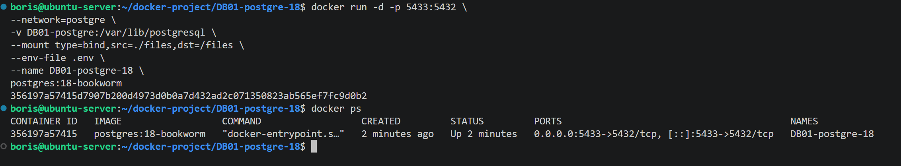

Подключусь к **`СУБД`** и проверю, что она работает.

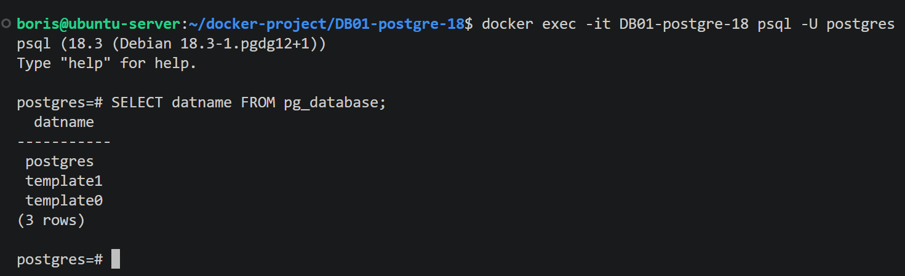

Теперь перейду непосредственно к заданию. Прежде чем писать блок-схему, я хочу визуально представить таблицы, с которыми придётся работать, и лучше всего это сделать на практике.

Сперва создам тестовую **`DB`**.

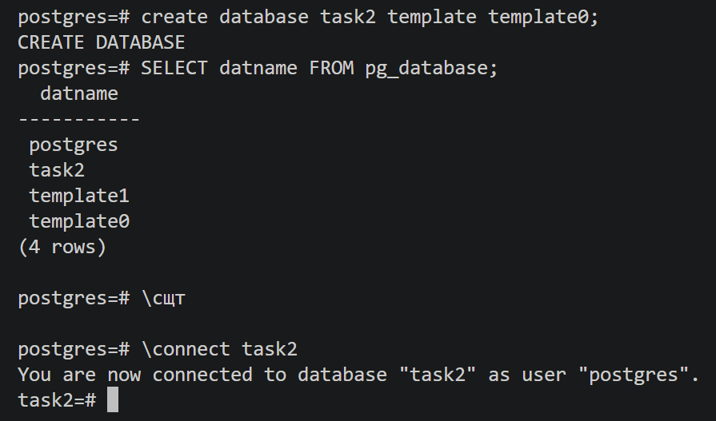

Далее создам первую таблицу **`users`**. В ней будет **4** атрибута (столбца): **`id`**, **`login`**, **`password`**, **`created_at`**.

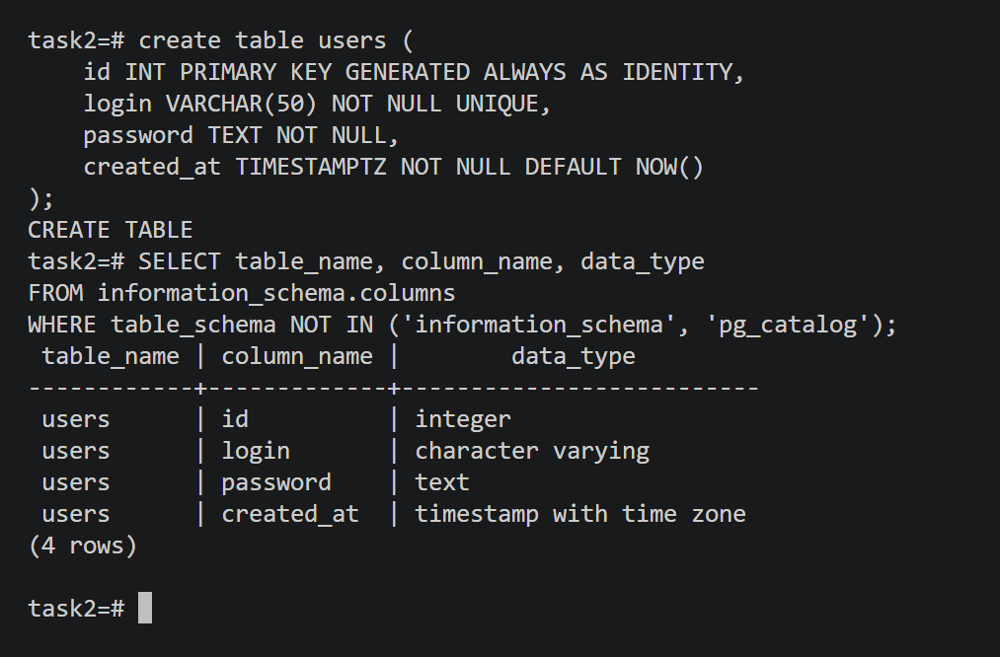

Благодаря **`LLM`** можно быстро попросить создать запрос на наполнение данными. В итоге у меня получилась такая тестовая таблица с пользователями.

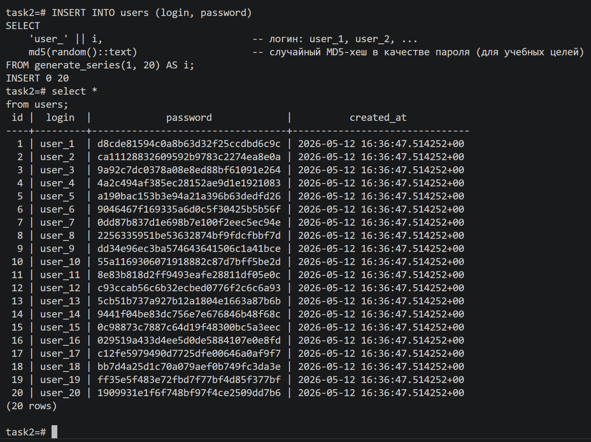

Приступаю ко второй таблице **`books`**.

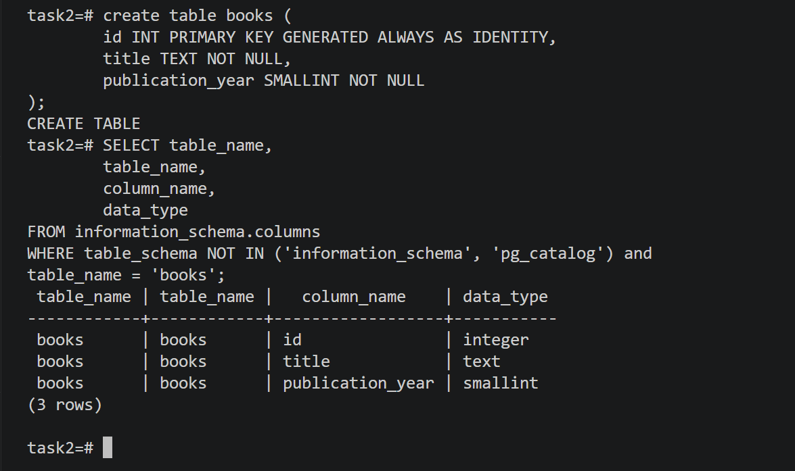

Наполняю данными и смотрю результат.

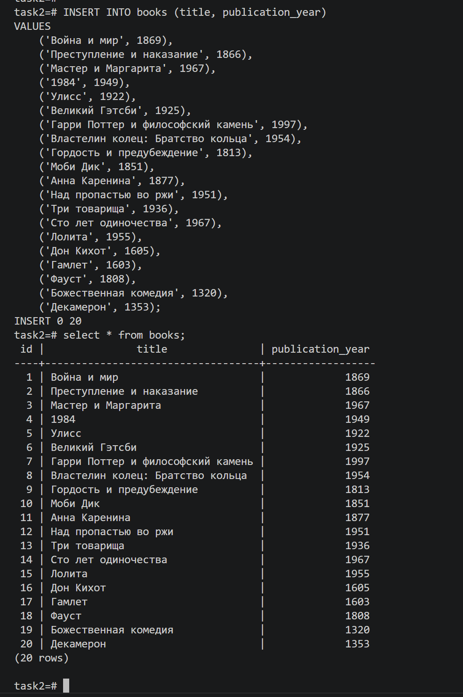

Далее таблица **`stores`**.

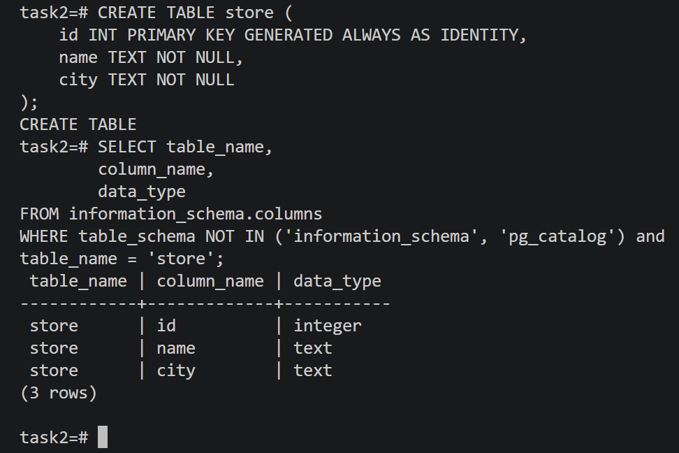

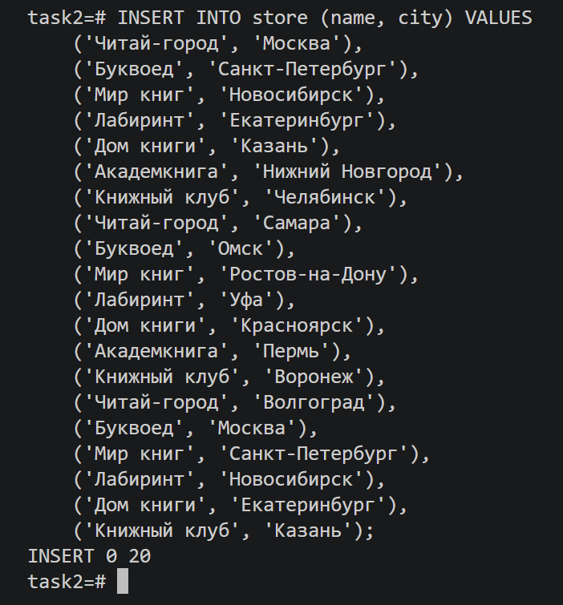

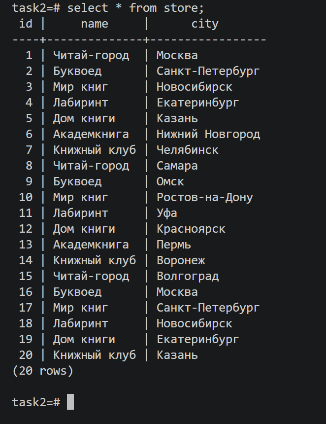

Итак, у меня есть визуальное представление таблиц, которые нужно разделить на шарды.

### **`USERS`**
Идея для таблицы **`users`** – буду применять **вертикальное шардирование**, где я вынесу столбец с паролем на отдельный сервер. Так как шардирование в основном используют в связке с репликацией, можно будет направлять запросы на чтение к серверу, на котором будет храниться шард с паролем, исключительно только при запросе для авторизации на сервис. Эту логику можно будет настроить на инструменте, который будет осуществлять балансировку или прокси, либо уже программировать логику в самом клиенте. Тут нужно решать задачи по системному дизайну, но главная идея заключается в том, что для свободного доступа на просмотр будут направляться запросы на первый сервер, в котором не будет столбца с паролем, а только **`id`**, **`login`** и дата создания. Например, так:

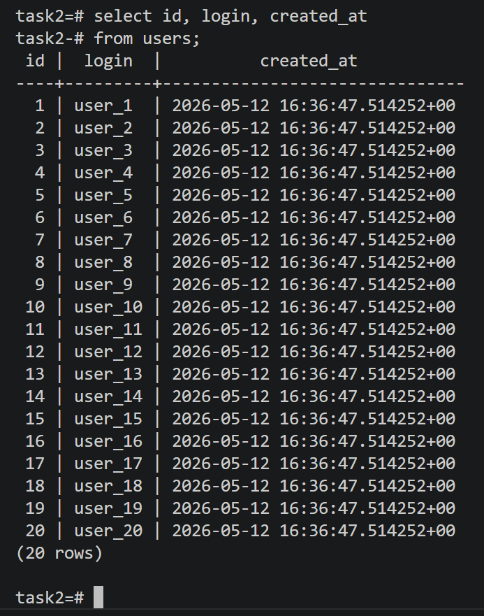

А на втором сервере – только **`id`** и **`password`**, и доступ туда строго ограничен. Содержимое будет примерно такое:

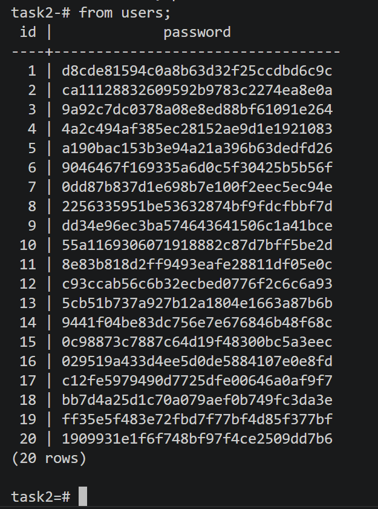

### **`books`**
В таблице **`books`** хотел бы применить вариант горизонтального шардирования, и разбивка будет по столбцу **`publication_year`**, то есть по дате публикации книг. Например:

- книги годов с **1300** по **1799** – на первом сервере,

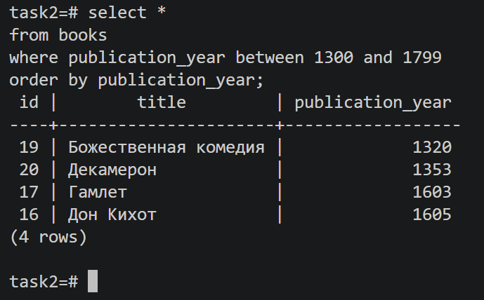

- с **1800** по **1899** – на втором,

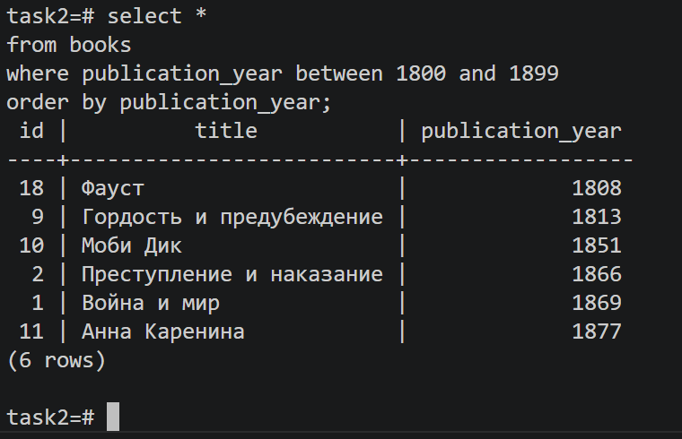

- с **1900** по текущий момент – на третьем.

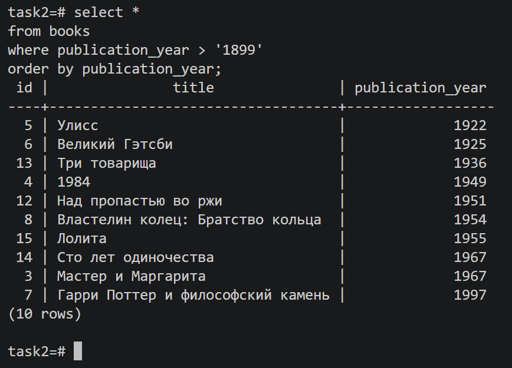

Естественно, разбивку можно делать как угодно, главное, чтобы получилось более-менее равномерное наполнение данных.

### **`stores`**
Таблицу **`stores`** я также применю горизонтальное шардирование, но по столбцу **`city`**, а разбивку буду делать по буквенному диапазону.

Условно:
- на первом сервере будут размещаться данные по городам, которые начинаются на букву в диапазоне **А–Ж**,

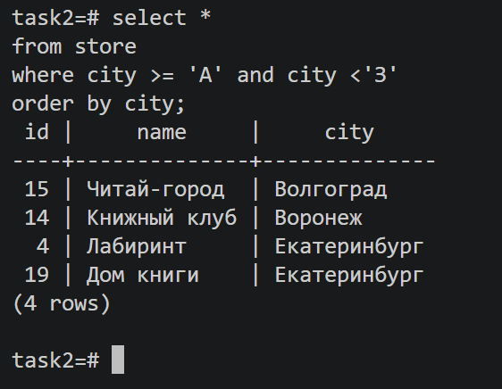

- на втором сервере – диапазон **З–П**,

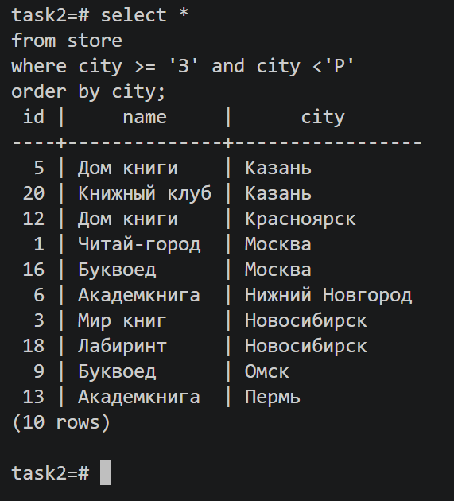

- на третьем – диапазон **Р–Я**.

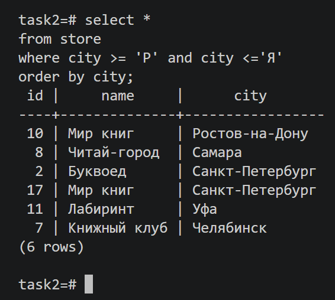

Что касается архитектуры и точек отказа: как я уже упомянул, шардинг применяется, как правило, на высоконагруженных **`БД`**, где уже нет возможности осуществлять вертикальное масштабирование, и шардинг идёт в связке с репликацией. В тех **`СУБД`**, где применяется шардинг, усложняется работа на стороне клиента или на стороне архитектуры балансировки между шардами, но в любом случае настраивать реплику на каждый шард будет необходимо, и реплики можно использовать в качестве источника для бэкапов или для запросов **`SELECT`**, где не будут выполняться операции по изменению данных в таблицах.

В итоге блок-схема по шардингу у меня получилась такая:

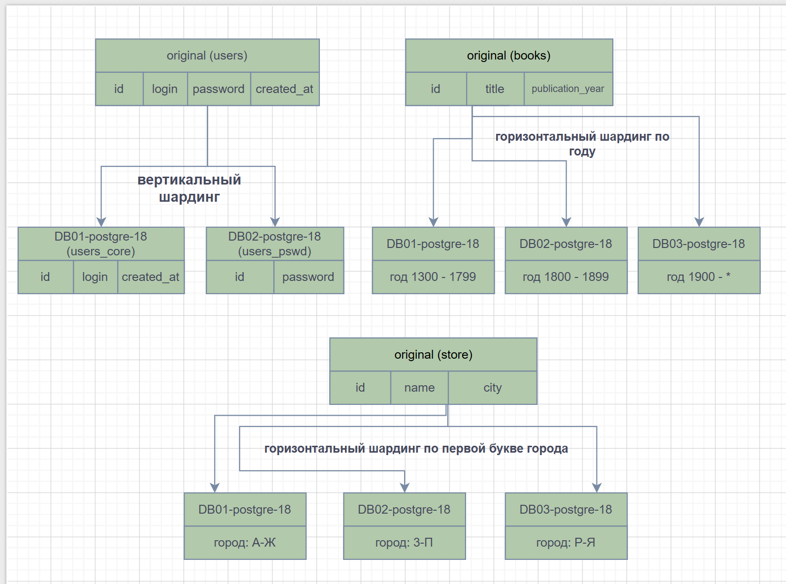

[**`Shards.drawio`**](files/hw-07/task-2/Shards_task2.drawio)

---
---

