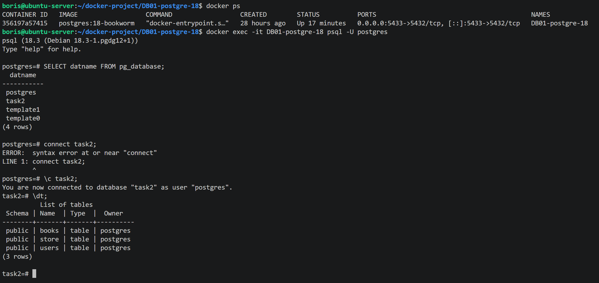
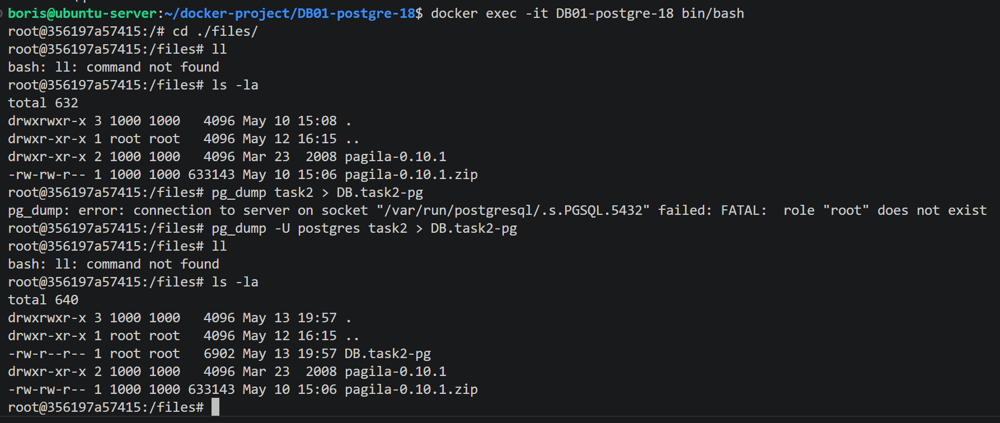
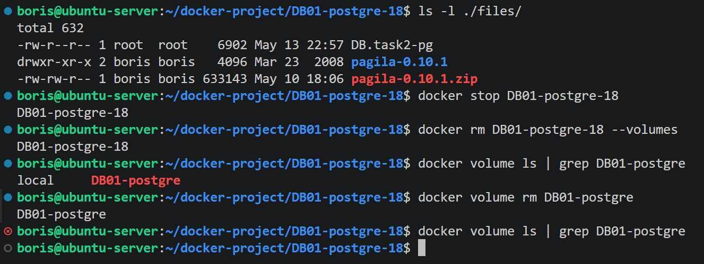
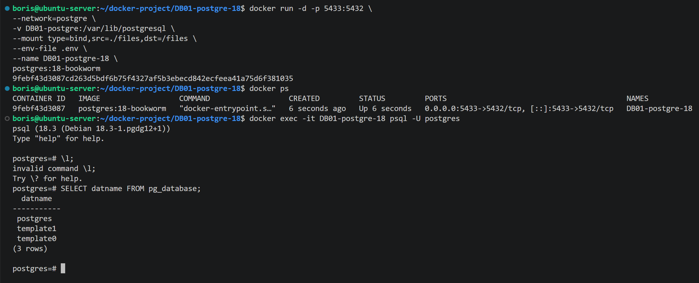
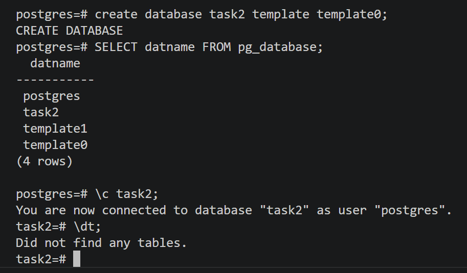
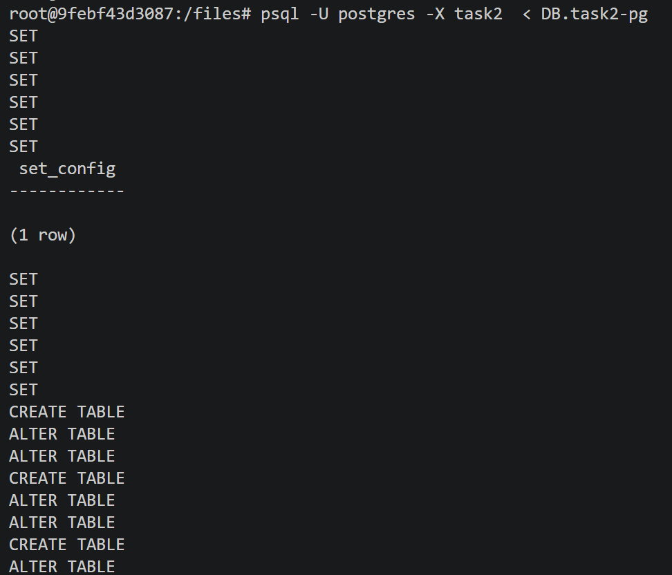
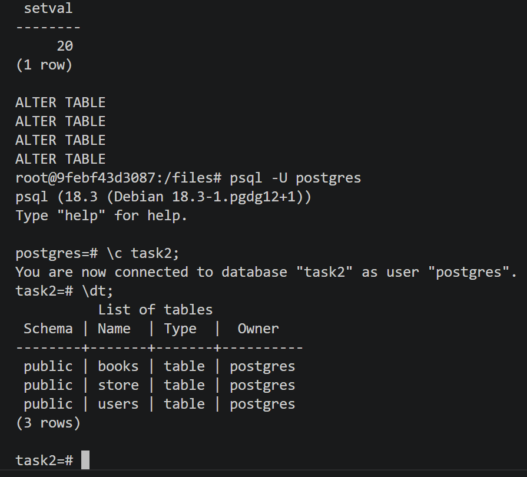

# Домашнее задание к занятию "`Резервное копирование баз данных`" - `Сидоров Борис`

---
---

## Задание 1. Резервное копирование

### Кейс
Финансовая компания решила увеличить надёжность работы баз данных и их резервного копирования. 

Необходимо описать, какие варианты резервного копирования подходят в случаях: 

1.1. Необходимо восстанавливать данные в полном объёме за предыдущий день.

1.2. Необходимо восстанавливать данные за час до предполагаемой поломки.

1.3.* Возможен ли кейс, когда при поломке базы происходило моментальное переключение на работающую или починенную базу данных.

*Приведите ответ в свободной форме.*

---

## Решение 1
Так как мы имеем дело с финансовой компанией, нужно отталкиваться от того, что потерять хоть каких-то данных в фин-тех недопустима, а значит нужно делать упор на надежность в ущерб экономии ресурсов. Но самое главное при работе бизнеса, завязанного на финансовых операциях, – все виды работ должны проходить на горячую, так как допускать простоя работы сервиса бизнес не допустит. Держа эту информацию в голове, выбираем нужный тип резервного копирования.

### 1.1
В первом случае, когда есть требования восстанавливать данные в полном объеме за предыдущий день, я бы выбрал **`полный бекап`**. **`Full backup`** гарантированно восстановит данные за определённый промежуток времени (в нашем случае за один день). Самое главное, что **`full backup`** гарантирует полное восстановление данных на момент времени создания этой резервной копии и не имеет точек отказа в отличие от других типов резервного копирования.

### 1.2
Если речь идет об откате данных на небольшой промежуток времени, то в этом случае не подойдут ни **`дифференциальный`**, ни **`инкрементный`** бэкап. **`Дифференциальная копия`** будет расти с каждым часом, и к концу дня размер будет практически идентичен **`полному бекапу`**, а в случае с **`инкрементным`** – очень много промежуточных точек зависимости, что накладывает большие риски сбоя и невозможности откатиться на определённый инкремент. Поэтому лучше всего подойдет один **`полный бэкап`**, который создается ежедневно, плюс откатываться, используя **`журнал транзакций`**. Вот прямая цитата из презентации, которая чётко отвечает на этот вопрос:

> **`Журнал транзакций (Transaction Log/WAL)`**: записывает все изменения. При восстановлении сначала применяется **`полный бэкап`**, а затем все журналы с момента бэкапа до момента сбоя, чтобы "накатить" изменения и привести **`БД`** в согласованное состояние.

### 1.3
Для финансов не то что вариант переключения **`БД`** на другой источник возможен – он должен быть реализован и протестирован до публикации таких решений в прод. В фин-тех цена простоя очень велика и практически недопустима. Для решения таких проблем существует инструмент **`групповая репликация`**, когда есть кворум серверов **`СУБД`**, в которых есть **`primary`** (источник) и несколько **`secondary`** серверов, работающих в синхронном режиме и согласовывающих каждую транзакцию. В случае если **`primary`** сервер выходит из строя, оставшиеся **`secondary`** серверы по праву большинства принимают решение, кто будет новым **`primary`** сервером **`СУБД`**. После того как вышедший из строя бывший **`primary`** восстанавливается, происходит процедура удалённого восстановления данных (подключившись к одному из серверов – этот список указан в конфигурации **`СУБД`**), и после того как сервер догоняет группу по данным, он становится **`secondary`** сервером. Для реализации кворума количество серверов **`СУБД`** в группе должно быть нечётным. Такое решение накладывает дополнительную нагрузку на сеть и может провоцировать задержку, но для транзакций потеря данных куда критичнее скорости проведения транзакций. Также за пределами групповой репликации, как правило, настраиваются дополнительные сервера реплик к каждой **`СУБД`** для обеспечения более высокой отказоустойчивости.

Я привел пример **`групповой репликации`**, основываясь на опыте работы с **`MySQL`**, где есть такая возможность. Данный подход так и называется **`групповая репликация`**; есть ещё **`InnoDB Cluster`** – это уже комплексное решение «под ключ», но вариант групповой репликации весьма показателен как пример.

Всё, что я описал про групповую репликацию, – это правда, но это всего лишь одна часть большого механизма под названием **“Повышение доступности (High Availability)”**. Помимо настройки синхронной репликации, нужно настраивать и балансировку трафика, логику клиентского приложения и прочее. В целом это сложная архитектурная задача, которая решает вопросы отказоустойчивости, но это реально, и это важно для фин-тех.

---
---

### Задание 2. PostgreSQL

2.1. С помощью официальной документации приведите пример команды резервирования данных и восстановления БД (pgdump/pgrestore).

2.1.* Возможно ли автоматизировать этот процесс? Если да, то как?

*Приведите ответ в свободной форме.*

---

## Решение 2
### 2.1
Описание резервной копии утилиты **`pg_dump`** для **`СУБД PostgreSQL`** описано в официальной документации в главе **Chapter 25. Backup and Restore**, в главе **25.1** рассказывается пример работы встроенной утилиты **`pg_dump`**. Вот пример создания резервной копии из официальной документации:

    pg_dump dbname > dumpfile

Пример восстановления данных из дамп-файла – используется утилита **`psql`** и указание на созданный файл утилитой **`pg_dump`**:

    psql -X dbname < dumpfile

Лучше всего это проверить на практике.  
В предыдущем задании я описывал технологию работы шардирования, и у меня есть тестовая **`СУБД PostgreSQL`**.  
Я создавал тестовую **`БД`** и в ней создал несколько таблиц.

Теперь попробую сделать дамп тестовой **`БД`** (**`task2`**), используя утилиту **`pg_dump`**.  
Подключусь к оболочке контейнера и запущу утилиту **`pg_dump`**.

Появился дамп-файл с целевой **`БД`**. Директория **`files`** у меня примонтирована к хостовой части, поэтому удалю текущий контейнер и именованный том, в котором сохраняются все данные **`СУБД`**.

Создам заново контейнер с **`СУБД`** и проверю, что там ничего нет.

Теперь попробую восстановить данные из дампа, используя утилиту **`pg_dump`**. Для восстановления сначала нужно создать пустую **`БД`**, в которую будет применён список всех команд в дампе.

**`БД`** создана, и она пустая. Теперь попробую восстановить данные, используя утилиту **`psql`** и мой ранее созданный файл, который хранится в примонтированном томе.

Процесс завершился успешно. Проверю:

Да, всё ок – все таблицы на месте, восстановление выполнено.

### 2.2
Насколько я понял, в самой **`СУБД PostgreSQL`** нет встроенного планировщика, поэтому на ум приходят простые однострочные скрипты, поставленные на планировщик **`cron`**, или написание сервиса для таргета **`systemd-timer`**, что даст больше гибкости при применении скрипта. Есть ещё сторонние решения, такие как **`pgagent`** – там тоже вроде есть функция планировщика для **`job`**, но это также стороннее решение за рамками пакета **`СУБД`**. Хотя наверняка сейчас всё работает в контейнерной среде с использованием **`k8s`** – скорее всего, там тоже есть специальные инструменты, но в эту сторону я ещё не изучал. Знаю, что есть объект **`CronJob`**, который служит для запуска **`job`** по расписанию, но возможно, я ошибаюсь.

---
---

